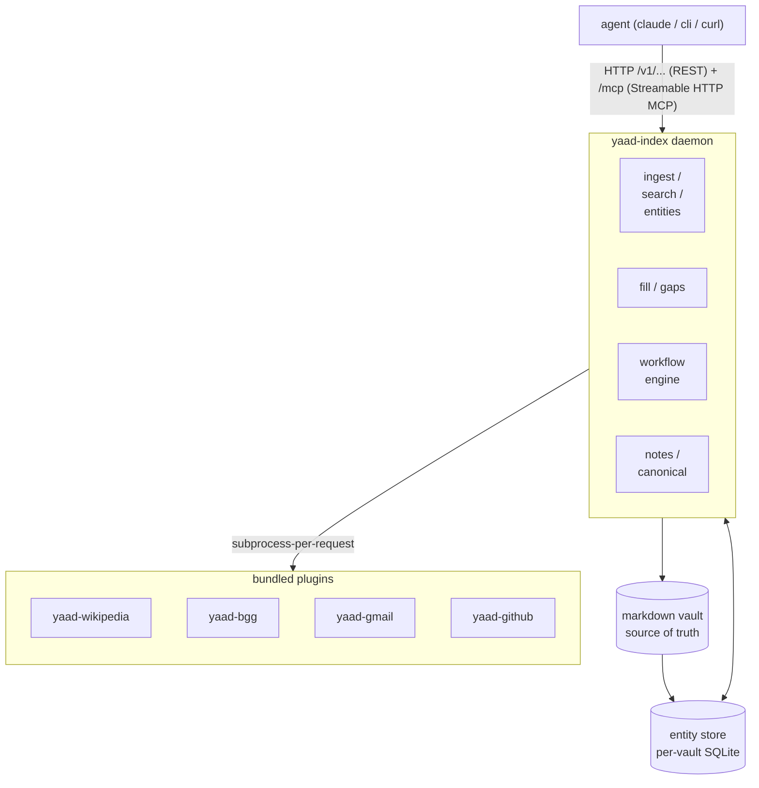

# yaad-index

> ⚠️ **DESIGN IN FLUX — WE WILL BREAK THINGS.**
>
> This project is iterating on its plugin / cache / API surface and is **NOT stable**. Schemas, wire shapes, plugin contracts, and CLI flags may change without notice or migration path until a `stable` flag is set on a future release. Operators and downstream consumers should treat any version of these interfaces as ephemeral. Backward-compatibility shims you might expect (e.g., plugins-predating-legacy fallback, deprecated-but-supported config keys) may be removed at any time.

Personal knowledge index for AI agents. Caches structured and unstructured sources (web pages, emails, board games, code repos, calendars, …) into a queryable graph that agents read via HTTP — not files.

## Why "yaad"

**یاد** (*yaad*) is the Persian word for memory — specifically the remembering kind: recollection, the act of holding something in mind, the thing someone leaves behind when they're gone. It's a soft word. Old game pieces, their color worn off, that you keep because they were your mother's are a *yaad* of her. A photograph of your father, smiling, is a *yaad*. The vault this tool sits on top of, accumulating years of a person's thinking, is also a *yaad*.

The tool is named for what it does: it holds onto the things you've encountered — the games you played, the people you met, the articles you read, the emails that mattered — so you don't have to re-meet them every time you want to remember. It's memory as a thing you keep, not a thing you re-fetch.

Pronounced roughly like English *"yod"* (as in the Hebrew letter) but with a slightly longer vowel — *yaahd*. Short *a* would also be understood in most Persian dialects.

The name was chosen deliberately rather than descriptively: `yaad-index` is more honest than `knowledge-graph-tool-47` about what the thing actually is.

The tool is built for both humans and AIs to use. Its HTTP API exposes the same queries the CLI does — an AI agent and a person are equally first-class users of the knowledge graph. Not AI-as-bolt-on, not AI-as-main-act: equal access to the same surface.

It's also an experiment: this project is being built *with* an AI (Yaad, which the tool is named for), not just *for* one. The ADR review history in this repo shows that across design decisions — the AI is a contributor, not a tool.

## Status

Pre-release. Daemon + 4 bundled plugins (Wikipedia, BoardGameGeek, Gmail, GitHub) + MCP surface + workflow engine + agent-feedback notes are all live on `main`. Latest tagged cut is **v0.8.0**. Interfaces still in flux per the design-in-flux warning above.

An earlier prototype lived under a file-first design; this repo starts over from an **AI-first, remote-API** premise. See [ADR-0001](./adr/0001-fresh-rewrite-ai-first-remote-api.md) for the rewrite rationale.

## What it does

1. **Ingest.** Plugins fetch sources (Wikipedia article, BoardGameGeek page, Gmail message, GitHub PR / issue) and emit them as entities + edges. Plugins are subprocesses spawned per-request (per [ADR-0005](./adr/0005-plugin-lifecycle.md)); URL-shape inputs route through `/v1/ingest`, command-shape `<plugin>: !<command>` inputs run bulk passes per [ADR-0022](./adr/0022-plugin-command-protocol.md).
2. **Index.** Entities land in a per-vault SQLite store with stable canonical IDs ([ADR-0017](./adr/0017-canonical-id-clean-slug.md), [ADR-0021](./adr/0021-daemon-owns-slug.md)). Markdown vaults remain authoritative for human-edited content ([ADR-0008](./adr/0008-vault-as-source-of-truth.md)); the index is the agent-facing view.
3. **Serve.** Everything reachable via HTTP at `/v1/...` and via MCP at `/mcp` (Streamable HTTP). Local agents and remote agents call the same endpoints.
4. **Fill the gaps.** Canonical entity kinds declare what they don't know yet (`gaps:`); agents read `raw_content`, derive values, and POST them back via `/v1/entities/{id}/fill` ([ADR-0013](./adr/0013-canonical-kind-owns-gap-contract.md), [ADR-0019](./adr/0019-operator-fill.md)). The corpus closes its own gaps over time.
5. **React.** Workflows ([ADR-0024](./adr/0024-workflows-and-tasks.md)) subscribe to entity events (`entity.created`, `entity.edge_added`, `entity.updated`, `fill.completed`) and fire actions: append notes, add gaps, dispatch plugins, file tasks. Reactive layer for "when X happens, do Y."
6. **Annotate.** Agents can flag emitted entities as wrong, stale, or worth attention via the notes surface ([issue #186](https://github.com/yaad-index/yaad-index/issues/186), shipped 2026-05-22). Notes carry an optional `kind=annotation` flag so agent-feedback can be filtered cleanly from regular operator notes.

## What it isn't

- **Not a live-state tool.** yaad-index holds knowledge that changes slowly. Sub-second freshness belongs in MCP servers fronting live systems.
- **Not a multi-tenant service in v1.** One vault per server instance.
- **Not a CLI-first tool.** The CLI is a thin client over the API.
- **Not authz-enforced in v1.** Network topology is the trust model. See [ADR-0001](./adr/0001-fresh-rewrite-ai-first-remote-api.md).

## Architecture sketch



Full design lives in [`adr/`](adr/). Recently-shipped: [ADR-0024](./adr/0024-workflows-and-tasks.md) (workflow engine), [ADR-0025](./adr/0025-date-entities.md) (day entities — foundation in-flight), [ADR-0026](./adr/0026-yaad-github-plugin.md) (yaad-github plugin). For the API surface itself, see [ADR-0002](./adr/0002-api-surface.md).

## Getting started

New to yaad-index? [`docs/getting-started.md`](docs/getting-started.md) walks from `git clone` to a first ingest + first agent connection. About an hour end-to-end. The reference docs below assume the daemon is already running.

## Quick start

```bash
# Build from source
git clone git@github.com:yaad-index/yaad-index.git
cd yaad-index
make build

# Mint an operator token + start the daemon
./yaad-index keygen --keys-dir ./keys
./yaad-index issue-token --operator $USER --operator-only --keys-dir ./keys > op.jwt
./yaad-index serve --keys-dir ./keys --bind localhost:7433

# From an agent or curl, ingest a source (URL shape)
curl -X POST http://localhost:7433/v1/ingest \
 -H "Authorization: Bearer $(cat op.jwt)" \
 -H 'Content-Type: application/json' \
 -d '{"url": "https://boardgamegeek.com/boardgame/224517/brass-birmingham"}'

# Fetch the resulting entity
curl -H "Authorization: Bearer $(cat op.jwt)" \
 http://localhost:7433/v1/entities/boardgame:brass-birmingham
```

See [`docs/getting-started.md`](docs/getting-started.md) for the full walkthrough (clone → build → token → serve → first ingest → first workflow → MCP agent connection).

## Bundled plugins

Four plugins ship in-tree under `cmd/`:

| Plugin | Source | Shape | Docs |
|---|---|---|---|
| [`yaad-wikipedia`](cmd/yaad-wikipedia/) | Wikipedia articles | URL-shape | — |
| [`yaad-bgg`](cmd/yaad-bgg/) | BoardGameGeek games | URL-shape | — |
| [`yaad-gmail`](cmd/yaad-gmail/) | Gmail messages | Command-shape (`gmail: !fetch`) | [`docs/plugins/yaad-gmail.md`](docs/plugins/yaad-gmail.md) |
| [`yaad-github`](cmd/yaad-github/) | GitHub PRs + issues | URL-shape + command-shape (`github: !fetch`) | [`docs/plugins/yaad-github.md`](docs/plugins/yaad-github.md) |

Each plugin is a standalone Go binary built from `cmd/<plugin>/`. Operators wire them in `config.yaml` per [`docs/configs.md`](docs/configs.md) — structured per-plugin config delivered via the `config:` block + a JSON Schema declared in the plugin's `--init` capabilities (per [ADR-0006](./adr/0006-plugin-discovery-config-allowlist.md)'s 2026-05-22 amendment). Secrets stay in env-passthrough; non-secret config travels in the structured block.

The plugin protocol ([ADR-0005](./adr/0005-plugin-lifecycle.md) + [ADR-0022](./adr/0022-plugin-command-protocol.md) + [ADR-0023](./adr/0023-unified-plugin-response-protocol.md)) means any binary that speaks the JSON / NDJSON contract works — third-party plugins ship as separate repos without touching this codebase.

## Connecting AI agents (MCP)

The daemon exposes its full tool surface as an MCP server at
`/mcp` over Streamable HTTP, alongside the REST `/v1/...` routes.
An AI agent (Claude Code, Claude Desktop, Cursor, anything that
speaks Streamable-HTTP MCP) connects directly to the daemon —
no wrapper process to install or manage.

**Endpoint:** `<base-url>/mcp` (same host + port the REST surface
serves, e.g. `http://localhost:7433/mcp`).

**Auth:** the same Bearer JWT that protects `/v1/...` routes —
issue a token with `yaad-index issue-token --operator <op> --agent <name>`,
configure the agent to send it as `Authorization: Bearer <token>`.

**Tools:** every daemon HTTP route is exposed as an MCP tool —
`ingest`, `get_entity`, `list_entities`, `fill`, `add_note`,
the UGC + workflow + task families, and so on. Live inventory
via `tools/list`; for the per-tool reference and usage patterns
see [`mcp/SKILL.md`](mcp/SKILL.md).

**Claude Code config example:**

```json
{
 "mcpServers": {
 "yaad-index": {
 "type": "http",
 "url": "http://localhost:7433/mcp",
 "headers": { "Authorization": "Bearer <token>" }
 }
 }
}
```

**Dual path during the transition.** The legacy `mcp/` TypeScript
wrapper (a separate Node process speaking stdio MCP, forwarding
to the daemon's `/v1/...` routes) is still bundled and still
works. Until the direct `/mcp` path is field-tested across
operators' integrations, both connection paths are supported. The
TS wrapper's removal is a later operator-driven step (see
[issue #101](https://github.com/yaad-index/yaad-index/issues/101)),
not a near-term cutover.

## Repo layout

- `adr/` — Architecture Decision Records. Read these before making design changes.
- `cmd/yaad-index/` — server binary entry point + CLI subcommands (`serve`, `keygen`, `issue-token`, `command`, `fetch`, `reindex`, `plugins`, `workflow`, `task`).
- `cmd/yaad-{wikipedia,bgg,gmail,github}/` — bundled plugin binaries.
- `internal/api/` — v1 HTTP handlers (entities, ingest, fill, search, notes, kinds, workflows, tasks).
- `internal/canonical/` — daemon-managed canonical kinds + edge type vocabulary.
- `internal/workflow/` — workflow engine (event bus subscriber, action runners, parser).
- `internal/plugins/` — plugin registry + invocation + subprocess + capabilities.
- `internal/vault/` — markdown vault reader / writer / reindex.
- `internal/store/` — SQLite store, migrations, queries.
- `internal/mcp/` — MCP tool registration (every HTTP route mirrored as an MCP tool).
- `docs/` — operator + agent reference docs (getting-started, plugin-flow, configs, workflows, tasks, fill-gap, ingest, per-plugin notes).
- `mcp/` — legacy TypeScript MCP wrapper (kept during the in-process MCP transition per [issue #101](https://github.com/yaad-index/yaad-index/issues/101)).

## Building and running

```bash
make build # → ./yaad-index
./yaad-index serve --bind localhost:7433 # or set $YAAD_INDEX_BIND
curl http://localhost:7433/v1/kinds # returns the canonical kinds payload
```

`--db-path` (env `YAAD_INDEX_DB_PATH`, default `~/.local/share/yaad-index/yaad.db`) selects the SQLite file. The path's parent directory and the database itself are created on first run; schema migrations apply automatically. The server uses [`modernc.org/sqlite`](https://pkg.go.dev/modernc.org/sqlite) — pure Go, no CGO required.

The server logs structured JSON to stderr (per [ADR-0004](./adr/0004-logging-library-slog.md)) and shuts down gracefully on `SIGINT` / `SIGTERM`.

## Docker

A multi-stage `Dockerfile` at the repo root builds a runnable image with all 4 bundled plugin binaries (`yaad-wikipedia`, `yaad-bgg`, `yaad-gmail`, `yaad-github`).

```bash
make docker-build # → yaad-index:latest
make docker-build TAG=v1.2.3 # → yaad-index:v1.2.3
make docker-build YAAD_UID=$(id -u) YAAD_GID=$(id -g) # for non-1000 hosts (macOS etc)
```

`make docker-build` uses BuildKit (`DOCKER_BUILDKIT=1`). Plugins live in-tree under `cmd/`, so no ssh-agent or private-repo cloning is needed — they build from the same source tree as the daemon.

The container's `yaad` user defaults to **uid 1000 / gid 1000**, the conventional first-user uid on debian/ubuntu/most modern distros. This matches the typical `id -u` of the host operator running the build, so bind-mounted host files (`yaad-index.db`, `vault/`) are writable from inside the container without manual chmod. If your host uid differs (e.g. macOS, multi-user shared boxes), override at build time per the third example above.

The image bakes:

- `/usr/local/bin/yaad-index` — server binary
- `/usr/local/lib/yaad-index/plugins/yaad-{wikipedia,bgg,gmail,github}` — bundled plugins
- `/etc/yaad-index/config.yaml.example` — starter config

Three mount points; two are required, one is optional:

| Mount | Required | Behavior if not mounted |
|------------------------------------|----------|--------------------------------------------------------------------------------------|
| `/etc/yaad-index/config.yaml` | **yes** | Container fails fast on startup with a helpful error pointing at the example |
| `/data/vault` | **yes** | Container fails fast on startup; vault is the source of truth per ADR-0008 |
| `/data/index.db` | no | SQLite creates an ephemeral file at `/data/index.db`; lost on container restart |

The config file accepts a `cache_ttl_seconds` knob (default `0` = disabled, cache hits forever; positive values bound the lookup-first cache freshness window in seconds). See [`docs/plugin-flow.md`](docs/plugin-flow.md) §2b for the full TTL semantics.

### Setup

```bash
cp config.yaml.example yaad-index.yaml # edit if needed
touch yaad-index.db # create the file before first run
mkdir -p vault # if you don't already have one
```

The `touch` step matters: docker bind-mounts treat a missing host path as a directory and create one — if `yaad-index.db` doesn't exist on the host, you'll get a directory mount and the SQLite open will fail. The default `YAAD_UID=1000` matches most host operators' uid; the bind-mounted file is then writable without chmod. On non-1000 hosts, build with `YAAD_UID=$(id -u) YAAD_GID=$(id -g)` per the section above, OR `chmod a+rw yaad-index.db && chmod a+rwX vault/` if rebuilding isn't convenient.

### Run

```bash
docker run -d \
 -v ./yaad-index.yaml:/etc/yaad-index/config.yaml \
 -v ./vault:/data/vault \
 -v ./yaad-index.db:/data/index.db \
 -p 7433:7433 \
 yaad-index:latest
```

Copy `config.yaml.example` from this repo as your starting point — the baked example points at the bundled plugin path and `/data/vault`. Adding a new bundled plugin is a small Dockerfile addition: one parallel build stage cloning the plugin source, one COPY into the runtime image, one entry in the example config.

### Operator commands

After a plugin upgrade, if the plugin's Capabilities surface (URL patterns, entity kinds, frontmatter-edge mappings, etc.) changes but the plugin author forgot to bump `--version`, the daemon's startup cache will trust the stale row and never see the new fields. Recover with:

```bash
yaad-index plugins reprobe # force re-probe every plugin
yaad-index plugins reprobe --name bgg # or just one
```

This clears the cached `plugin_capabilities` row and re-runs `--init`. Restart the daemon afterwards so the running registry picks up the fresh capabilities. The companion `yaad-index plugins clear-cache` drops cached rows without re-probing — useful when you want the next server start to do the work.

## Development

```bash
git clone git@github.com:yaad-index/yaad-index.git
cd yaad-index
make check # full verification: vet, build, test, fmt, lint, go mod tidy
make install-hooks # (optional) wire the checks as a pre-commit block
```

`make check` runs the same chain CI runs. `make install-hooks` generates `.githooks/pre-commit` and points `git.core.hooksPath` at it, so commits that fail `make githook-check` (fmt-check + vet + lint + tidy-check) are rejected locally before they reach CI. See `make help` for every target.

## License

Apache 2.0. See [LICENSE](./LICENSE).
