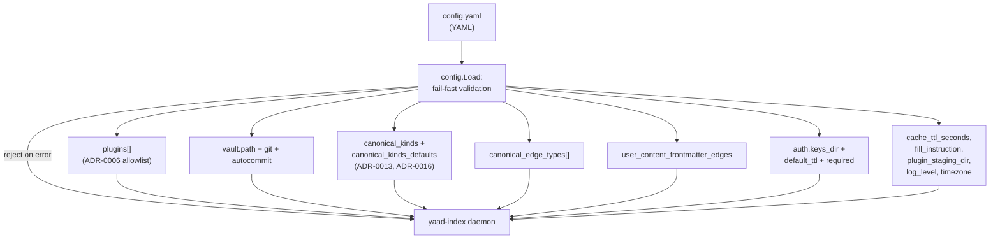

# Configs

Agent-facing reference for the operator config surface: the `config.yaml` shape the daemon reads at startup, the validation rules each block enforces, and how each entry feeds the runtime. Audience is agents that read live config to know what the operator declared + agents-via-operators debugging unexpected gap shapes or rejected ingests.

This is a **living reference** (not an ADR). Decision-grounded — each block names the ADR that owns the rule.

For per-feature surfaces that consume the config see [`docs/ingest.md`](./ingest.md) (plugins allowlist + canonical-kind registry at ingest time) and [`docs/fill-gap.md`](./fill-gap.md) (gap-shape validation at fill time). For the workflow engine's complementary file format see [`docs/workflows.md`](./workflows.md) (forthcoming).

## Big picture



`config.Load` is fail-fast: any validation error rejects the entire config and the daemon doesn't start. Operators see a structured error pointing at the offending field. ADRs: [ADR-0006](../adr/0006-plugin-discovery-config-allowlist.md) (allowlist + first-match-wins), [ADR-0013](../adr/0013-canonical-kind-owns-gap-contract.md) (canonical-kind owns gap contract), [ADR-0016](../adr/0016-canonical-kind-defaults.md) (defaults + plugin-driven activation).

## 1. File location

Default path: `~/.config/yaad-index/config.yaml`. Override via `--config <path>` or `YAAD_INDEX_CONFIG=<path>`. The daemon reads exactly one file; there is no per-directory cascade.

The path resolves at startup; a missing file is OK only when the agent / operator hasn't requested any config-dependent surface (no plugins, no canonical kinds). Most production deployments pass `--config` explicitly.

## 2. Top-level shape

```yaml
plugins:                              # ADR-0006 allowlist (ordered)
  - name: yaad-wikipedia
    path: /opt/yaad/yaad-wikipedia

vault:                                # ADR-0008 vault root
  path: /home/operator/vault
  auto_commit: true
  auto_push: false
  committer_name: "yaad-index"
  committer_email: "yaad@local"

canonical_kinds:                      # ADR-0013 per-kind gap registry
  boardgame:
    gaps:
      rating:
        type: int
        description: "your 1-10 rating"
        range: [1, 10]
        fill_strategy: operator
      designed_by:
        type: canonical_type
        description: "the designer"
        kinds: [person]
        fill_strategy: agent
    instruction:
      enabled: true
      text: "Be brief."

canonical_kinds_defaults:             # ADR-0016 root-level defaults
  gaps:
    external_url:
      type: string
      description: "canonical URL if known"
  instruction:
    enabled: true
    text: "Skip if absent."

canonical_edge_types:                 # operator-declared edge vocabulary
  - is_about
  - is_a
  - designed_by

user_content_frontmatter_edges:       # UGC frontmatter → canonical edge
  designer:
    edge_type: designed_by
    target_kind: person

auth:                                 # ADR-0019 auth surface
  keys_dir: /etc/yaad-index/keys
  default_ttl: 2160h
  required: true

plugin_staging_dir: /var/lib/yaad/staging   # ADR-0014 attachment staging
cache_ttl_seconds: 86400                    # global cache TTL
fill_instruction: "Be concise."             # global fill prompt prefix
log_level: info                             # debug / info / warn / error
timezone: "Europe/Berlin"                   # daemon TZ
```

Every block is optional except as noted in §11. Empty blocks evaluate to "no config for this surface" and the daemon proceeds with the per-block default.

## 3. `plugins:` — the allowlist (ADR-0006)

```yaml
plugins:
  - name: yaad-wikipedia
    path: /opt/yaad/yaad-wikipedia
  - name: yaad-bgg
    path: /opt/yaad/yaad-bgg
  - name: yaad-gmail
    path: /opt/yaad/yaad-gmail
  - name: yaad-github
    path: /opt/yaad/yaad-github
```

The four entries above are the bundled plugins this monorepo ships (also baked into the container image at `/usr/local/lib/yaad-index/plugins/<name>`). Per-plugin env-var requirements + sample config blocks live in [`config.yaml.example`](../config.yaml.example) and the per-plugin docs at [`docs/plugins/`](plugins/).

Each entry: `{name, path}`.

- `name` — plugin identifier the daemon logs + reports through `/v1/plugins`.
- `path` — **absolute** path to the executable. ADR-0006 explicitly rejects relative paths, PATH search, and `~/` shell expansion.

**Order matters.** The daemon dispatches URLs to plugins via first-match-wins (per ADR-0006 §"Dispatch order"). Earlier entries claim ambiguous URLs before later ones; the list shape (not a map) is deliberate because Go map iteration is randomized and would scramble dispatch priority.

**Validation at Load time:**

- Missing `path` → reject.
- Relative path → reject (must be absolute).
- File doesn't exist OR not executable OR is a directory → reject.

A rejected `plugins:` block fails the entire config; the daemon refuses to start.

### 3.1 Per-plugin `config:` sub-block (ADR-0006 §"Per-plugin config delivery")

Each plugin entry MAY carry a structured `config:` sub-block. Arbitrary YAML structure is accepted (scalars, lists, nested maps); the plugin owns its schema:

```yaml
plugins:
  - name: github
    path: /opt/yaad/yaad-github
    config:
      repos: [acme/proj, beta/widget]
      recent_days: 7
      base_url: https://api.github.com
```

**How the plugin reads it.** At subprocess spawn the daemon JSON-marshals the whole block and delivers it as a single env var named `YAAD_PLUGIN_CONFIG`. Every plugin reads the same name; per-subprocess env isolation keeps the value scoped to its target. The plugin does one `os.Getenv("YAAD_PLUGIN_CONFIG")` + `json.Unmarshal` into its own struct on startup.

**Schema declaration + validation.** Each plugin's `--init` capabilities document MAY include a `config_schema` field (JSON Schema draft 2020-12). The daemon validates the operator's `config:` block against the schema at registry-load time and fails fast on mismatch — operators see the violation in the startup log, not at first ingest. Plugins without a declared schema get their config passed through unvalidated.

**Daemon-injected fields.** The daemon writes reserved `_`-prefixed keys into the JSON payload before delivery:

- `_name` — the entry's `name:` value, so multi-instance plugins (e.g. `github-personal` / `github-work`) read their instance identity without operator-side duplication.

Operator keys starting with `_` are rejected at Load (a defensive guard against shadowing daemon-injected fields). The `_`-prefix is reserved for daemon-injected fields generally; future iterations may inject additional fields under the same convention without per-field design decisions.

**Secrets stay in the daemon's process env**, not the `config:` block. The yaml file typically lands in ops/SCM; tokens / passwords / etc. live at the daemon-process layer (docker `-e`, systemd `EnvironmentFile`, …). The daemon passes its env to subprocesses by default, so the plugin reads `os.Getenv("YAAD_GITHUB_TOKEN")` directly.

The two channels are explicit: `config:` for structured non-secret values that benefit from yaml-shaped expression (lists, maps); daemon-process env for secrets.

### 3.2 Per-plugin `instances:` sub-block (ADR-0028)

A plugin entry MAY carry an `instances:` block declaring N runtime-config variants of the same plugin binary — per ADR-0028 §1. Use this when one plugin binary needs to run against multiple independent runtime contexts (two Gmail accounts, two GitHub identity contexts, etc.):

```yaml
plugins:
  - name: gmail
    path: /opt/yaad/yaad-gmail
    instances:
      - name: personal
        env:
          YAAD_GMAIL_ACCOUNT: ops@example.com
          YAAD_GMAIL_APP_PASSWORD_REF: gmail-personal
      - name: work
        env:
          YAAD_GMAIL_ACCOUNT: work@example.com
          YAAD_GMAIL_APP_PASSWORD_REF: gmail-work
  - name: github
    path: /opt/yaad/yaad-github
    instances:
      - name: personal
        config:
          repos: [alice/dotfiles, alice/notes]
        env:
          YAAD_GITHUB_TOKEN_REF: github-personal
      - name: acme-org
        config:
          repos: [acme-org/*]
        env:
          YAAD_GITHUB_TOKEN_REF: github-acme
```

Each instance has:

- `name` — operator-chosen, unique within the plugin, matches `[a-z0-9]+([_-][a-z0-9]+)*` (no slash; slash is reserved for the `<plugin>/<instance>` invocation + entity `source:` shape).
- `env` (optional) — env-var entries spliced into the subprocess at spawn time for THIS instance's invocations.
- `config` (optional) — the per-instance structured config, delivered as `YAAD_PLUGIN_CONFIG` (same surface as the legacy plugin-level `config:` block).
- `enabled` (optional, default `true`) — operator on/off flag per ADR-0028 §7. When `false`: invisible to URL routing + command dispatch + scheduled refresh; config + runtime state retained for easy re-enable.
- `data_dir` (optional) — absolute path to this instance's persistent-state directory per #284. Stamped on `YAAD_PLUGIN_DATA_DIR` for every subprocess invocation; plugin writes durable state (cookie jars, refresh tokens, plugin-managed caches) under it. Default `<userCacheDir>/yaad-<plugin>/<instance>/` (XDG-style, picks up `$XDG_CACHE_HOME`). Created with `0700` perms at daemon startup; daemon never deletes the dir.

**Implicit single-instance.** A plugin entry without an `instances:` block synthesizes a single implicit instance named `default` — the operator never has to write `instances: [{name: default}]`. The synthesized default's `config:` inherits the legacy plugin-level `config:` block so existing single-instance configs flow through the new per-instance dispatch unchanged.

**Plugin self-declares support.** Plugin `--init` capabilities carry a `supports_instances: bool` field (default `false`). Operators with two-plus instance entries for a plugin that didn't opt in get a fail-fast at startup — the plugin's data shape doesn't support independent runtime contexts (e.g. yaad-bgg uses a single API key for all reads; running two "instances" would silently double-write identical entities into one DB row). Plugin authors opt in by setting `supports_instances: true` when their scope is genuinely per-instance.

**Invocation surfaces** (per ADR-0028 §3 + §4):

- URL ingest → routed automatically to the matching instance via the plugin's declared `instance_routing` capability (e.g. yaad-github globs the URL's `{owner}/{repo}` against each instance's `config.repos`).
- Command invocation `<plugin>/<instance>: !<cmd>` → routes to exactly the named instance.
- Bare command invocation `<plugin>: !<cmd>` → fans out **serially** across every enabled instance in operator-config declaration order; results aggregated per-instance in the response.

**Entity attribution** (per ADR-0028 §5): every entity carries `source: <plugin>/<instance>` slash-form attribution. Multi-source overlap (same entity matched by 2+ instances' globs) promotes the field to an array.

**Validation at Load time:**

- Empty `instances: []` → reject (operator likely meant to delete the plugin entry).
- Duplicate instance name within a plugin → reject.
- Name doesn't match the shape rule → reject.
- `supports_instances: false` plugin + 2+ instance entries → reject.
- `supports_instances: false` plugin + the sole instance disabled → reject (the plugin would silently never run).
- Multi-instance plugin with EVERY instance disabled → WARN (likely operator mistake but not load-fatal; dispatch returns `no_enabled_instances` per call).
- `data_dir` (when set) → must be an absolute path; reject otherwise.
- `env[<reserved key>]` → reject. Daemon-stamped keys can't be set in `instances[*].env` because exec.Cmd's last-wins duplicate-key semantics would let an operator entry shadow the daemon value. The current reserved set (per #286):

  | Reserved key | Route the operator to |
  |---|---|
  | `YAAD_PLUGIN_DATA_DIR` | `instances[*].data_dir` (#284) |
  | `YAAD_PLUGIN_STAGING_DIR` | daemon-level `plugin_staging_dir` (no per-instance override today) |
  | `YAAD_TIMEZONE` | daemon-global setting; no per-instance override |

  `YAAD_PLUGIN_CONFIG` is intentionally NOT reserved — operator env wins over the daemon-stamped value to support env-only instances.

**Per-instance `config:` validation.** When the plugin declares a `config_schema` in `--init`, the daemon validates each instance's `config:` block against it at startup. Validation errors name the offending plugin + instance + index for diagnostics.

**Config changes take effect at next daemon restart** in v1. The §8 hot-reload mechanics (file watcher, mtime/hash diff, runtime cache invalidation, instance-removal archival) are deferred — see [#254](https://github.com/yaad-index/yaad-index/issues/254). Restart the daemon after editing `instances:` to pick up the change.

**Per-instance persistent state directory** (per #284 + #287). The daemon stamps `YAAD_PLUGIN_DATA_DIR=<abs-path>` on every subprocess invocation. Plugins that need durable per-instance state (cookie jars, refresh tokens, plugin-managed caches) write under this path; the plugin SDK helper at `github.com/yaad-index/yaad-index/pkg/plugin/data.DataDir()` reads the env value. Path resolution (highest priority first):

1. **`instances[*].data_dir: /custom/abs/path`** — per-instance operator override. Absolute path required, validated at config-load.
2. **Top-level `plugin_data_root: /abs/path`** — operator-configured base directory for all plugins. Joined with `yaad-<plugin>/<instance>/` per instance. Absolute path required.
3. **`$STATE_DIRECTORY` env** — systemd-managed when the unit sets `StateDirectory=<unit>`; systemd auto-creates `/var/lib/<unit>/` and exports the path here. The daemon joins it with `plugin-data/yaad-<plugin>/<instance>/` so the plugin subtree stays distinct from any other state under the same root.
4. **`<userCacheDir>/yaad-<plugin>/<instance>/`** — XDG fallback for dev hosts (`$XDG_CACHE_HOME` or `~/.cache`). Useful when running the daemon by hand outside systemd.

The directory is created with `0700` perms at daemon startup before any plugin subprocess spawns. Permission posture matches the env-file secret model (#256) — contents are credential-equivalent in practice. The daemon does NOT enumerate, read, delete, or re-perm files under the dir; lifecycle is plugin-owned. A non-directory at the resolved path fails fast at boot.

Multi-instance isolation: each `<plugin>/<instance>` resolves to a distinct path, so e.g. `gmail/personal` and `gmail/work` get separate cookie jars.

**Production hardened-systemd unit setup.** Units that apply `ProtectHome=read-only` can't write under `os.UserCacheDir()` (it resolves under an unwritable `$HOME`). Set `StateDirectory=yaad-index` on the unit and the daemon picks the resolved path up from `$STATE_DIRECTORY` automatically with no yaml changes. For non-systemd deployments or operators who want the root elsewhere, set `plugin_data_root: /abs/path` at the top level of `config.yaml`.

**Secret references in `env` values** (per #256). `instances[*].env` values support `${NAME}` reference expansion at instance-env-build time. The daemon walks each value and substitutes any `${NAME}` literal with the corresponding entry from its own process environment — typically populated by systemd's `EnvironmentFile=/etc/yaad-index/yaad-index.env` directive. The intended split:

- `/etc/yaad-index/yaad-index.env` (mode `0600`, secret store) — holds the actual secret values, one per env var name.
- `config.yaml` (mode `0644`, operator-config) — references them via `${...}` literals, no secrets inline.

```yaml
# /etc/yaad-index/yaad-index.env
YAAD_GITHUB_TOKEN_PERSONAL=ghp_xxx_personal
YAAD_GITHUB_TOKEN_ACME=ghp_xxx_acme
```

```yaml
# config.yaml
plugins:
  - name: github
    instances:
      - name: personal
        env:
          YAAD_GITHUB_TOKEN: ${YAAD_GITHUB_TOKEN_PERSONAL}
      - name: acme-org
        env:
          YAAD_GITHUB_TOKEN: ${YAAD_GITHUB_TOKEN_ACME}
```

**Syntax rules** (strict, v1 scope):

- `${NAME}` substitution only. Bare `$NAME` (shell shorthand) passes through unchanged so PATs / API keys containing literal `$` work.
- `${VAR:-default}` shell-fallback shape and any literal-dollar-brace escape sequence are **out of v1 scope**.
- Literal text + references compose in a single value (`prefix-${VAR}-suffix`).
- Multiple references in one value all expand in order.
- One-level only: if a referenced env var's value itself contains `${...}`, no second pass — the value passes through verbatim.

**Resolution timing.** Lookup happens at instance-env-build time (per dispatch), not at config-load time. A startup validation pass probes every configured `instances[*].env` value at daemon boot and fail-fasts with `validate plugin instance env: plugin <name> instance <name> env[<key>]: config: unresolved env reference: ${<missing>}` if any reference is unresolved — operators see the gap at boot, not at first dispatch. Environment-file edits require a daemon restart to take effect.

**Empty references** (env var present but value is `""`) emit a WARN log line at startup but proceed — useful for placeholder values during setup. The dispatch path replays the resolution on every call but doesn't re-warn (the startup warning is the audit point).

**Relationship to `_name`.** The daemon-injected `_name` field documented under §3.1 continues to carry the plugin's `name:` value. ADR-0028's per-instance shape adds the `<plugin>/<instance>` slash-form on the `source:` field (§5) and per-instance `env:` splice on the subprocess (§4 + §3); the existing `_name` semantic is unchanged.

## 4. `vault:` — the source-of-truth root (ADR-0008)

```yaml
vault:
  path: /home/operator/vault
  auto_commit: true                  # optional; nil → auto-detect via .git/
  auto_commit_debounce_seconds: 5    # optional; 0 → per-op commit
  auto_push: false                   # optional
  committer_name: "yaad-index"
  committer_email: "yaad@local"
```

- `path` — absolute path to the markdown vault root.
- `auto_commit` — tri-state `*bool`. `nil` → auto-detect: enable iff `<path>/.git/` exists. `true` → enable; reject if `.git/` missing. `false` → disable regardless of `.git/`. Operators with a non-git vault leave the field unset.
- `auto_commit_debounce_seconds` — 0 → per-operation commit. >0 → bursty writes collapse into batched commits (`bulk: ingest 12 entities, fill 3, note 2`).
- `auto_push` — when true and `auto_commit` enabled, the daemon `git push`'s after each commit batch.
- `committer_name` / `committer_email` — git author stamped on auto-commits.

**Validation:**

- Path must be absolute, exist, and be a directory.
- `auto_commit=true` with no `.git/` subdirectory → reject.
- Missing `vault:` is OK; callers that need a vault (reindex, ingest with vault-side mirror) surface their own errors.

## 5. `canonical_kinds:` + `canonical_kinds_defaults:` (ADR-0013 + ADR-0016)

The operator's canonical-kind registry. ADR-0013 §1 makes each canonical kind the owner of its gap vocabulary; ADR-0016 layers in defaults + plugin-driven activation.

### 5.1 Per-kind shape

```yaml
canonical_kinds:
  boardgame:
    resolver_plugin: bgg              # per #276; see below
    gaps:
      rating:
        type: int
        description: "your 1-10 rating"
        range: [1, 10]
        fill_strategy: operator
      designed_by:
        type: canonical_type
        description: "the designer"
        kinds: [person]
        fill_strategy: agent
      summary:
        type: string
        description: "one-line description"
        max_length: 200
        fill_strategy: both
      knows_how_to_play:
        type: enum
        description: "your familiarity"
        values: [no, partial, yes]
        fill_strategy: operator
    instruction:
      enabled: true
      text: "Be brief; one short paragraph max."
```

- Key (`boardgame`) — canonical kind name. Shape: `[a-z][a-z0-9_]*(-[a-z0-9_]+)*` (lowercase + digits + hyphens between groups). Hyphens permitted for plugin-emitted multi-word kinds like `tv-show`, `email-address`, `film-series`.
- `gaps` — map of gap-field name → `GapSpec`. See §5.2.
- `instruction` — per-kind AI-fill instruction. Pointer-shape `*InstructionSpec`: absence inherits from `canonical_kinds_defaults`; explicit `{enabled: false}` opts out.
- `resolver_plugin` — per #276; optional string naming the plugin authoritative for this kind. When set, `canonical_type` gap fills targeting this kind require the canonical id to already exist in the store (the agent should have ingested through the named plugin first); fills against an unresolved target return `422 unresolved_target`. When unset, fills auto-materialize a thin row as today. Operator-fill can bypass per-call with `?allow_unresolved=true` (commit-message-stamped for audit). The plugin-emit edge path is unaffected.

### 5.2 GapSpec shape (per gap)

```yaml
gap_name:
  type: int | string | enum | canonical_type
  description: "agent-facing fill prompt"
  prompt: "alias of description"
  fill_strategy: agent | operator | both
  # type-specific:
  range: [min, max]            # int only; optional
  max_length: N                # string only; optional
  values: [allowed, list]      # enum only; required
  kinds: [person, ...]         # canonical_type only; required; "*" accepted
```

- `type` — the value shape. `string`/`int`/`enum`/`canonical_type`. Default `string` when omitted.
- `description` — agent-facing fill prompt. `prompt:` is an accepted alias (one or the other; not both).
- `fill_strategy` — `agent` / `operator` / `both`. Default `both`.
- `range` — integer pair; `int`-type gaps only; inclusive bounds.
- `max_length` — character cap; `string`-type gaps only.
- `values` — allowlist; **required** for `enum`-type gaps.
- `kinds` — canonical-kind allowlist; **required** for `canonical_type` gaps. Accepts `["*"]` (wildcard: any kind in the operator's full registry) or an explicit list (`["person", "company"]`). Wildcard mixed with explicit kinds is rejected.

The shorthand pre-ADR-0016 shape `rating: "your 1-10 rating"` (bare string description) still parses via custom `UnmarshalYAML` — existing operator configs migrate without rewrite. The shorthand decodes to `{type: string, description: "..."}`.

### 5.3 Defaults shape

```yaml
canonical_kinds_defaults:
  gaps:
    external_url:
      type: string
      description: "canonical URL if known"
  instruction:
    enabled: true
    text: "Skip if absent."
```

The root-level defaults merge into every per-kind block per ADR-0016 §3's four-layer hierarchy:

1. Code defaults (built into yaad-index).
2. Plugin extras (from each plugin's `--init` `canonical_kinds_emitted`).
3. Operator defaults (this block).
4. Operator per-kind (the `canonical_kinds[<name>]` block).

Later layers override earlier ones on key collision. The merged result is what `/v1/needs-fill`, `/v1/structure`, and the AI-fill prompt surface read.

### 5.3a Daemon-shipped Layer 1.5 defaults (per #48 slice 2)

The daemon binary ships per-kind default gap-sets at "Layer 1.5" of the merge — between the universal `DefaultGaps()` (Layer 1) and plugin-extras (Layer 2). They give operators a sensible starter pool for common canonical kinds without having to invent gap-sets from scratch or wait for a plugin to ship extras.

| Kind | Layer 1.5 gaps |
|---|---|
| `boardgame` | `rating` (int 1-10, operator), `owned`, `want`, `played`, `knows_how_to_play` (all bool, operator) |
| `person` | `birth_date`, `death_date`, `occupation` (all string) |
| `place` | `country` (string), `type` (enum: city / country / region / landmark / neighborhood / other) |
| `book` | `author`, `year` (int), `rating` (int 1-10, operator), `read` (bool, operator) |
| `article` | `author`, `publication`, `published_date` (all string) |
| `recipe` | `cuisine`, `prep_time_minutes` (int 0-1440), `servings` (int 1-100) |

**Dormant until activation.** Layer 1.5 is a *starter pool*, not auto-on. A kind's built-in gap-set surfaces only when the kind activates in the merged registry — either via a plugin's `canonical_kinds_emitted` (Layer 2 plugin-driven activation, see §5.4) or via explicit operator config (`canonical_kinds: { book: {} }`). An operator running with no plugins + no `book` in operator config sees NO `book` entry in the merged registry, even though Layer 1.5 ships defaults for it. This preserves ADR-0013's opt-in canonical-kind contract.

**Operator overrides win.** Layer 1.5 defaults can be overridden field-by-field by operator config (Layer 3 / Layer 4). The operator redeclares the field under `canonical_kinds.<kind>.gaps.<field>` with new `type` / `description` / `range` / etc.; the merge's last-write-wins replaces the built-in's spec with the operator's.

**Per-gap disable is not supported in v1.** There is no "drop this built-in entirely without supplying a replacement" mechanism today. The validator rejects empty / whitespace-only `description:`, so a config that tries to wipe a built-in by setting an empty description fails config-load rather than disabling it. Operators who want a kind without a particular Layer 1.5 gap can override the field with their own minimal spec; a true disable marker (`disabled: true` or null) lands in a follow-up if operator pain surfaces.

### 5.4 Plugin-driven activation (ADR-0016 §plugin-driven-activation)

A plugin that declares `canonical_kinds_emitted: [person, boardgame]` in `--init` **auto-activates** those kinds in the merged registry — operators do NOT need to re-declare them in `canonical_kinds:` to enable. The operator block ADDS to the merged set; it never REMOVES plugin-emitted kinds.

This means three operator-side patterns are valid:

1. **Empty `canonical_kinds:`** — operator relies entirely on plugin activations; the registry equals the union of plugin emissions.
2. **Operator adds new kinds** — operator declares kinds no plugin emits (e.g. `meal` for a personal-notes flow).
3. **Operator extends plugin-emitted kinds** — operator adds gaps to a plugin-emitted kind (e.g. `rating: { type: int }` on `boardgame` even though yaad-bgg only emits the kind without gaps).

### 5.5 Validation

Per `GapSpec.Validate`:

- Unknown `type` → reject.
- `fill_strategy` not in `{agent, operator, both}` → reject.
- `canonical_type` without non-empty `kinds` → reject.
- Non-`canonical_type` with `kinds` set → reject (cross-field guard).
- `enum` without non-empty `values` → reject.
- `range` set on non-`int` type → reject.
- `max_length` set on non-`string` type → reject.
- Wildcard `kinds: ["*"]` mixed with explicit kinds → reject.

Validation runs at config Load time. Operator typos fail server start.

## 6. `canonical_edge_types:` — operator-declared edge vocabulary

```yaml
canonical_edge_types:
  - is_about
  - is_a
  - designed_by
  - tagged_as
```

Flat string list of canonical edge types the operator's vault layer accepts. Plugin-emitted edges union with this set per ADR-0016 §plugin-driven-activation — `yaad-bgg` emitting `designed_by` activates the edge type automatically; the operator declares only what plugins don't emit.

Workflow `add_canonical_edge` actions (#132) validate their literal `edge_type` against this list (PLUS the plugin-emitted set) at workflow-load time. Unknown values reject the workflow file.

The `CanonicalGuard` (per ADR-0013 §1) gates every edge create against `canonical_edge_types ∪ plugin_emitted_edge_types`. Edges to unknown types log + drop with a counter; vault writes don't carry them.

## 7. `user_content_frontmatter_edges:` — UGC frontmatter mapping

```yaml
user_content_frontmatter_edges:
  designer:
    edge_type: designed_by
    target_kind: person
  setting:
    edge_type: takes_place_in
    target_kind: city
```

Map of UGC frontmatter field-name → `{edge_type, target_kind}`. When the operator creates a UGC entity via `/v1/user-content/` with frontmatter like:

```yaml
designer: Uwe Rosenberg
setting: Tehran
```

The daemon derives canonical edges:

- `<ugc-id> -[designed_by]-> person:uwe-rosenberg`
- `<ugc-id> -[takes_place_in]-> city:tehran`

Same `{name, kind}` slug derivation rule as plugin emissions per ADR-0021. Empty / missing → derivation is a no-op (UGC frontmatter still parses; no edges synthesized).

## 8. `auth:` — auth keys + token TTL

```yaml
auth:
  keys_dir: /etc/yaad-index/keys
  default_ttl: 2160h
  required: true
```

- `keys_dir` — directory holding `private.pem` + `public.pem`. The `yaad-index issue-token` subcommand signs tokens with the private key; the HTTP middleware verifies with the public key. Empty / unset → `/etc/yaad-index/keys/` (CLI / env layer resolves the default).
- `default_ttl` — duration the `issue-token` CLI uses when `--ttl` isn't passed. Go `time.ParseDuration` syntax: `ns`/`us`/`ms`/`s`/`m`/`h` only (no `d` suffix). Empty / unset → `2160h` (90 days).
- `required` — tri-state `*bool` on the HTTP middleware. `true` (default) → reject unauthenticated requests. `false` → allow anonymous. `nil` → falls through the CLI > env > config > default-true precedence chain.

Validation at Load time is deliberately minimal: empty values are valid (the CLI layer fills defaults); a non-empty `keys_dir` is NOT stat'd here because the keygen subcommand may run before the directory exists.

### Key + token layout

```
<keys_dir>/
├── private.pem            # ed25519 signing key
└── public.pem             # ed25519 verifying key
```

The `yaad-index issue-token --subject <agent-id> --operator <human-id> --ttl <duration>` subcommand mints a pair-claim JWT. Subject = the agent calling the API; Operator = the human authorizing the call. Both name real identities; agent-only tokens (no operator claim) reject from operator-only surfaces (per ADR-0019 §"Operator-authority gate").

## 9. Misc top-level keys

| Key                        | Type    | Role                                                                                                                  |
|----------------------------|---------|-----------------------------------------------------------------------------------------------------------------------|
| `plugin_staging_dir`       | string  | Absolute path where plugins stage attachments (ADR-0014). Plugins write under `<staging>/<message-id>/...`.            |
| `cache_ttl_seconds`        | int     | Global notation-cache TTL (sentinel rules: `>0` = N seconds, `0` = "no opinion fall through", `<0` = infinite). Per ADR-0008's derived-index principle. |
| `fill_instruction`         | string  | Global fill-prompt prefix surfaced in `/v1/needs-fill`'s `instruction` field when no per-kind override exists.        |
| `log_level`                | string  | `debug` / `info` / `warn` / `error`. Default `info`. Unknown values fall back to `info` (no fail-loud on typo).        |
| `timezone`                 | string  | IANA TZ name (`Europe/Berlin`, `America/Los_Angeles`, `UTC`). Two semantic uses: (1) display-side timestamps (auto-commit messages, log lines, provenance stamps) — empty / unset falls back to UTC; (2) day-anchor resolution per ADR-0025 (`day:<YYYY-MM-DD>` slugs name that day in this zone) — empty / unset falls back to `time.Local` (host TZ), distinct from the display fallback because operators reading `day:today` expect their wall clock. One zone per deployment — yaad-index doesn't carry per-entity or per-request TZ overrides. |

## 10. Effective shape vs config shape

The daemon's runtime registries do NOT equal the config file 1:1. Three transformations land between Load and runtime:

- **`mergedRegistry`** = `MergeCanonicalRegistry(code_defaults, plugin_emitted_kinds, canonical_kinds_defaults, canonical_kinds)`. The merged result drives `/v1/needs-fill`, `/v1/structure`, the AI-fill prompt, and the CanonicalGuard's kind-allowlist.
- **`enabledEdgeTypes`** = `canonical_edge_types ∪ plugin_emitted_edge_types`. The CanonicalGuard's edge-allowlist.
- **`canonicalKindNames(mergedRegistry)`** — the set of kind names the system accepts. The CanonicalGuard rejects edge creates to unknown kinds.

Inspect the resolved state at runtime via `/v1/structure` (operator-facing snapshot) or `/v1/cv-status` (canonical-validation drift counter — surfaces plugin-emitted kinds / edges the operator hasn't declared, when relevant).

**Drift-signal surfacing** (per #48 slice 1). `/v1/cv-status` is the **canonical drift surface** — it returns per-(plugin, kind) and per-(plugin, edge_type) drop counts since the last `POST /v1/reindex`. In parallel, the daemon emits a one-shot `WARN` log line at the first observed drop of each (plugin, kind|edge_type) tuple in the current process lifetime so operators see the problem in the boot/run log without having to poll the endpoint. Sample log line:

```
canonical kind dropped by config filter (first occurrence this process); aggregate counts at /v1/cv-status plugin=yaad-github kind=pull_request
```

The aggregate counter answers "how many drops since last reindex"; the WARN-once answers "did anything start dropping silently right now". Subsequent drops of the same key are silent (the counter ticks; the log doesn't repeat). A `POST /v1/reindex` resets the durable counter but does NOT reset the in-process WARN gate — operators wanting to re-WARN restart the daemon.

## 11. Where to look when config fails to validate

| Symptom                                                | First look                                                                                              |
|--------------------------------------------------------|---------------------------------------------------------------------------------------------------------|
| Server refuses to start with config error              | `journalctl` / stderr names the offending field + the validation rule it broke. Fix that field.         |
| Plugin not dispatched on URLs it should claim          | `plugins:` order — first-match-wins. Move it earlier OR check its `--init` `url_patterns`.              |
| Auto-commit unexpectedly disabled                      | `vault.auto_commit` tri-state: `nil` auto-detects on `.git/`. Run `git init` in the vault or set `false`. |
| Gap doesn't surface on `/v1/needs-fill`                | Gap's `fill_strategy` may not match the audience (agent vs operator). Check `gap_metadata.<gap>.fill_strategy`. |
| Edge create dropped silently                           | `canonical_edge_types` (∪ plugin emitted) doesn't include the type. `/v1/cv-status` shows the drift.    |
| Canonical kind appears in `/v1/structure` but operator didn't declare it | A plugin's `canonical_kinds_emitted` activated it (ADR-0016). No operator action needed.                 |
| `instruction:` text not appearing on fill prompts      | Pointer-shape `*InstructionSpec`. `nil` inherits from defaults; `{enabled: false}` opts the kind out.   |
| `fill_strategy: agent` on `type: enum` accepted but no value chosen | Validation accepts; runtime expects the agent to pick one of `values`. Confirm `values:` is non-empty.    |
| UGC frontmatter field doesn't derive an edge           | Check `user_content_frontmatter_edges` for the field. The mapping is required; bare frontmatter doesn't auto-derive. |

## 12. ADRs that govern this surface

- [ADR-0006](../adr/0006-plugin-discovery-config-allowlist.md) — plugin allowlist + first-match-wins.
- [ADR-0008](../adr/0008-vault-as-source-of-truth.md) — vault as source of truth.
- [ADR-0013](../adr/0013-canonical-kind-owns-gap-contract.md) — canonical-kind owns gap contract.
- [ADR-0014](../adr/0014-plugin-attachment-contract.md) — attachment staging directory.
- [ADR-0016](../adr/0016-canonical-kind-defaults.md) — defaults + plugin-driven activation.
- [ADR-0019](../adr/0019-operator-fill.md) — operator-fill + auth pair-claim model.
- [ADR-0021](../adr/0021-daemon-owns-slug.md) — daemon owns slug derivation.
