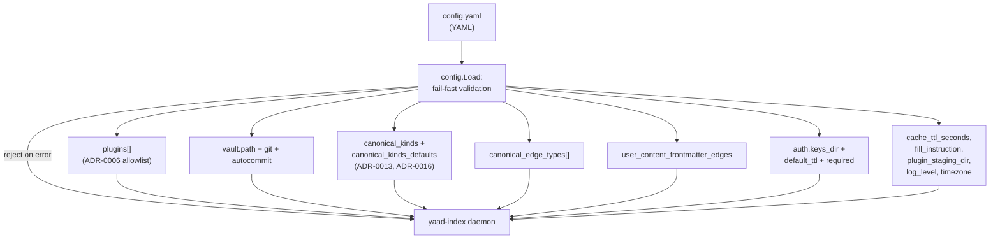

# Configs

Agent-facing reference for the operator config surface: the `config.yaml` shape the daemon reads at startup, the validation rules each block enforces, and how each entry feeds the runtime. Audience is agents that read live config to know what the operator declared + agents-via-operators debugging unexpected gap shapes or rejected ingests.

This is a **living reference** (not an ADR). Decision-grounded — each block names the ADR that owns the rule.

For per-feature surfaces that consume the config see [`docs/ingest.md`](./ingest.md) (plugins allowlist + canonical-kind registry at ingest time) and [`docs/fill-gap.md`](./fill-gap.md) (gap-shape validation at fill time). For the workflow engine's complementary file format see [`docs/workflows.md`](./workflows.md) (forthcoming).

## Big picture



`config.Load` is fail-fast: any validation error rejects the entire config and the daemon doesn't start. Operators see a structured error pointing at the offending field. ADRs: [ADR-0006](../adr/0006-plugin-discovery-config-allowlist.md) (allowlist + first-match-wins), [ADR-0013](../adr/0013-canonical-kind-owns-gap-contract.md) (canonical-kind owns gap contract), [ADR-0016](../adr/0016-canonical-kind-defaults.md) (defaults + plugin-driven activation).

## 1. File location

Default path: `~/.config/yaad-index/config.yaml`. Override via `--config <path>` or `YAAD_INDEX_CONFIG=<path>`. The daemon reads exactly one file; there is no per-directory cascade.

The path resolves at startup; a missing file is OK only when the agent / operator hasn't requested any config-dependent surface (no plugins, no canonical kinds). Most production deployments pass `--config` explicitly.

## 2. Top-level shape

```yaml
plugins:                              # ADR-0006 allowlist (ordered)
  - name: yaad-wikipedia
    path: /opt/yaad/yaad-wikipedia

vault:                                # ADR-0008 vault root
  path: /home/operator/vault
  auto_commit: true
  auto_push: false
  committer_name: "yaad-index"
  committer_email: "yaad@local"

canonical_kinds:                      # ADR-0013 per-kind gap registry
  boardgame:
    gaps:
      rating:
        type: int
        description: "your 1-10 rating"
        range: [1, 10]
        fill_strategy: operator
      designed_by:
        type: canonical_type
        description: "the designer"
        kinds: [person]
        fill_strategy: agent
    instruction:
      enabled: true
      text: "Be brief."

canonical_kinds_defaults:             # ADR-0016 root-level defaults
  gaps:
    external_url:
      type: string
      description: "canonical URL if known"
  instruction:
    enabled: true
    text: "Skip if absent."

canonical_edge_types:                 # operator-declared edge vocabulary
  - is_about
  - is_a
  - designed_by

user_content_frontmatter_edges:       # UGC frontmatter → canonical edge
  designer:
    edge_type: designed_by
    target_kind: person

auth:                                 # ADR-0019 auth surface
  keys_dir: /etc/yaad-index/keys
  default_ttl: 2160h
  required: true

plugin_staging_dir: /var/lib/yaad/staging   # ADR-0014 attachment staging
cache_ttl_seconds: 86400                    # global cache TTL
fill_instruction: "Be concise."             # global fill prompt prefix
log_level: info                             # debug / info / warn / error
timezone: "Europe/Berlin"                   # daemon TZ
```

Every block is optional except as noted in §11. Empty blocks evaluate to "no config for this surface" and the daemon proceeds with the per-block default.

## 3. `plugins:` — the allowlist (ADR-0006)

```yaml
plugins:
  - name: yaad-wikipedia
    path: /opt/yaad/yaad-wikipedia
  - name: yaad-bgg
    path: /opt/yaad/yaad-bgg
  - name: yaad-gmail
    path: /opt/yaad/yaad-gmail
  - name: yaad-github
    path: /opt/yaad/yaad-github
```

The four entries above are the bundled plugins this monorepo ships (also baked into the container image at `/usr/local/lib/yaad-index/plugins/<name>`). Per-plugin env-var requirements + sample config blocks live in [`config.yaml.example`](../config.yaml.example) and the per-plugin docs at [`docs/plugins/`](plugins/).

Each entry: `{name, path}`.

- `name` — plugin identifier the daemon logs + reports through `/v1/plugins`.
- `path` — **absolute** path to the executable. ADR-0006 explicitly rejects relative paths, PATH search, and `~/` shell expansion.

**Order matters.** The daemon dispatches URLs to plugins via first-match-wins (per ADR-0006 §"Dispatch order"). Earlier entries claim ambiguous URLs before later ones; the list shape (not a map) is deliberate because Go map iteration is randomized and would scramble dispatch priority.

**Validation at Load time:**

- Missing `path` → reject.
- Relative path → reject (must be absolute).
- File doesn't exist OR not executable OR is a directory → reject.

A rejected `plugins:` block fails the entire config; the daemon refuses to start.

### 3.1 Per-plugin `config:` sub-block (ADR-0006 §"Per-plugin config delivery")

Each plugin entry MAY carry a structured `config:` sub-block. Arbitrary YAML structure is accepted (scalars, lists, nested maps); the plugin owns its schema:

```yaml
plugins:
  - name: github
    path: /opt/yaad/yaad-github
    config:
      repos: [acme/proj, beta/widget]
      recent_days: 7
      base_url: https://api.github.com
```

**How the plugin reads it.** At subprocess spawn the daemon JSON-marshals the whole block and delivers it as a single env var named `YAAD_PLUGIN_CONFIG`. Every plugin reads the same name; per-subprocess env isolation keeps the value scoped to its target. The plugin does one `os.Getenv("YAAD_PLUGIN_CONFIG")` + `json.Unmarshal` into its own struct on startup.

**Schema declaration + validation.** Each plugin's `--init` capabilities document MAY include a `config_schema` field (JSON Schema draft 2020-12). The daemon validates the operator's `config:` block against the schema at registry-load time and fails fast on mismatch — operators see the violation in the startup log, not at first ingest. Plugins without a declared schema get their config passed through unvalidated.

**Daemon-injected fields.** The daemon writes reserved `_`-prefixed keys into the JSON payload before delivery:

- `_name` — the entry's `name:` value, so multi-instance plugins (e.g. `github-personal` / `github-work`) read their instance identity without operator-side duplication.

Operator keys starting with `_` are rejected at Load (a defensive guard against shadowing daemon-injected fields). The `_`-prefix is reserved for daemon-injected fields generally; future iterations may inject additional fields under the same convention without per-field design decisions.

**Secrets stay in the daemon's process env**, not the `config:` block. The yaml file typically lands in ops/SCM; tokens / passwords / etc. live at the daemon-process layer (docker `-e`, systemd `EnvironmentFile`, …). The daemon passes its env to subprocesses by default, so the plugin reads `os.Getenv("YAAD_GITHUB_TOKEN")` directly.

The two channels are explicit: `config:` for structured non-secret values that benefit from yaml-shaped expression (lists, maps); daemon-process env for secrets.

## 4. `vault:` — the source-of-truth root (ADR-0008)

```yaml
vault:
  path: /home/operator/vault
  auto_commit: true                  # optional; nil → auto-detect via .git/
  auto_commit_debounce_seconds: 5    # optional; 0 → per-op commit
  auto_push: false                   # optional
  committer_name: "yaad-index"
  committer_email: "yaad@local"
```

- `path` — absolute path to the markdown vault root.
- `auto_commit` — tri-state `*bool`. `nil` → auto-detect: enable iff `<path>/.git/` exists. `true` → enable; reject if `.git/` missing. `false` → disable regardless of `.git/`. Operators with a non-git vault leave the field unset.
- `auto_commit_debounce_seconds` — 0 → per-operation commit. >0 → bursty writes collapse into batched commits (`bulk: ingest 12 entities, fill 3, note 2`).
- `auto_push` — when true and `auto_commit` enabled, the daemon `git push`'s after each commit batch.
- `committer_name` / `committer_email` — git author stamped on auto-commits.

**Validation:**

- Path must be absolute, exist, and be a directory.
- `auto_commit=true` with no `.git/` subdirectory → reject.
- Missing `vault:` is OK; callers that need a vault (reindex, ingest with vault-side mirror) surface their own errors.

## 5. `canonical_kinds:` + `canonical_kinds_defaults:` (ADR-0013 + ADR-0016)

The operator's canonical-kind registry. ADR-0013 §1 makes each canonical kind the owner of its gap vocabulary; ADR-0016 layers in defaults + plugin-driven activation.

### 5.1 Per-kind shape

```yaml
canonical_kinds:
  boardgame:
    gaps:
      rating:
        type: int
        description: "your 1-10 rating"
        range: [1, 10]
        fill_strategy: operator
      designed_by:
        type: canonical_type
        description: "the designer"
        kinds: [person]
        fill_strategy: agent
      summary:
        type: string
        description: "one-line description"
        max_length: 200
        fill_strategy: both
      knows_how_to_play:
        type: enum
        description: "your familiarity"
        values: [no, partial, yes]
        fill_strategy: operator
    instruction:
      enabled: true
      text: "Be brief; one short paragraph max."
```

- Key (`boardgame`) — canonical kind name. Shape: `[a-z][a-z0-9_]*(-[a-z0-9_]+)*` (lowercase + digits + hyphens between groups). Hyphens permitted for plugin-emitted multi-word kinds like `tv-show`, `email-address`, `film-series`.
- `gaps` — map of gap-field name → `GapSpec`. See §5.2.
- `instruction` — per-kind AI-fill instruction. Pointer-shape `*InstructionSpec`: absence inherits from `canonical_kinds_defaults`; explicit `{enabled: false}` opts out.

### 5.2 GapSpec shape (per gap)

```yaml
gap_name:
  type: int | string | enum | canonical_type
  description: "agent-facing fill prompt"
  prompt: "alias of description"
  fill_strategy: agent | operator | both
  # type-specific:
  range: [min, max]            # int only; optional
  max_length: N                # string only; optional
  values: [allowed, list]      # enum only; required
  kinds: [person, ...]         # canonical_type only; required; "*" accepted
```

- `type` — the value shape. `string`/`int`/`enum`/`canonical_type`. Default `string` when omitted.
- `description` — agent-facing fill prompt. `prompt:` is an accepted alias (one or the other; not both).
- `fill_strategy` — `agent` / `operator` / `both`. Default `both`.
- `range` — integer pair; `int`-type gaps only; inclusive bounds.
- `max_length` — character cap; `string`-type gaps only.
- `values` — allowlist; **required** for `enum`-type gaps.
- `kinds` — canonical-kind allowlist; **required** for `canonical_type` gaps. Accepts `["*"]` (wildcard: any kind in the operator's full registry) or an explicit list (`["person", "company"]`). Wildcard mixed with explicit kinds is rejected.

The shorthand pre-ADR-0016 shape `rating: "your 1-10 rating"` (bare string description) still parses via custom `UnmarshalYAML` — existing operator configs migrate without rewrite. The shorthand decodes to `{type: string, description: "..."}`.

### 5.3 Defaults shape

```yaml
canonical_kinds_defaults:
  gaps:
    external_url:
      type: string
      description: "canonical URL if known"
  instruction:
    enabled: true
    text: "Skip if absent."
```

The root-level defaults merge into every per-kind block per ADR-0016 §3's four-layer hierarchy:

1. Code defaults (built into yaad-index).
2. Plugin extras (from each plugin's `--init` `canonical_kinds_emitted`).
3. Operator defaults (this block).
4. Operator per-kind (the `canonical_kinds[<name>]` block).

Later layers override earlier ones on key collision. The merged result is what `/v1/needs-fill`, `/v1/structure`, and the AI-fill prompt surface read.

### 5.4 Plugin-driven activation (ADR-0016 §plugin-driven-activation)

A plugin that declares `canonical_kinds_emitted: [person, boardgame]` in `--init` **auto-activates** those kinds in the merged registry — operators do NOT need to re-declare them in `canonical_kinds:` to enable. The operator block ADDS to the merged set; it never REMOVES plugin-emitted kinds.

This means three operator-side patterns are valid:

1. **Empty `canonical_kinds:`** — operator relies entirely on plugin activations; the registry equals the union of plugin emissions.
2. **Operator adds new kinds** — operator declares kinds no plugin emits (e.g. `meal` for a personal-notes flow).
3. **Operator extends plugin-emitted kinds** — operator adds gaps to a plugin-emitted kind (e.g. `rating: { type: int }` on `boardgame` even though yaad-bgg only emits the kind without gaps).

### 5.5 Validation

Per `GapSpec.Validate`:

- Unknown `type` → reject.
- `fill_strategy` not in `{agent, operator, both}` → reject.
- `canonical_type` without non-empty `kinds` → reject.
- Non-`canonical_type` with `kinds` set → reject (cross-field guard).
- `enum` without non-empty `values` → reject.
- `range` set on non-`int` type → reject.
- `max_length` set on non-`string` type → reject.
- Wildcard `kinds: ["*"]` mixed with explicit kinds → reject.

Validation runs at config Load time. Operator typos fail server start.

## 6. `canonical_edge_types:` — operator-declared edge vocabulary

```yaml
canonical_edge_types:
  - is_about
  - is_a
  - designed_by
  - tagged_as
```

Flat string list of canonical edge types the operator's vault layer accepts. Plugin-emitted edges union with this set per ADR-0016 §plugin-driven-activation — `yaad-bgg` emitting `designed_by` activates the edge type automatically; the operator declares only what plugins don't emit.

Workflow `add_canonical_edge` actions (#132) validate their literal `edge_type` against this list (PLUS the plugin-emitted set) at workflow-load time. Unknown values reject the workflow file.

The `CanonicalGuard` (per ADR-0013 §1) gates every edge create against `canonical_edge_types ∪ plugin_emitted_edge_types`. Edges to unknown types log + drop with a counter; vault writes don't carry them.

## 7. `user_content_frontmatter_edges:` — UGC frontmatter mapping

```yaml
user_content_frontmatter_edges:
  designer:
    edge_type: designed_by
    target_kind: person
  setting:
    edge_type: takes_place_in
    target_kind: city
```

Map of UGC frontmatter field-name → `{edge_type, target_kind}`. When the operator creates a UGC entity via `/v1/user-content/` with frontmatter like:

```yaml
designer: Uwe Rosenberg
setting: Tehran
```

The daemon derives canonical edges:

- `<ugc-id> -[designed_by]-> person:uwe-rosenberg`
- `<ugc-id> -[takes_place_in]-> city:tehran`

Same `{name, kind}` slug derivation rule as plugin emissions per ADR-0021. Empty / missing → derivation is a no-op (UGC frontmatter still parses; no edges synthesized).

## 8. `auth:` — auth keys + token TTL

```yaml
auth:
  keys_dir: /etc/yaad-index/keys
  default_ttl: 2160h
  required: true
```

- `keys_dir` — directory holding `private.pem` + `public.pem`. The `yaad-index issue-token` subcommand signs tokens with the private key; the HTTP middleware verifies with the public key. Empty / unset → `/etc/yaad-index/keys/` (CLI / env layer resolves the default).
- `default_ttl` — duration the `issue-token` CLI uses when `--ttl` isn't passed. Go `time.ParseDuration` syntax: `ns`/`us`/`ms`/`s`/`m`/`h` only (no `d` suffix). Empty / unset → `2160h` (90 days).
- `required` — tri-state `*bool` on the HTTP middleware. `true` (default) → reject unauthenticated requests. `false` → allow anonymous. `nil` → falls through the CLI > env > config > default-true precedence chain.

Validation at Load time is deliberately minimal: empty values are valid (the CLI layer fills defaults); a non-empty `keys_dir` is NOT stat'd here because the keygen subcommand may run before the directory exists.

### Key + token layout

```
<keys_dir>/
├── private.pem            # ed25519 signing key
└── public.pem             # ed25519 verifying key
```

The `yaad-index issue-token --subject <agent-id> --operator <human-id> --ttl <duration>` subcommand mints a pair-claim JWT. Subject = the agent calling the API; Operator = the human authorizing the call. Both name real identities; agent-only tokens (no operator claim) reject from operator-only surfaces (per ADR-0019 §"Operator-authority gate").

## 9. Misc top-level keys

| Key                        | Type    | Role                                                                                                                  |
|----------------------------|---------|-----------------------------------------------------------------------------------------------------------------------|
| `plugin_staging_dir`       | string  | Absolute path where plugins stage attachments (ADR-0014). Plugins write under `<staging>/<message-id>/...`.            |
| `cache_ttl_seconds`        | int     | Global notation-cache TTL (sentinel rules: `>0` = N seconds, `0` = "no opinion fall through", `<0` = infinite). Per ADR-0008's derived-index principle. |
| `fill_instruction`         | string  | Global fill-prompt prefix surfaced in `/v1/needs-fill`'s `instruction` field when no per-kind override exists.        |
| `log_level`                | string  | `debug` / `info` / `warn` / `error`. Default `info`. Unknown values fall back to `info` (no fail-loud on typo).        |
| `timezone`                 | string  | IANA TZ name (`Europe/Berlin`). Stamps timestamps on auto-commit messages + task spawns. Default UTC.                 |

## 10. Effective shape vs config shape

The daemon's runtime registries do NOT equal the config file 1:1. Three transformations land between Load and runtime:

- **`mergedRegistry`** = `MergeCanonicalRegistry(code_defaults, plugin_emitted_kinds, canonical_kinds_defaults, canonical_kinds)`. The merged result drives `/v1/needs-fill`, `/v1/structure`, the AI-fill prompt, and the CanonicalGuard's kind-allowlist.
- **`enabledEdgeTypes`** = `canonical_edge_types ∪ plugin_emitted_edge_types`. The CanonicalGuard's edge-allowlist.
- **`canonicalKindNames(mergedRegistry)`** — the set of kind names the system accepts. The CanonicalGuard rejects edge creates to unknown kinds.

Inspect the resolved state at runtime via `/v1/structure` (operator-facing snapshot) or `/v1/cv-status` (canonical-validation drift counter — surfaces plugin-emitted kinds / edges the operator hasn't declared, when relevant).

## 11. Where to look when config fails to validate

| Symptom                                                | First look                                                                                              |
|--------------------------------------------------------|---------------------------------------------------------------------------------------------------------|
| Server refuses to start with config error              | `journalctl` / stderr names the offending field + the validation rule it broke. Fix that field.         |
| Plugin not dispatched on URLs it should claim          | `plugins:` order — first-match-wins. Move it earlier OR check its `--init` `url_patterns`.              |
| Auto-commit unexpectedly disabled                      | `vault.auto_commit` tri-state: `nil` auto-detects on `.git/`. Run `git init` in the vault or set `false`. |
| Gap doesn't surface on `/v1/needs-fill`                | Gap's `fill_strategy` may not match the audience (agent vs operator). Check `gap_metadata.<gap>.fill_strategy`. |
| Edge create dropped silently                           | `canonical_edge_types` (∪ plugin emitted) doesn't include the type. `/v1/cv-status` shows the drift.    |
| Canonical kind appears in `/v1/structure` but operator didn't declare it | A plugin's `canonical_kinds_emitted` activated it (ADR-0016). No operator action needed.                 |
| `instruction:` text not appearing on fill prompts      | Pointer-shape `*InstructionSpec`. `nil` inherits from defaults; `{enabled: false}` opts the kind out.   |
| `fill_strategy: agent` on `type: enum` accepted but no value chosen | Validation accepts; runtime expects the agent to pick one of `values`. Confirm `values:` is non-empty.    |
| UGC frontmatter field doesn't derive an edge           | Check `user_content_frontmatter_edges` for the field. The mapping is required; bare frontmatter doesn't auto-derive. |

## 12. ADRs that govern this surface

- [ADR-0006](../adr/0006-plugin-discovery-config-allowlist.md) — plugin allowlist + first-match-wins.
- [ADR-0008](../adr/0008-vault-as-source-of-truth.md) — vault as source of truth.
- [ADR-0013](../adr/0013-canonical-kind-owns-gap-contract.md) — canonical-kind owns gap contract.
- [ADR-0014](../adr/0014-plugin-attachment-contract.md) — attachment staging directory.
- [ADR-0016](../adr/0016-canonical-kind-defaults.md) — defaults + plugin-driven activation.
- [ADR-0019](../adr/0019-operator-fill.md) — operator-fill + auth pair-claim model.
- [ADR-0021](../adr/0021-daemon-owns-slug.md) — daemon owns slug derivation.
