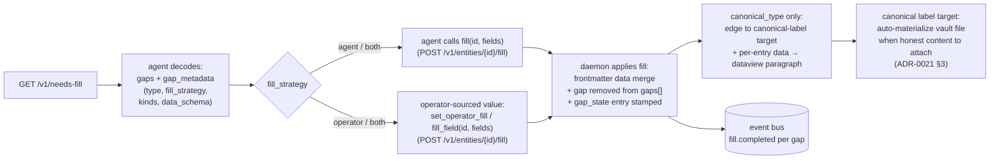

# Fill-gap

Agent-facing reference for the gap-fill surface: how an entity declares missing fields, how the agent or operator closes those fields, and what happens on disk + in the DB after a fill lands. Audience is agents calling the MCP `fill` / `set_operator_fill` tools and operators-via-agents debugging unexpected fill behaviour.

This is a **living reference** (not an ADR). Decision-grounded — every step cites the ADR that governs it.

For the ingest path that produces gaps in the first place, see [`docs/ingest.md`](./ingest.md). For the MCP tool surface as a whole, see [`mcp/SKILL.md`](../mcp/SKILL.md).

## Big picture



ADRs governing this surface: [ADR-0008](../adr/0008-vault-as-source-of-truth.md) (vault-as-SoT), [ADR-0013](../adr/0013-canonical-kind-owns-gap-contract.md) (canonical-kind owns the gap contract), [ADR-0019](../adr/0019-operator-fill.md) (operator-fill + per-gap state), [ADR-0021](../adr/0021-daemon-owns-slug.md) (canonical labels + auto-materialize policy).

## 1. Gap shape

A **gap** is a missing field on an entity. The entity's vault frontmatter carries two related lists:

```yaml
gaps:
  - rating
  - hiring_alert_for
gap_state:
  rating: { source: operator, filled_at: "2026-05-08T16:30:00Z" }
  hiring_alert_for:
    data_schema:
      role: "the role title in the hiring alert"
      salary: "salary range if mentioned, else omit"
```

- `gaps:` — list of open gap names. A name disappears from this list once the gap is filled (or stays if the gap is `deferred`).
- `gap_state:` — per-gap state map. Records who filled (`source: agent | operator`), when (`filled_at`), whether deferred (`deferred: true` + `deferred_at`), and (for `canonical_type` gaps) the workflow-injected `data_schema` per [#117](../adr/0024-workflows-and-tasks.md) that drives the agent's per-key extraction.

Per [ADR-0013](../adr/0013-canonical-kind-owns-gap-contract.md), gap shapes are declared by the operator's `canonical_kinds:` config. Each gap on each canonical kind names:

- `type` — the value shape the gap expects (see §2).
- `description` — the agent-facing fill prompt (`prompt:` alias accepted).
- `fill_strategy` — who's allowed to fill (see §3).
- Type-specific shape — `range`, `max_length`, `values`, `kinds` (see §2).

## 2. Gap types

| Type             | Value shape                                                                                                       | Type-specific keys             |
|------------------|-------------------------------------------------------------------------------------------------------------------|--------------------------------|
| `string`         | Plain string                                                                                                      | `max_length` (optional)        |
| `int`            | Integer                                                                                                           | `range: [min, max]` (optional) |
| `enum`           | One of a fixed allowlist                                                                                          | `values: [...]` (required)     |
| `canonical_type` | List of `{name, kind, data?}` objects; daemon slugifies each `name` and creates an edge per ADR-0021              | `kinds: [...]` (required)      |

The `string`/`int`/`enum` shapes are scalar single-valued fills. `canonical_type` is the polymorphic shape:

### canonical_type gap shape

```yaml
gaps:
  designed_by:
    type: canonical_type
    description: "the designer of this game"
    kinds: [person]
    fill_strategy: agent
```

The fill value is a list:

```json
{ "designed_by": [{ "name": "Uwe Rosenberg", "kind": "person" }] }
```

The daemon's behaviour per [ADR-0021](../adr/0021-daemon-owns-slug.md):

1. Slugify each `name` via `slug.Slug` → canonical id `<kind>:<slug>`.
2. Create an edge from the source entity to each canonical label (`designed_by → person:uwe-rosenberg`).
3. Persist the list of canonical-label IDs in the source entity's frontmatter `data:` (or the edge graph, depending on the data shape).
4. If a per-entry `data: {...}` map is present (#119), append a sorted-key dataview paragraph to each target canonical entity's body (see §6).

The `kinds:` allowlist gates which canonical kinds the agent may use:

- `kinds: [person]` — only `person` accepted; `{kind: company}` rejected.
- `kinds: ["*"]` — wildcard; any kind in the operator's `canonical_kinds:` registry per ADR-0008.

ADR refs: [ADR-0013](../adr/0013-canonical-kind-owns-gap-contract.md), [ADR-0019](../adr/0019-operator-fill.md), [ADR-0021](../adr/0021-daemon-owns-slug.md).

## 3. Fill strategies

| `fill_strategy` | Surfaces on `/v1/needs-fill` for                  | Who calls the fill                              |
|-----------------|---------------------------------------------------|-------------------------------------------------|
| `agent`         | Agent-only `needs_fill` listings                  | Agent-trigger `fill_field` / `fill`             |
| `operator`      | Operator-only `needs_fill` listings               | Operator-trigger `fill_field`                   |
| `both`          | Both audiences                                    | Either trigger-mode                             |

The endpoint applies the audience filter at response-build time (`buildNeedsFillEntry` in `internal/api/needs_fill.go`). A gap whose `fill_strategy: operator` is invisible to an agent's `needs_fill()` call; the agent can't accidentally write into it.

ADR refs: [ADR-0019](../adr/0019-operator-fill.md) §"Fill strategy".

## 4. Discovering work: `/v1/needs-fill`

Pull-based batch endpoint. Returns up to `limit` entities (default 50, max 200) with at least one open gap matching the caller's audience.

Request:

```
GET /v1/needs-fill?limit=50&cursor=<base64>&exclude=canonical_vocabulary,clean_content
```

`exclude` is optional (default empty — include everything); see "Caching agents" below.

Response:

```json
{
  "ok": true,
  "canonical_vocabulary": { "person": { ... } },
  "entities": [
    {
      "id": "boardgame:caverna",
      "kind": "boardgame",
      "gaps": {
        "designed_by": "the designer of this game",
        "rating":      "your 1-10 rating"
      },
      "gap_metadata": {
        "designed_by": {
          "type":          "canonical_type",
          "fill_strategy": "agent",
          "kinds":         ["person"]
        },
        "rating": {
          "type":          "int",
          "fill_strategy": "operator",
          "range":         [1, 10]
        },
        "hiring_alert_for": {
          "type":          "canonical_type",
          "fill_strategy": "agent",
          "kinds":         ["company"],
          "data_schema": {
            "role":      "the role title in the hiring alert",
            "salary":    "salary range if mentioned, else omit",
            "work_mode": "remote / hybrid / onsite if mentioned, else omit"
          }
        }
      },
      "clean_content": "...article body...",
      "clean_content_truncated": false,
      "instruction": "extract structured fields per the schema"
    }
  ],
  "next_cursor": "..."
}
```

Field roles:

- `canonical_vocabulary` (response-root, per #275) — the operator's `canonical_kinds:` registry shape, surfaced once per response so the agent's UI sees the kind allowlist for `kinds: ["*"]` gaps at fill-prompt time. Pre-#275 this field was repeated per-entry, which blew agent-context windows when the kind set grew.
- `gaps` — name → fill-prompt map. The agent's per-field LLM call uses each value as the extraction instruction.
- `gap_metadata` — typed metadata sibling. Same key set as `gaps`. Drives prompt construction beyond the bare prompt string:
  - `type` / `fill_strategy` / `range` / `max_length` / `values` — gap-spec mirror from `canonical_kinds:`.
  - `kinds` — for `canonical_type` gaps, the canonical-kind allowlist (or `["*"]`).
  - `data_schema` — for `canonical_type` gaps with per-entry data, the workflow-injected per-key extraction guidance (#117). Surfaces only when a workflow's `add_gap` action injected the schema; gaps without it omit the field.
- `clean_content` — the source body the agent extracts from. The plugin's `raw_content` after marker stripping.
- `instruction` — top-level fill instruction (operator-configured per-kind override + global fallback).

**Caching agents** can opt out of receiving fields they've already cached:

- `?exclude=canonical_vocabulary` — drop the top-level registry block (re-fetch once from `/v1/structure` or `/v1/kinds` at session start instead).
- `?exclude=clean_content` — drop the per-entry body (fetch on demand from `/v1/entities/<id>` per entity).
- `?exclude=canonical_vocabulary,clean_content` — both.

Unknown field names are silently ignored (forward-compatible with future fields).

The MCP tool `needs_fill(limit?, cursor?, exclude?)` returns this verbatim — no client-side filtering, no auto-pagination.

ADR refs: [ADR-0002](../adr/0002-api-surface.md) §"Pull-based batch endpoints", [ADR-0013](../adr/0013-canonical-kind-owns-gap-contract.md), [ADR-0019](../adr/0019-operator-fill.md).

## 5. Filling: MCP tools

Two MCP tools cover the fill surface, both thin wrappers over the HTTP endpoints. See `mcp/SKILL.md` for the full tool catalogue.

### `fill(id, fields)` — agent fill

```ts
fill("boardgame:caverna", {
  designed_by: [{ name: "Uwe Rosenberg", kind: "person" }],
  artist_by:   [{ name: "Klemens Franz",  kind: "person" }]
});
```

Maps to `POST /v1/entities/{id}/fill`. The handler:

1. Validates each field against its `gap_metadata.type` + the type-specific shape (range / max_length / values / kinds).
2. Acquires the per-entity write-lock.
3. Reads the vault file; merges the new fields into frontmatter `data:`. For `canonical_type` fields the merged value is the **canonical-label ID list** (`["person:uwe-rosenberg"]`) — the raw `[{name, kind, data}]` shape is projected to IDs at the persist step (`canonicalLabelEntryIDs` helper). Per-entry `data:` does NOT land on the source's frontmatter; it flows to the target canonical entity's body per §6.
4. For `canonical_type` fields: slugifies each `{name, kind}` and creates an edge per element (idempotent — re-fills don't duplicate edges).
5. Removes each filled gap name from `gaps:` and stamps the `gap_state[<gap>]` entry with `source: agent`, `filled_at: <now>`.
6. Writes the vault file, mirrors to the store.
7. For `canonical_type` fields carrying per-entry `data: {...}`: appends one dataview paragraph to each target canonical entity's body (see §6).
8. Publishes one `fill.completed` event per gap filled.

A fill that fails type validation rejects the WHOLE request (no partial writes) and leaves both vault + store untouched.

### `fill_field(id, fields)` — unified fill (replaces `set_operator_fill`)

```ts
fill_field("boardgame:caverna", {
  rating: 9,
  owned:  true
});
```

Maps to `POST /v1/entities/{id}/fill` — the unified endpoint per [ADR-0029](../adr/0029-unified-fill-surface.md). Same flow as `fill` with three case-routing branches per submitted field:

- **Open gap** — the strategy gate is **one-directional** (per the [ADR-0029](../adr/0029-unified-fill-surface.md) §3 #521 amendment). The trigger-mode is **operator** when the caller's JWT has `Subject == Operator` **or** carries the `operator_delegated` claim (an agent token the operator confirmed via the agent skill UI — minted with `issue-token --on-behalf-of-operator`, per #361); otherwise it is **agent**. An **operator-strategy** gap accepts a write under *either* trigger-mode — `fill_strategy: operator` annotates the value's source (operator input, surfaced out-of-band and written by the agent on the operator's confirmed behalf), not who may execute the write. An **agent-strategy** gap rejects operator-trigger writes with `400 agent_only_field`. Either-strategy gaps are open to both. `operator_only_field` is no longer emitted.
- **Overwrite** — a field with an existing value (gap previously closed) rejects with `409 already_filled` unless `?force=true` is set.
- **Ad-hoc** — a brand-new field (no spec, no value, no current gap) accepts the write only under operator-trigger; agent-trigger ad-hoc writes reject with `400 unknown_field`.

`gap_state[<gap>].source` is stamped as `operator` or `agent` per the request's trigger-mode.

The unified endpoint is also the **deliberate-create path** for canonical labels (per ADR-0021 §3): a fill against a canonical-label target with no vault file auto-creates the file before applying the fill. The frontmatter carries the fill values; subsequent fills merge in-place.

The related **defer** surface is `defer_gap(id, gap)`, which now POSTs to the same unified endpoint as `{<gap>: {"defer": true}}`. The deferred flag flips on, the gap stops surfacing on `needs_fill` for either audience. A subsequent fill on the deferred gap un-defers it (the deferred flag clears, source/filled_at land).

`set_operator_fill` remains as a compat alias for one minor version after the cut; its handler now dispatches through `fill_field`. New work should prefer the `fill_field` name.

The pre-#355 standalone `POST /v1/entities/{id}/operator-fill` URL is removed (returns `410 gone` with a `Location` header pointing at `/v1/entities/{id}/fill`). Callers that wrote against the operator-fill URL replay the same body against the unified endpoint.

ADR refs: [ADR-0029](../adr/0029-unified-fill-surface.md), [ADR-0019](../adr/0019-operator-fill.md) (superseded), [ADR-0021](../adr/0021-daemon-owns-slug.md) §3.

## 6. Per-entry `data` on `canonical_type` (the dataview path)

`canonical_type` fills MAY carry an optional `data: {...}` map per entry (per #119):

```json
{
  "designed_by": [
    {
      "name": "Uwe Rosenberg",
      "kind": "person",
      "data": {
        "role":      "lead designer",
        "co_player": "alice",
        "year":      "2024"
      }
    }
  ]
}
```

The daemon's behaviour:

1. Source entity's frontmatter `data.designed_by` persists only the ID list (`["person:uwe-rosenberg"]`). The per-entry `data:` does NOT land on the source's frontmatter.
2. For each entry with non-empty `data:`, the daemon:
   - Renders a sorted-key dataview-inline paragraph: `co_player:: alice  role:: lead designer  year:: 2024`.
   - Hashes the sorted-key shape for dedup.
   - Acquires the per-target write-lock on the canonical label's vault file (auto-materializes if missing — see §7).
   - Appends the paragraph to the target's body between `<!-- yaad:dataview start -->` / `<!-- yaad:dataview end -->` markers, unless the same hash is already present (idempotent — re-fills with identical data skip the append; different data accumulates as a history-of-events).
   - Publishes a `fill.completed` event scoped to the TARGET canonical entity (`entity_id=person:uwe-rosenberg`, `gap=designed_by`).

The workflow's `add_gap.data_schema` (per #117) shapes which keys the agent's fill prompt extracts. Reading from `/v1/needs-fill`'s `gap_metadata.<gap>.data_schema` gives the agent the per-key extraction instructions inline; the LLM uses each instruction to decide what to extract per key.

ADR + spec refs: [ADR-0015](../adr/0015-plugin-body-markers.md) (marker-pair pattern extended for `yaad:dataview`), [ADR-0021](../adr/0021-daemon-owns-slug.md) §3 (auto-materialize trigger set), `#117` (workflow `add_gap.data_schema`), `#119` (canonical_type per-entry data).

## 7. Auto-materialize: when canonical labels get a vault file

Per [ADR-0021](../adr/0021-daemon-owns-slug.md) §3, a canonical label is a **pure pointer** by default — the edge graph references it without a vault file existing. The label's vault file at `{ROOT}/ct/<kind>/<slug>.md` materializes when there's substantive content to attach. Three triggers today (the "honest content to attach" set):

1. **Operator-fill on an operator-strategy gap** (per ADR-0019). `set_operator_fill` against a canonical-label target with no vault file: daemon auto-creates the file before applying the fill. The frontmatter carries the fill values; subsequent operator-fills merge in-place.
2. **Note authored on a canonical label** (per ADR-0021 §3 + ADR-0015 extension). The note lands inside the `yaad:notes` marker pair. Note authoring **does NOT create entities from nothing**: if no DB row exists, note requests return 404. The vault file materializes only when the thin DB row already exists (typically from an ingest-time materialization), and only when the note carries an operator-claim token (agent-only tokens with no operator claim do NOT trigger note-path materialization).
3. **Dataview-paragraph-append from canonical_type fill** (per #119). Structured per-event content (with its own dedup key + provenance) is treated as substantive — the vault file auto-materializes on first paragraph append regardless of token claim shape (the workflow YAML carries the structured-data intent; this is not a "casual" action).

Outside these triggers a canonical label stays a pure pointer. Edges pointing AT a canonical label are unaffected by whether the label has a vault file.

ADR refs: [ADR-0021](../adr/0021-daemon-owns-slug.md) §3, [ADR-0019](../adr/0019-operator-fill.md), [ADR-0015](../adr/0015-plugin-body-markers.md).

## 8. After a fill lands

For each gap that lands, the daemon publishes a `fill.completed` event to the in-process bus:

```json
{
  "type":      "fill.completed",
  "entity_id": "boardgame:caverna",
  "gap":       "designed_by",
  "source":    "agent",
  "value":     [{"name": "Uwe Rosenberg", "kind": "person"}],
  "filled_at": "2026-05-17T11:00:00Z"
}
```

The workflow engine subscribes to `fill.completed` and re-evaluates any workflow whose `trigger: { type: fill_completed }` matches. Workflows can chain fills (one fill landing triggers another workflow that adds a follow-up gap via `add_gap`, dispatches a `plugin_dispatch` to fetch related data, opens a `task_append`, etc.). See `docs/workflows.md` (forthcoming) for the workflow engine surface.

For `canonical_type` fills carrying per-entry `data:`, one `fill.completed` event fires per LANDED paragraph (target entity scope), in addition to the source entity's per-gap event. Deduped paragraphs do not fire a separate event.

ADR refs: [ADR-0024](../adr/0024-workflows-and-tasks.md) (workflow trigger types).

## 9. Where to look when fill behaves unexpectedly

| Symptom                                              | First look                                                                                                       |
|------------------------------------------------------|------------------------------------------------------------------------------------------------------------------|
| Fill rejected with `422 unknown_gap`                 | The gap isn't open. Check `gap_state[<gap>].filled_at` — already filled; or `.deferred` — operator deferred.     |
| `fill_strategy` audience mismatch                    | Agent tried to fill a `fill_strategy: operator` gap. Use `set_operator_fill` instead.                            |
| `kinds` allowlist rejection                          | Fill element's `kind` not in the gap's `kinds`. Either widen the gap config or supply an accepted kind.          |
| Type-validation failure on the whole request         | Validation is all-or-nothing. Inspect the response error for the offending gap; nothing was written.             |
| Edge created but vault file missing on the target    | Canonical label is a pure pointer — by design. Materializes only on the §7 triggers.                             |
| Dataview paragraph didn't append on re-fill          | Sorted-key content-hash matched an existing paragraph — idempotent skip. Inspect the target body for the hash.   |
| `fill.completed` event not firing                    | Fill rejected (see error response) OR the gap was deduped on a `canonical_type` paragraph append (no event).     |
| `gap_metadata.data_schema` not in needs-fill         | The gap had no workflow-injected schema. Check the workflow YAML's `add_gap.data_schema` for the originating run.|
| Agent sees fewer gaps than expected on `needs_fill`  | Audience filter is dropping `fill_strategy: operator` gaps. Check `gap_metadata.<gap>.fill_strategy` per gap.    |
| Same gap re-appears after a successful fill          | A workflow re-added it via `add_gap` (post-fill `fill.completed` chained). Inspect workflow logs.                |

## 10. Plugin-side note: gaps come from canonical_kinds, not from plugins

Per [ADR-0013](../adr/0013-canonical-kind-owns-gap-contract.md), gap shapes are declared by the operator's `canonical_kinds:` config — NOT by plugins. A plugin that fetches a Wikipedia article does not declare what gaps a `boardgame` canonical entity has; the operator's config does. The plugin's role on the fill surface is limited to:

- Emitting `clean_content` (markdown body) on ingest. The agent reads this from `/v1/needs-fill` to drive its extraction.
- Optionally pre-populating frontmatter `data:` fields via the plugin emission's `data:` map (these become NOT-gaps from the start; the operator's `canonical_kinds:` config determines which keys are gap-shaped).

Plugin-side gap declaration was the pre-ADR-0013 shape and is no longer supported.

## 11. ADRs that govern this surface

- [ADR-0002](../adr/0002-api-surface.md) — API surface (pull-based batch endpoints).
- [ADR-0008](../adr/0008-vault-as-source-of-truth.md) — vault as source of truth (every fill writes vault first).
- [ADR-0013](../adr/0013-canonical-kind-owns-gap-contract.md) — gaps declared by canonical_kinds, not plugins.
- [ADR-0015](../adr/0015-plugin-body-markers.md) — marker-pair contract (extended to `yaad:notes` + `yaad:dataview`).
- [ADR-0019](../adr/0019-operator-fill.md) — operator-fill + per-gap state + fill strategies (SUPERSEDED by ADR-0029).
- [ADR-0029](../adr/0029-unified-fill-surface.md) — unified fill surface (collapses `/v1/fill` + `/v1/operator-fill` into a single endpoint with trigger-mode strategy gate).
- [ADR-0021](../adr/0021-daemon-owns-slug.md) — daemon owns slug; canonical labels are edge-target labels; auto-materialize policy (§3).
- [ADR-0024](../adr/0024-workflows-and-tasks.md) — workflows + fill_completed trigger.
