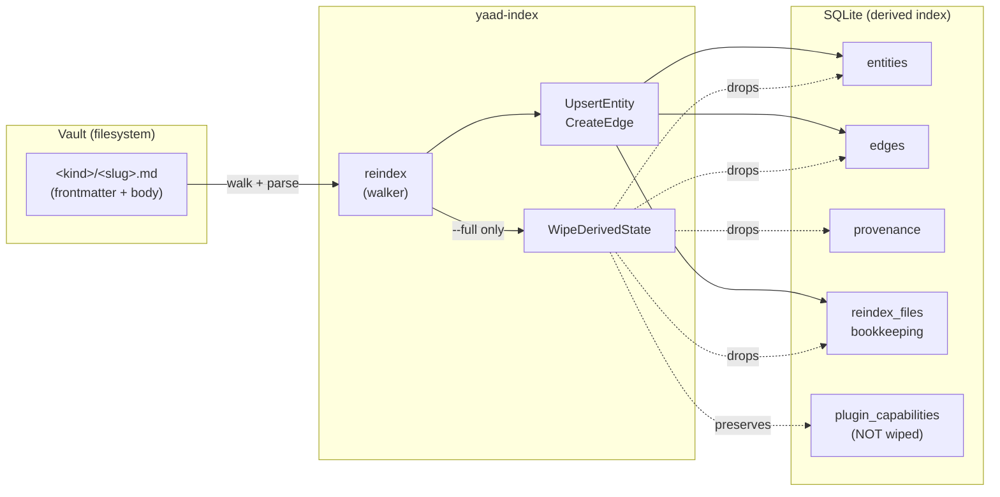
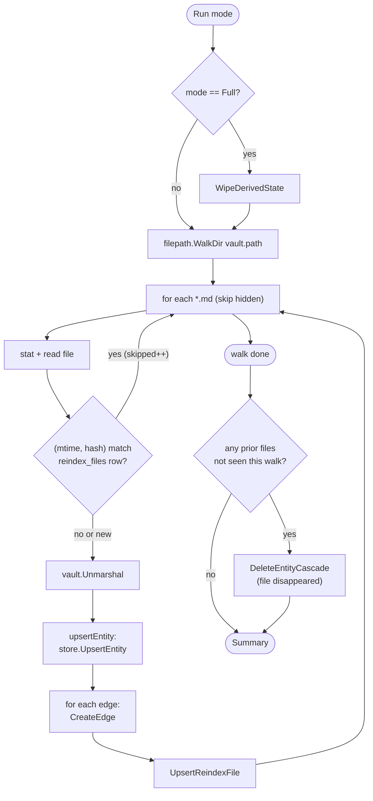

# Index flow

The end-to-end story of every index-internal surface in yaad-index — flows that DON'T touch plugins. Companion to [`docs/plugin-flow.md`](plugin-flow.md), which covers plugin-touching surfaces (startup/cache, ingest, fill, plugin contract).

This is a **living reference** (not an ADR). ADRs record decisions; this map describes how those decisions compose at runtime. When an ADR or PR changes index behavior, the same change should update this doc.

## The big picture



The vault is the source of truth. The DB is a derived index — losing it is recoverable via `yaad-index reindex`. Losing the vault is NOT recoverable from yaad-index alone (operator's responsibility: Syncthing, Git, backups).

## 1. Vault as source of truth

Per [ADR-0008](../adr/0008-vault-as-source-of-truth.md): every state mutation writes the vault FIRST, then mirrors to the DB. A vault-write failure aborts the request and leaves the DB untouched (no partial state).

### Vault file layout

```
<vault.path>/
 <kind>/
 <slug>.md ← one entity per file
```

`kind` is the entity kind (e.g. `boardgame`, `wikipedia`, `person`). `slug` is the entity ID's slug part (e.g. `boardgame:brass-birmingham` → `brass-birmingham.md`).

### Frontmatter schema

YAML frontmatter at the top of every `*.md` file:

```yaml
---
id: wikipedia:susanna-clarke
kind: wikipedia
plugin: wikipedia
aliases:
 - Susanna Clarke # bare-string per ADR-0011 + plugin-emit
notations:
 - https://en.wikipedia.org/wiki/Susanna_Clarke
 - https://en.m.wikipedia.org/wiki/Susanna_Clarke
 - "wikipedia: Susanna Clarke"
data:
 title: Susanna Clarke
 lang: en
 # ... plugin-emitted fields + agent-filled fields
gaps: [] # remaining unfilled gap field names
provenance:
 - source: wikipedia
 fetched_at: 2025-12-15T10:00:00Z
 ok: true
edges:
 - type: authored
 to: book:jonathan-strange-and-mr-norrell
comments_text: | # derived projection of note threads
 ...
created_at: 2025-12-15T10:00:00Z
updated_at: 2026-01-10T14:30:00Z
---

# Optional body content below the frontmatter
```

Per-field notes for the lookup-overlay fields:

- `aliases:` — alternative-label list driving Obsidian wikilink resolution and agent reverse-lookup (per / ADR-0011). Bare strings render as wikilink targets; typed `<edge-type>: <label>` prefixes carry a reverse-lookup hint. Reindex re-derives the DB row from this frontmatter list. Full contract: [`docs/plugin-flow.md`](plugin-flow.md) §4 (`FetchResult.Aliases`).
- `notations:` — every input form (canonical URL, mobile-subdomain URL, shorthand `<plugin>: <id>`, …) that resolves to this entity (per a prior PR). Originating notation first; reindex calls `store.ReplaceNotations` (vault wins, orphan DB rows dropped). Powers the lookup-first ingest cache. Full contract: [`docs/plugin-flow.md`](plugin-flow.md) §2a.

The body content is preserved verbatim across writes (the writer doesn't re-flow Markdown body text), but the index doesn't derive any state from the body — only the frontmatter is authoritative for entity state.

### Atomic writes

`internal/vault/writer.go` uses temp-file + rename for every write:

1. Write the new content to `.<slug>.md.tmp-<random>` in the same directory
2. `fsync` the temp file
3. `rename` over the target — POSIX-atomic on the same filesystem
4. Cleanup on error: temp file gets removed, target unchanged

Hidden temp files (`.foo.md.tmp-*`) are skipped by the reindex walker via the leading-dot prefix check (per `reindex.go`'s `strings.HasPrefix(d.Name(), ".")`).

### Reserved data keys

Some `data:` keys are owned by yaad-index, not plugins (per AGENTS.md "Reserved data keys"):

- `summary` — derived from `vault.Entity.Summary` (a prior PR)
- `tags` — derived from `vault.Entity.Tags` (a prior PR)
- `comments_text` — `\n`-joined projection of note threads, FTS-only (a prior PR)

Plugin attempts to emit these as plugin-extracted fields get clobbered by the vault → DB projection (`internal/api/fill.go::vaultEntityDataForDB`) on every re-ingest + fill cycle. Treat them as reserved.

## 2. Reindex

`internal/reindex/reindex.go` walks the vault and (re)builds the derived SQLite state from the markdown files. Two modes:

| Mode | What it does | When to use |
|---------------|---------------------------------------------------------------------------------------------------------------------------------------|--------------------------------------------------------------|
| `Incremental` | Walk every `*.md`, compare each file's `(mtime, content_hash)` against the per-file row in `reindex_files`, re-parse only changes. | Default — startup, post-edit refresh, anything routine. |
| `Full` | Drop derived state via `WipeDerivedState`, then walk + parse every file as if new. | Schema change, suspected drift, after a vault `git reset`. |

### Invocation

```bash
# CLI, default incremental
yaad-index reindex

# CLI, full
yaad-index reindex --full

# HTTP, default incremental
curl -X POST http://localhost:7433/v1/reindex

# HTTP, full
curl -X POST http://localhost:7433/v1/reindex -d '{"mode":"full"}'
```

### Walker mechanics



Single-goroutine, synchronous. At personal-vault scale (thousands of files), well under a second on a warm filesystem; file I/O dominates over CPU. A future PR can parallelize parsing if benchmarks justify it.

### What gets re-derived per file

For each parsed file (`Reindexer.upsertEntity` in `internal/reindex/reindex.go`):

1. **Entity row** — `id`, `kind`, `data` (full frontmatter `data:` block as JSON), `created_at`, `updated_at` → `store.UpsertEntity`.
2. **Provenance rows** — every entry in frontmatter `provenance:` → `store.ReplaceProvenance` (per ADR-0009). DELETE-prior + INSERT-each in one tx; the vault list is canonical, the DB row-set reconciles to match on every walk. Hand-edits to the vault frontmatter flow through the next reindex into the DB.
3. **Notation rows** — every entry in frontmatter `notations:` → `store.ReplaceNotations` . Same DELETE+INSERT shape as `ReplaceProvenance`; the vault list is canonical, **vault wins**, orphan DB rows the vault no longer carries are dropped. Powers the lookup-first ingest cache (see [`docs/plugin-flow.md`](plugin-flow.md) §2a). Empty/missing frontmatter `notations:` clears the entity's DB rows — opting out of cache pre-registration without rebuilding the table by hand.
4. **Edge rows** — every entry in frontmatter `edges:` → `store.CreateEdge` with `Type`, `From: entity.ID`, `To: edge.To`. Forward references (edge target not yet upserted in this walk) emit `ErrMissingEntity` from `CreateEdge`; the walker captures the error in `Summary.Errors` and continues. A subsequent walk after the target appears resolves the edge.
5. **Reindex bookkeeping** — `reindex_files` row with `(path, mtime, content_hash, last_indexed_at)` → `store.UpsertReindexFile`.

**Reindex is non-destructive on the vault.** It derives DB rows from the vault, never the other way around. A vault file with stale or expired content stays as it is; reindex faithfully reflects whatever the frontmatter says. Past-TTL gates the lookup path only (see [`docs/plugin-flow.md`](plugin-flow.md) §2b); the next ingest of a stale entity goes through the plugin, which re-writes the vault. There is no automatic vault purge anywhere — cache cleanup is operator-triggered (planned CLI in). Future reindex evolutions MUST preserve this invariant.

The live ingest / fill paths still call `AppendProvenance` (not `ReplaceProvenance`) so the DB stays current between reindex passes; ADR-0010's row-level UNIQUE indexes (`idx_prov_unique_fetch` + `idx_prov_unique_fill`) make duplicate inserts silent no-ops, so concurrent reindex `Replace` + live `Append` for the same entity can't produce a duplicate row.

### File-disappeared cascade

After the walk, the walker compares `seen` (files traversed this run) to `prior` (rows from `store.ListReindexFiles` at the start). Any path in `prior` but not in `seen` triggers `store.DeleteEntityCascade` for the entity that file represented — the source `.md` is gone, so the derived row is gone too. This handles vault edits done outside the API (`rm`, `git revert`, etc.).

### Summary shape

```go
type Summary struct {
 Mode string // "incremental" or "full"
 Scanned int // total *.md seen
 Skipped int // unchanged since last walk
 Parsed int // re-parsed and upserted
 EntitiesCreated int // new bookkeeping rows
 EntitiesUpdated int // existing rows touched
 EntitiesDeleted int // file-disappeared cascades
 EdgeRowsWritten int // CreateEdge invocations
 Errors []string // parse/upsert errors; non-fatal
 StartedAt string
 FinishedAt string
 DurationMillis int64
}
```

Returned by `Reindexer.Run`; HTTP encodes directly, CLI prints line-by-line. Per-file errors don't halt the walk — they accumulate in `Errors`. Only fatal errors (filesystem unreachable, store wipe failed) return non-nil from `Run`.

**ADRs that govern this surface:** [ADR-0008](../adr/0008-vault-as-source-of-truth.md) (vault-canonical, reindex re-derives from frontmatter), [ADR-0009](../adr/0009-provenance-reconciliation.md) (provenance reconciliation — pattern reused for notations), [ADR-0010](../adr/0010-row-level-idempotency-for-derived-tables.md) (UNIQUE constraints + ON CONFLICT DO NOTHING).
**Cross-link:** [`docs/plugin-flow.md`](plugin-flow.md) §2a (notation cache architecture), §2b (TTL semantics).
**PRs that evolved it:** (vault → DB derivation) (reindex helpers) (`derivedTables` slice + note) (FK note tightening) (`log_level` config flowing through reindex CLI's logger) (`store.ReplaceProvenance`) (reindex calls `ReplaceProvenance`) (provenance UNIQUE indexes), + (entity_notations schema + reindex re-derive).

## 3. WipeDerivedState

`internal/store/reindex.go:WipeDerivedState` is the helper `Reindexer.Run` calls when mode is `Full`. Drops every row from the vault-derived tables in a single transaction.

### Wiped tables

| Table | Why it's derived (regenerable from vault) |
|--------------------|----------------------------------------------------------------------------------------------------|
| `entities` | `id`, `kind`, `data`, `created_at`, `updated_at` → re-derived from each `*.md` frontmatter |
| `edges` | typed relationships → re-derived from frontmatter `edges:` list |
| `entity_notations` | input-form → entity_id lookup cache . Re-derived from frontmatter `notations:` list via `Reindexer.upsertEntity`'s `store.ReplaceNotations` call (a prior PR). Vault wins — orphan rows dropped. Implicitly wiped on `--full` reindex via the FK cascade (`entity_id REFERENCES entities(id) ON DELETE CASCADE`); when `entities` empties, `entity_notations` empties with it. Not in the explicit `derivedTables` slice for the same reason `provenance` was added there only after — the cascade is correct, but a future migration that drops the FK would silently leak orphan rows; if that lands, add explicit DELETE. |
| `provenance` | fetch / fill audit rows → re-derived from frontmatter `provenance:` list per ADR-0009. Reindex's `Reindexer.upsertEntity` calls `store.ReplaceProvenance` after every parsed file, so wipe-and-reindex restores the full DB-side table. Row-level UNIQUE indexes from ADR-0010 keep AppendProvenance idempotent against concurrent reindex Replace. |
| `reindex_files` | per-file `(mtime, content_hash, last_indexed_at)` bookkeeping → self-rebuilds on the next walk |

### Excluded tables

Preserved across the wipe — NOT vault-derived:

| Table | Why it's preserved |
|------------------------|------------------------------------------------------------------------------------------------------------------------|
| `plugin_capabilities` | Operator-config-driven plugin loader cache (ADR-0006 +). Wiping forces every plugin to re-run `--init` on the next start. Operator clears this via `yaad-index plugins clear-cache` if needed. |
| `schema_migrations` | Migration accounting. Dropping rows would force the next start to re-apply every migration; breaks schema-version checks. |

### FK-safety constraint

`migrations/001_init.sql` declares `edges.from_id` / `edges.to_id REFERENCES entities(id)` (no CASCADE). `sqlite.go` sets `PRAGMA foreign_keys = ON` per connection. So FK enforcement IS on; `DELETE FROM` order matters.

The current `derivedTables` slice is alphabetical (`edges, entities, provenance, reindex_files`) and FK-safe **by coincidence** — `edges` (the only FK child in the set) sorts before `entities` (the parent), which is what the FK requires. Future tables that introduce new parent/child relationships MUST verify deletion order explicitly; alphabetical might break child-first.

The slice's inline note names this constraint (per PRs +) so future editors don't repeat the wrong-claim shape the cold-reviewer flagged on a prior PR.

### Adding a new table

When a future PR adds a new derived table:

1. Append to `derivedTables` slice (alphabetical position).
2. Add the table + rationale to the **Wiped tables** list above.
3. Verify FK chain: if the new table has FKs to or from `entities` / `edges` / `provenance` / `reindex_files`, confirm the alphabetical order keeps child-before-parent. If not, reorder explicitly + update the slice's inline note.
4. Add migration that creates the table + any FKs.

Non-derived tables (e.g. a future auth/session table): add to **Excluded tables** instead. Silence in this doc means a future editor has to read the slice to know the wipe set, which is the gap a prior PR closed.

**ADRs that govern this surface:** [ADR-0008](../adr/0008-vault-as-source-of-truth.md) (DB is derived, vault is canonical).
**PRs that evolved it:** (`derivedTables` slice + initial note) (FK note tightening — corrected the "no FK" claim).

## 4. DB upsert invariants

The store interface (`internal/store/`) is the destination for derived state. Three primary upsert paths feed it:

### `UpsertEntity` (`internal/store/sqlite.go`)

- **Insert-or-update by `id`** — entity ID is the primary key, kind + data + timestamps overwrite on collision.
- **Single-statement autocommit** — `db.ExecContext` runs one `INSERT ... ON CONFLICT(id) DO UPDATE` against the connection pool. NO explicit `BeginTx` / `Commit` wrapper. Atomicity holds because SQLite's single-statement INSERT-ON-CONFLICT is itself atomic. This is the mechanism — the function is NOT transactional in the explicit-tx sense.
- **`updated_at` always advances** — even when no field other than `updated_at` itself changed, the upsert bumps the timestamp. (Reindex skips parse+upsert when `(mtime, content_hash)` matches, so timestamp churn is bounded to actual content changes.)

### `UpsertEdge` / `CreateEdge`

- **Composite primary key** — `(type, from_id, to_id)`. Same edge re-asserted is a no-op (idempotent).
- **FK-checked** — both `from_id` and `to_id` MUST exist in `entities`; missing endpoints fail with `ErrMissingEntity`. Reindex's forward-reference handling: capture the error, continue walking, the next walk that re-parses the file (after the target exists) resolves the edge.
- **No CASCADE** — `entities` deletion does NOT auto-delete edges referencing it; `DeleteEntityCascade` is the explicit helper that walks edges first.

### `AppendProvenance`

- **Append-only** — every call adds a new row; no upsert / dedup. Reindex re-runs across vault edits accumulate provenance rows naturally (since the frontmatter `provenance:` list grows over an entity's lifetime).
- **No FK** — `target_entity_id` is plain TEXT, not REFERENCES. Provenance rows can outlive their entity (during the wipe → reindex window). Practical consequence: `DeleteEntityCascade` must explicitly delete provenance for the cascading entity; FK doesn't do it.

### Transaction boundaries

API handlers (`handleIngest`, `handleFill`, `handleCreateEdge`) do NOT open transactions themselves — there's no `BeginTx` in `internal/api/`. Tx scope is **per-store-method**:

- **`UpsertEntity`** — single-statement autocommit (no explicit tx; SQLite atomicity guarantees the INSERT-ON-CONFLICT).
- **`CreateEdge`** — explicit `BeginTx` + `Commit` / `Rollback` (one tx per call).
- **`AppendProvenance`** — explicit `BeginTx` + `Commit` / `Rollback` (one tx per call).
- **`WipeDerivedState`** — explicit `BeginTx` + `Commit` / `Rollback` wraps all four `DELETE FROM` calls. Either all wipe or none do; partial wipes are impossible.

Practical consequence: a fill handler that calls `UpsertEntity` then `AppendProvenance` runs them as TWO separate transactions. If the second fails after the first commits, the first persists — there's no handler-level rollback. Vault-first persistence is the durable correctness guarantee: the vault file is rewritten atomically (temp + rename) before any DB call, so vault state stays consistent even if the DB-side mirror partially fails. Reindex can rebuild from vault.

For reindex specifically: each file's `upsertEntity` + `CreateEdge` loop runs as separate per-call transactions. A failed `CreateEdge` on file N doesn't roll back the entity write that just succeeded; the walker captures the error in `Summary.Errors` and moves on. The next walk that re-parses (after forward references resolve) repairs.

## 5. What this doc deliberately does NOT cover

- **Plugin-touching surfaces** (startup/cache, ingest, fill, plugin contract) — see [`docs/plugin-flow.md`](plugin-flow.md).
- **Operator config schema** (`yaad-index.yaml`, `canonical_kinds:`, plugin allowlist) — see `AGENTS.md` and ADR-0006.
- **Notes / search / batch endpoints** — `POST /v1/entities/{id}/notes`, `GET /v1/search`, `POST /v1/entities/batch` are agent-facing surfaces, not index-internal flows. Their persistence paths use the upsert invariants above; their wire shapes are in ADR-0002.
- **Agent authentication** — currently stub-shaped (`agent:stub` source on provenance per `internal/api/edges.go` + `internal/api/fill.go`). Real authn is a future ADR.

## Maintenance discipline

This doc is living-reference. When a future PR changes index-internal behavior — new derived table, schema migration that affects the wipe set, reindex walker change — the same PR should update the relevant section here. Don't let it become a frozen snapshot. ADRs continue to record decisions; this is the orientation map ADRs cross-reference.
