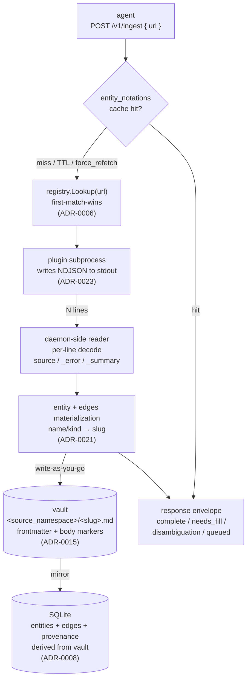

# Ingest

Agent-facing reference for the end-to-end ingest path: how a URL turns into an entity on disk and a row in the index. Audience is agents that read the response shapes and operators-via-agents that debug unexpected results.

This is a **living reference** (not an ADR). ADRs are the load-bearing rules; this doc shows how they compose at runtime. Decision-grounded — every step cites the ADR that governs it.

For surfaces that do NOT touch plugins (full reindex walks, DB-only operations), see [`docs/index-flow.md`](./index-flow.md). For the plugin contract from the plugin author's seat (capabilities, lifecycle, fetch protocol details), see [`docs/plugin-flow.md`](./plugin-flow.md).

## Big picture



The vault is the source of truth; the DB is a derived index (ADR-0008). Every successful ingest writes the vault first, then mirrors to the DB. A vault write failure aborts the request and leaves the DB untouched.

## 1. Request shape

`POST /v1/ingest` body:

```json
{
  "url": "https://en.wikipedia.org/wiki/Tehran",
  "wait_seconds": 30,
  "force_refetch": false,
  "hint": "wikipedia"
}
```

- `url` (required) — any input form a registered plugin accepts. Full URL, shorthand like `wikipedia: Tehran`, mobile-subdomain URL, future shapes. No URL-shape validation runs before the registry match — the matcher decides.
- `wait_seconds` — long-poll budget, clamped to `[0, 300]`. `0` forces async-only (immediate `queued` response).
- `force_refetch` — skips the notation cache; always spawns the plugin.
- `hint` — optional plugin name to bias the matcher; non-binding.

ADRs: [ADR-0002](../adr/0002-api-surface.md) (API surface), [ADR-0006](../adr/0006-plugin-discovery-config-allowlist.md) (allowlist).

## 2. Cache probe

Per [ADR-0008](../adr/0008-vault-as-source-of-truth.md)'s derived-index principle, `entity_notations` (DB table) maps every input form yaad-index has seen to the canonical entity slug it resolved to. On `force_refetch=false`:

1. Probe `store.GetNotation(req.URL)`.
2. On hit, load the entity by slug + read the vault file.
3. Apply the TTL freshness gate against vault frontmatter `cache_ttl_seconds:` and the freshest non-cache-shaped `fetched_at` provenance entry.
4. Respond directly — `complete` if `gaps:` empty, `needs_fill` if non-empty. No plugin call.

Cache responses carry an ephemeral `cache:notations` provenance entry on the wire so the agent can distinguish them from fresh fetches; the entity's persistent provenance is unchanged.

**Cache miss conditions** (any falls through to plugin dispatch):

- Notation not in the table.
- Stale notation pointing at a deleted entity (logged WARN).
- TTL expired against the freshest non-cache provenance entry (logged INFO at the refresh boundary).
- Vault frontmatter has positive `cache_ttl_seconds:` but no qualifying provenance (defensive: treat as expired).
- `force_refetch=true`.

## 3. Plugin dispatch

`registry.Lookup(req.URL)` walks plugins in registration order (ADR-0006's first-match-wins is enforced by slice order, not regex specificity). The match is plugin-defined — typically a URL-pattern regex from the plugin's `--init` `url_patterns`.

- **Match found** → dispatch.
- **No match + URL-fixture sentinel** (`brass-birmingham`, `queued-test`, `needs-fill-test`) → test-only paths used by integration suites.
- **No match + no fixture** → `422 unsupported_url`.

ADRs: [ADR-0005](../adr/0005-plugin-lifecycle.md), [ADR-0006](../adr/0006-plugin-discovery-config-allowlist.md).

## 4. Plugin output: NDJSON lines

Per [ADR-0023](../adr/0023-unified-plugin-response-protocol.md), every plugin emits newline-delimited JSON on stdout. One self-contained object per line; flush after each line; exit when done. Three line shapes:

### 4.1 Source emission (the typical line)

```json
{
  "ok": true,
  "structured": {
    "kind": "source",
    "name": "Martin Wallace (game designer)",
    "data": { "subject": "...", "date": "..." },
    "edges": {
      "is_a":     { "name": "wikipedia-article", "kind": "source-type" },
      "is_about": { "name": "Martin Wallace",    "kind": "person" }
    },
    "provenance": [
      { "source": "wikipedia:fetch", "fetched_at": "2026-05-17T11:00:00Z", "ok": true }
    ]
  },
  "raw_content": "# Martin Wallace\n\nBritish board game designer...",
  "attachments": [
    { "role": "thumbnail", "uri": "file:///tmp/staging/<id>/thumb.jpg", "extension": "jpg" }
  ]
}
```

Field roles:

- `structured.kind` — always `"source"` per [ADR-0021](../adr/0021-daemon-owns-slug.md) §2. All plugin emissions are source-shape nodes; canonical kinds (person, boardgame, etc.) are reached only via edges.
- `structured.name` — descriptive name. The daemon slugifies via the deterministic clean-slug rule (ADR-0021 §1); plugins do NOT produce slugs.
- `structured.data` — structured metadata destined for frontmatter `data:`. Examples: `subject`, `date`, `author`. **Not** the body content — that goes in `raw_content`.
- `structured.edges` — polymorphic edges block keyed by edge type; each value is `{name, kind}` (singular) or a list of those (one-to-many). Every cross-entity reference is an edge.
- `structured.provenance` — fetch metadata array; the daemon appends one entry per successful fetch.
- `raw_content` — the markdown body content. The daemon wraps it between `<!-- yaad:plugin start -->` / `<!-- yaad:plugin end -->` markers per [ADR-0015](../adr/0015-plugin-body-markers.md) and writes into the .md body. Hand-edits outside the marker pair survive re-ingest.
- `attachments` — optional, per [ADR-0014](../adr/0014-plugin-attachment-contract.md). Three URI schemes (`file://`, `https://`, `base64://`); the daemon stages + copies under the entity's `attachments/` subdir.

### 4.2 Error sentinel

```json
{ "_error": { "slug": "<msgid_dot_zzz>", "kind": "parse", "message": "malformed MIME boundary" } }
```

Per-envelope skip. The daemon logs + increments `_summary.errors`; the stream continues.

### 4.3 Summary packet

```json
{ "_summary": { "ingested": 3, "errors": 1, "duration_ms": 4521 } }
```

Optional terminal line. The daemon uses it for ingest-stats observability. A summary line emitted mid-stream is treated as the stats close-signal; subsequent source-emission lines after it are still processed (a misplaced summary doesn't truncate the stream).

Lines starting with `{"_` are reserved for control packets. Source emissions never use leading-underscore top-level fields. Lines that fail to parse as JSON are logged and skipped (defensive).

ADRs: [ADR-0023](../adr/0023-unified-plugin-response-protocol.md), [ADR-0014](../adr/0014-plugin-attachment-contract.md), [ADR-0021](../adr/0021-daemon-owns-slug.md).

## 5. Daemon-side decoding

The daemon's reader (`internal/plugins/subprocess.streamStdout`) decodes one line at a time, dispatches each to the right callback:

1. **Probe top-level for control shape.** `_error` → log + increment error count. `_summary` → terminal stats hook.
2. **Decode as `fetchResponse`** (the shared per-line shape; same struct backs the historical single-blob path and the NDJSON path). A non-object value is logged and skipped.
3. **`ok=false` on the FIRST line** is a hard invocation failure. `ok=false` on a later line is treated like `_error` (plugin should have emitted `_error` for that case; defense in depth).
4. **`structured` present + valid** (kind = "source", name non-empty, plugin declared `source_namespace`) → translate to `FetchResult` + invoke the entity-write callback.

The reader maps `structured.name` → `slug` deterministically at the daemon, then constructs the source entity ID as `<source_namespace>:<slug>` (the plugin's declared namespace from `--init`).

## 6. Entity + edges materialization

Per [ADR-0021](../adr/0021-daemon-owns-slug.md), the daemon owns slug derivation and canonical-entity treatment:

1. **Source node materializes** at `<vault_root>/<source_namespace>/<slug>.md`.
   - `source_namespace` comes from the plugin's `--init` capabilities (e.g. `wikipedia-article`, `bgg`, `gmail`).
   - `slug` = `slug.Slug(structured.name)`.
   - The entity's `kind` in storage is `source` (universal); source-type identity (Wikipedia article vs BGG record vs email) lives on the `is_a` edge.

2. **Edge targets resolve as canonical-label edges.** For each `{name, kind}` in `structured.edges`:
   - Daemon applies the same slug rule: `<kind>:<slug.Slug(name)>`.
   - Stores the edge in the `edges` table pointing at the canonical label.
   - The canonical label is a **pure pointer** — no vault file is materialized at edge creation. A canonical entity becomes a vault file only when there's substantive content to attach (operator-fill, dataview-paragraph-append from canonical_type data, operator notes). See ADR-0021 §3.

3. **Cross-plugin convergence is best-effort.** Two plugins emitting `{name: "Martin Wallace", kind: person}` produce `person:martin-wallace` from each, deduplicating at the canonical-label level. Variant names (`Brass: Birmingham` vs `Brass Birmingham`) slug differently; the ADR-0011 alias-overlap merge is the safety net.

ADRs: [ADR-0021](../adr/0021-daemon-owns-slug.md), [ADR-0011](../adr/0011-vault-file-aliases-from-titles.md), [ADR-0017](../adr/0017-canonical-id-clean-slug.md) (superseded by ADR-0021; clean-slug algorithm preserved).

## 7. Vault write — where state lands

```markdown
---
id: wikipedia-article:martin-wallace-game-designer
kind: source
plugin: yaad-wikipedia
data:
  subject: "Martin Wallace (game designer)"
  date: "2026-05-17T11:00:00Z"
edges:
  - { type: is_a,     to: source-type:wikipedia-article }
  - { type: is_about, to: person:martin-wallace }
provenance:
  - { source: "wikipedia:fetch", fetched_at: "2026-05-17T11:00:00Z", ok: true }
---

<!-- yaad:plugin start -->
# Martin Wallace

British board game designer...
<!-- yaad:plugin end -->

## Edges

- [[source-type:wikipedia-article]] (is_a)
- [[person:martin-wallace]] (is_about)

<!-- yaad:notes start -->
## Notes

| Notes |
|----------|
| 2026-05-17 — agent:linkedin-classify |
| Saw this designer mentioned in a hiring alert; flagged for follow-up. |
<!-- yaad:notes end -->

<!-- yaad:dataview start -->
co_player:: alice  my_rating:: 9  played_at:: essen-2024
<!-- yaad:dataview end -->

(free-form operator prose lives outside every marker pair — preserved verbatim across re-ingest)
```

The body has three managed marker-pair regions today; each is owned end-to-end by the daemon. Anything OUTSIDE every marker pair (before any pair, between two pairs, after the last pair) is preserved verbatim on re-ingest.

The split:

| Where                                                 | What lands                                                                  | Owned by      |
|-------------------------------------------------------|-----------------------------------------------------------------------------|---------------|
| Frontmatter `data:`                                   | Structured metadata (`subject`, `date`, plugin-specific keys)               | Plugin        |
| Frontmatter `edges:`                                  | Resolved canonical-label edges (`{type, to}` flat list)                     | Daemon        |
| Frontmatter `provenance:`                             | Fetch metadata (`source`, `fetched_at`, `ok`); appended per fetch           | Daemon        |
| Frontmatter `gap_state:`                              | Per-gap state (source/filled_at/deferred + workflow-injected `data_schema`) | Daemon        |
| Body between `<!-- yaad:plugin start/end -->`         | Plugin-emitted `raw_content` (markdown)                                     | Plugin        |
| Body between `<!-- yaad:notes start/end -->`          | Note table (per [ADR-0015](../adr/0015-plugin-body-markers.md) extension via #115) | Daemon (write) / Agent + Operator (content) |
| Body between `<!-- yaad:dataview start/end -->`       | Sorted-key dataview-inline paragraphs from canonical_type `data` (#119)     | Daemon        |
| Body `## Edges` section                               | Wikilink mirror of frontmatter edges. **No marker pair**: written directly between the `yaad:plugin` and `yaad:notes` regions and regenerated wholesale on every write | Daemon |
| Body outside every marker pair                        | Free-form operator hand-edits                                               | Operator      |
| `<entity-dir>/attachments/<name>`                     | Staged binary attachments from `attachments[]`                              | Plugin/Daemon |

Per [ADR-0015](../adr/0015-plugin-body-markers.md): the daemon detects each marker pair on re-ingest, replaces ONLY the content between the markers, and preserves everything outside every pair verbatim. First-write with existing un-marked body keeps the existing content as the `before` region — plugin-emitted content appears AT THE END of that region, so operator-prepended prose stays on top.

**Heads-up for agents authoring hand-edits**: prose typed outside every marker pair survives re-ingest. Prose typed inside the `yaad:plugin` pair gets overwritten on the next ingest. Notes intended for durable storage should be added via the `add_note` workflow action or the `/v1/entities/{id}/notes` endpoint — the daemon lands them inside the `yaad:notes` pair where they belong.

## 8. DB derive

After the vault write succeeds, the daemon mirrors:

- `entities` row — `id`, `kind`, `data` (JSON), `gap_state` (JSON, when present), provenance pointer, created/updated timestamps.
- `edges` rows — one per resolved edge; `(from, type, to)` is the primary key.
- `provenance` rows — historical record; the vault frontmatter is the canonical mirror.
- `entity_notations` rows — every input form that resolved to this entity (URL, shorthand, mobile-subdomain variant) writes a row pointing at the canonical slug. This populates the cache probe in §2.

The DB is reconstitutable from the vault via `yaad-index reindex --full` — losing it is recoverable; losing the vault is not (operator's responsibility per ADR-0008).

## 9. Response envelopes

The handler maps the materialization result to one of four wire envelopes (per [ADR-0002](../adr/0002-api-surface.md)):

- **`complete`** — entity materialized with no gaps. Response carries the full source entity.
- **`needs_fill`** — entity materialized with `gaps:` non-empty. Response carries `gaps` (prompt map) + `gap_metadata` (typed metadata: type, fill_strategy, range, kinds, data_schema). Agent calls `/v1/needs-fill` or `/v1/entities/{id}/fill` next.
- **`disambiguation`** — plugin returned `options[]` instead of `structured` (multiple candidates). Response carries the options list; agent re-ingests with the resolved slug.
- **`queued`** — `wait_seconds=0` or fetch is still in-flight at deadline. Response carries the job handle; agent polls.

## 10. Where to look when ingest produces unexpected output

| Symptom                                              | First look                                                                                            |
|------------------------------------------------------|-------------------------------------------------------------------------------------------------------|
| `422 unsupported_url`                                | Plugin allowlist + `url_patterns` in each plugin's `--init` capabilities. ADR-0006 first-match-wins.  |
| Body content missing despite plugin returning it     | `raw_content` field on the NDJSON line. If empty, body stays empty by design (preserves prior body).  |
| Body content in `data.body` instead of .md body      | Plugin bug — emit on top-level `raw_content`, not `data["body"]`. yaad-gmail #125 was this shape.     |
| Frontmatter has only `data.subject` but no body      | Plugin didn't emit `raw_content`. Confirm against ADR-0008 (`frontmatter = metadata; body = data`).   |
| Re-ingest wiped operator hand-edits                  | Edits sat inside the `yaad:plugin` marker pair. Move them to outside every marker pair, or land notes via `add_note` (which writes into the `yaad:notes` pair). |
| Edge target points at non-existent canonical entity  | Expected — canonical labels are pure pointers (ADR-0021 §3). The label materializes only on attach.   |
| Duplicate canonical entities for the same concept    | Slug variance. Check `aliases:` overlap merge (ADR-0011); operator may need to merge manually.        |
| Cache served stale content                           | `cache_ttl_seconds:` in frontmatter + freshest non-cache provenance. `force_refetch=true` bypasses.   |
| Plugin emitted `_error` line                         | Per-envelope skip — the rest of the stream continues. Check stderr for the plugin-side log line.      |
| Plugin exited non-zero mid-stream                    | Write-as-you-go contract — anything that hit disk before exit stays. Next run resumes via slug dedup. |

## 11. Plugin-side requirements summary

Per ADR-0023 + ADR-0021 + ADR-0015 + ADR-0014, every plugin emits:

- NDJSON on stdout — one `{"ok": true, "structured": {...}, "raw_content": "...", "attachments": [...]}` per source per line. Flush after each line.
- `structured.kind: "source"` always. Source-type identity goes on the `is_a` edge.
- `structured.name` — descriptive; daemon slugifies. Never emit a slug.
- `structured.edges` — `{name, kind}` per ref; daemon resolves canonical-label edges.
- `raw_content` — body markdown. Don't wrap in markers (the daemon does that). MUST NOT contain the literal `<!-- yaad:plugin start -->` / `end` substrings.
- `attachments[]` — `{role, uri, extension}`. `file://` paths must live under the operator-configured staging directory.
- `_error` / `_summary` control packets for per-envelope skips + aggregate stats.

ADRs that govern this surface: [ADR-0005](../adr/0005-plugin-lifecycle.md), [ADR-0006](../adr/0006-plugin-discovery-config-allowlist.md), [ADR-0008](../adr/0008-vault-as-source-of-truth.md), [ADR-0014](../adr/0014-plugin-attachment-contract.md), [ADR-0015](../adr/0015-plugin-body-markers.md), [ADR-0021](../adr/0021-daemon-owns-slug.md), [ADR-0023](../adr/0023-unified-plugin-response-protocol.md).
