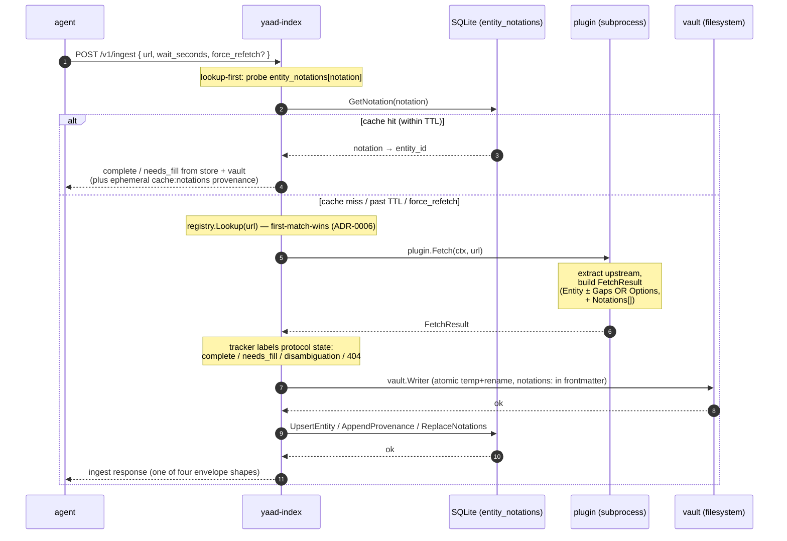

# Plugin flow

The end-to-end story of every plugin-touching surface in yaad-index — what happens at startup, how an ingest call flows through a plugin, how a fill call splits work between the agent and the plugin, and what a plugin author has to implement to plug in.

This is a **living reference** (not an ADR). ADRs record decisions; this map describes how those decisions compose at runtime. When an ADR or PR changes plugin behavior, the same change should update this doc.

For index-internal flows that don't touch plugins (full reindex walks, vault → DB derivation, atomic upsert invariants), see `docs/index-flow.md`.

## The big picture



Every plugin call is a subprocess invocation with a context-bounded timeout. The plugin returns data; yaad-index decides protocol state, persists, and shapes the wire response. A plugin author never types the words `complete`, `needs_fill`, or `disambiguation` — they populate the right field on `FetchResult`, and yaad-index labels.

**The index is the cache.** yaad-index maintains a `entity_notations` lookup table mapping every input form (URL, shorthand `<plugin>: <id>`, mobile-subdomain URL, etc.) to the canonical entity slug it resolves to. A repeat ingest of any equivalent form short-circuits the plugin spawn and serves directly from the store + vault. The plugin is the network-bound source-of-last-resort; most ingests resolve from the cache. (Architecture lands in.)

## 1. Startup / registration / cache

Server start runs once per process; all plugins resolve here. From `cmd/yaad-index/main.go:buildPluginRegistry`:

1. **Parse config.** `cfg.Plugins` is the operator-driven allowlist (per ADR-0006: explicit, ordered, first-match-wins). Empty / nil cfg → empty registry, server still starts.

2. **For each plugin entry, in YAML order**, the bring-up runs `registerPlugin`:

 1. **Cheap version probe.** `subprocess.RunVersion(ctx, path, 2*time.Second)` invokes the plugin binary with `--version`, expects fast hello-and-exit. The probe has a tight 2-second timeout — broken or non-conforming plugins fall through silently rather than blocking startup.

 2. **Cache lookup** in `plugin_capabilities` (table: `name`, `version`, `capabilities_json`):
 - **Hit, version matches** → unmarshal cached capabilities → `subprocess.NewWithCapabilities` constructs the plugin from cached metadata → register, **skip `--init`**.
 - **No row** → first-start, fall through to `--init`.
 - **Hit but version mismatch** → operator deployed a new binary, fall through to `--init`, upsert the new version on success.
 - **DB read error** → log WARN, fall through to `--init`.
 - **Cached row decoded as malformed JSON** → log ERROR, fall through to `--init`.
 - **Cached row OK but plugin construction fails** → log ERROR, fall through to `--init`.
 - **Probe failed (non-zero / timeout / no `--version` support)** → fall through to `--init` (cache lookup never runs; outcome categorized as a miss).

 3. **Fall-through `--init`.** `subprocess.New(name, path)` runs the full handshake (longer subprocess, 30-second probe context). The plugin's `--init` writes a JSON capabilities document (`name`, `version`, `url_patterns`, `entity_kinds`, `edge_kinds`, optional `canonical_kinds_emitted` / `canonical_edge_types_emitted`). On success, `store.UpsertPluginCapabilities` writes the new cache row.

3. **Per-plugin INFO log line** at register time: `plugin registered name=<n> path=<p> source=<cache|init> capabilities_name=<n> capabilities_version=<v>`.

4. **Startup summary INFO line** at end of `buildPluginRegistry` : `plugin cache summary cache_hits=<N> cache_misses=<N> cache_failures=<N> failed_plugins=[…] registered=<N>`. Skipped when zero plugins. `cache_misses` lumps first-start + version-change (both go through the same `--init` path); `cache_failures` is the WARN/ERROR paths an operator should investigate.

**Why a cache?** Full `--init` walks the plugin's capability surface (kinds, url_patterns, schema). For unchanged binaries that's wasted subprocess wall-clock at every server start. The cache reduces startup time from O(plugins × init-cost) to O(plugins × version-probe-cost) when nothing has changed.

**Operator override.** `yaad-index plugins clear-cache` (CLI) or DB-level deletion of `plugin_capabilities` rows forces a fresh `--init` on the next start. The `WipeDerivedState` reindex helper explicitly does NOT wipe `plugin_capabilities` (the cache isn't vault-derived state — see `docs/index-flow.md` for the wipe-set rationale).

**ADRs that govern this surface:** [ADR-0005](../adr/0005-plugin-lifecycle.md) (plugin lifecycle), [ADR-0006](../adr/0006-plugin-discovery-config-allowlist.md) (config-allowlist + first-match-wins).
**PRs that evolved it:** (cache) (capability cache wiring) (observability + log-level map) (operator log_level config).

## 2. Ingest

`POST /v1/ingest` is the agent's entry point for "extract this URL." From `internal/api/ingest.go:handleIngest`:

1. **Parse the request body** (`url`, optional `hint`, `force_refetch`, `wait_seconds`). `url` is required; everything else is optional. `wait_seconds=0` switches the call to async-only mode (returns `queued` shape immediately, no long-poll). The `url` field accepts any input form a plugin claims — full URL, the `<plugin>: <id>` shorthand, future shapes — not just `http://...` URLs.

2. **Bound `wait_seconds`** to `[0, 300]` (5-minute ceiling per ADR-0002 line 85).

3. **Lookup-first cache probe** (Per the prior design, when `force_refetch=false`). `tryNotationCacheHit` calls `store.GetNotation(req.URL)` against the `entity_notations` table. On hit it loads the entity by slug, applies the TTL freshness gate (see §2a), and (when wired) reads the vault file for the single-hop body fields. If everything checks out the handler responds directly with `complete` or `needs_fill` (inferred from the vault's `gaps:` list) — **no plugin call**. The response carries an ephemeral `cache:notations` provenance entry so the agent can distinguish a cache-served entity from a freshly-fetched one. The entity's persistent provenance stays untouched (cache hits aren't fetches).

 Cache miss conditions (any → fall through to plugin dispatch):
 - Notation not in the table.
 - Stale notation pointing at a deleted entity (logged WARN).
 - Vault frontmatter `cache_ttl_seconds:` positive AND freshest non-cache-shaped `fetched_at` is older than `now - frontmatter.cache_ttl_seconds` (logged INFO at the cache-refresh boundary). TTL was resolved + stamped at the previous ingest Per the prior design,'s three-level hierarchy.
 - Vault frontmatter has positive `cache_ttl_seconds:` but no qualifying provenance entry on the entity (defensive: treat as expired).
 - `force_refetch=true` skips the probe entirely.

4. **Plugin dispatch.** `registry.Lookup(req.URL)` walks plugins in registration order and returns the first one whose `Match(rawURL)` accepts. The match is plugin-defined (typically a URL-pattern regex from `Capabilities().URLPatterns`); ADR-0006's first-match-wins is enforced by the registry's slice ordering, not the plugin's regex specificity.

 - **Match found** → `ingestAttemptForPlugin(plugin, req.URL)` builds the attempt record.
 - **No match** → fall back to URL-fixture sentinels (test-only paths for `brass-birmingham`, `queued-test`, `needs-fill-test`).
 - **No match + no fixture** → `422 unsupported_url` (ADR-0002 + ADR-0006: well-formed-but-not-actionable).

 ADR-0006's shorthand input shape (`<plugin>: <id>`, e.g. `wikipedia: Tehran`) is dispatched the same way — no URL-shape validation runs before the matcher (a prior PR removed an http/https-only scheme check that was rejecting legitimate disambiguation re-invocations).

5. **Begin attempt + dispatch to plugin.** The tracker (`ingestTracker.beginAttempt`) registers a record keyed by the attempt id. A goroutine invokes `plugin.Fetch(ctx, rawURL)` with a per-fetch timeout (subprocess-side, typically 5s; configurable). The handler then either:

 - **Long-polls** for up to `wait_seconds` via `tracker.wait`, OR
 - **Returns `queued` immediately** if `wait_seconds == 0` — the goroutine continues in the background, persistence happens regardless of caller presence.

6. **`plugin.Fetch` returns a `FetchResult`** — two shapes only:

 - **`Entity` set, `Gaps` empty** → `complete`. Fetch resolved to a single canonical row, agent gets the entity back.
 - **`Entity` set, `Gaps` non-empty** → `needs_fill`. Plugin produced the source-shape entity but left specific data fields for the agent's AI to fill (see §3).
 - **`Options` non-empty** → `disambiguation` (per ADR-0006). Plugin returned multiple plausible matches; agent picks one option's key and re-invokes ingest with `<plugin>: <id>` shorthand.
 - **All empty** → `404 not_found`.

 The plugin also populates `FetchResult.Notations` with every input form it knows resolves to the entity (originating notation first; see §2a). A plugin author never names the protocol state — they populate the right field; the tracker labels.

7. **Vault-first persistence (per ADR-0008).** The orchestrator writes the entity to the vault file `<vault>/<kind>/<slug>.md` via the atomic `vault.Writer` (temp-file + rename), with `notations:` populated from `FetchResult.Notations`. Then it mirrors the result to the DB:
 - `store.UpsertEntity` — entity row.
 - `store.AppendProvenance` — fetched_at row stamped with the plugin's source identifier.
 - `store.ReplaceNotations(entity.ID, FetchResult.Notations)` — registers every input form in the lookup cache so subsequent ingests of an equivalent shape short-circuit. Replace-shape: a re-fetch on TTL expiry / `force_refetch=true` re-emits the canonical set, possibly evolved.

 Plus the canonical-shape stubs + edges (per ADR-0008 / PRs). The disambiguation path returns BEFORE the persistence block (no entity yet), so notations + provenance are skipped on that branch.

 When `vault.path` isn't configured, ingest stays DB-only (a prior PR) — the entity persists to the DB without a vault file. Fill (see §3) does NOT have this fallback; fill requires the vault.

8. **Wire response shape** is one of four envelopes:
 - `complete` (200 with `entity` field — including the single-hop body, see §2b)
 - `needs_fill` (200 with `entity`, `gaps`, `clean_content`, `clean_content_truncated`) — the agent-facing wire field; plugins emit the same body as `raw_content` (see [`AGENTS.md`](../AGENTS.md) §"Plugin protocol cheat sheet"), and yaad-index renames it at the API boundary.
 - `disambiguation` (200 with `options`)
 - `queued` (202 with `estimated_entity_id` if known)

 Each carries `state` (canonical) AND `status` (legacy alias, same value) for client-compat.

**ADRs that govern this surface:** [ADR-0002](../adr/0002-api-surface.md) (universal-state amendment), [ADR-0005](../adr/0005-plugin-lifecycle.md) (plugin invocation), [ADR-0006](../adr/0006-plugin-discovery-config-allowlist.md) (disambiguation responses), [ADR-0008](../adr/0008-vault-as-source-of-truth.md) (vault-first persistence), [ADR-0009](../adr/0009-provenance-reconciliation.md) (provenance re-derive pattern, mirrored by ReplaceNotations), [ADR-0010](../adr/0010-row-level-idempotency.md) (idempotent provenance writes).
**PRs that built this:** prior series.

## 2a. The notation cache (`entity_notations`)

Lookup-first ingest only works because every successful Fetch pre-registers the notation forms that resolve to the entity. The architecture spans three layers:

### Plugin layer — `FetchResult.Notations`

The plugin emits a list of every input form it knows resolves to the entity. The yaad-wikipedia plugin's set for `https://en.wikipedia.org/wiki/Susanna_Clarke`, e.g.:

```
[
 "https://en.wikipedia.org/wiki/Susanna_Clarke", // originating input — MUST be first
 "https://en.m.wikipedia.org/wiki/Susanna_Clarke", // mobile subdomain
 "wikipedia: Susanna Clarke", // shorthand
]
```

**Self-roundtrip invariant.** The originating notation MUST appear in the list (first-position by convention). The orchestrator's lookup-first probe matches on exact-string equality — without the input shape registered, a re-ingest with the same input would miss the cache.

Plugins that don't emit a `Notations` field today get the `omitempty` JSON tag drop on the wire. Lookup-first then doesn't register notations for those plugins, and re-ingest goes through the plugin every call (the legacy shape). This happens to work today, but isn't a stability promise — see the design-in-flux banner at the top of this repo's README. Plugins MUST adopt the contract once it stabilizes; the omit-and-skip path may be removed.

### Vault layer — `notations:` frontmatter

The vault is the source of truth (per ADR-0008). The same notation list lands in frontmatter alongside the entity:

```yaml
---
id: wikipedia:susanna-clarke
kind: wikipedia
plugin: wikipedia
notations:
 - https://en.wikipedia.org/wiki/Susanna_Clarke
 - https://en.m.wikipedia.org/wiki/Susanna_Clarke
 - "wikipedia: Susanna Clarke"
---
```

`vault.Entity.Notations []string` round-trips through `Marshal` / `Unmarshal`. Empty/nil omits the field entirely (no `notations: []` artifact). On every ingest, the writer **replaces wholesale** — no merging with existing — so the vault tracks the plugin's current view exactly.

### DB layer — `entity_notations` table

Schema (per migration `007_entity_notations.sql`):

```sql
CREATE TABLE entity_notations (
 notation TEXT NOT NULL PRIMARY KEY,
 entity_id TEXT NOT NULL REFERENCES entities(id) ON DELETE CASCADE,
 notation_kind TEXT NOT NULL DEFAULT 'url'
);
CREATE INDEX idx_entity_notations_entity_id ON entity_notations(entity_id);
```

PRIMARY KEY on `notation` enforces "the same input form can never resolve to two entities." `ON DELETE CASCADE` on `entity_id` keeps notations from outliving their entity (DeleteEntityCascade path).

The store API mirrors `ReplaceProvenance` from ADR-0009:
- `GetNotation(notation)` — one-shot lookup; returns `ErrNotFound` on miss.
- `UpsertNotation(n)` — insert-or-replace; reassignment supported.
- `DeleteNotationsForEntity(id)` — bulk drop, returns count.
- `ReplaceNotations(id, entries)` — transactional DELETE+INSERTs; empty entries clears.

### Reindex re-derive — vault wins

`Reindexer.upsertEntity` calls `store.ReplaceNotations(e.ID, e.Notations)` with the vault frontmatter list as the canonical source. **Orphan DB rows** — notations the vault frontmatter doesn't carry — are dropped on reindex. Same DELETE-then-INSERT shape ADR-0009 prescribes for provenance.

### Load-bearing invariant — reindex does NOT modify vault frontmatter

> *"All data is in frontmatter, so never remove them automatically and any reindex build them without change (database is still showing expired content)."* — the operator, 2026-05-03

- Past-TTL gates the **lookup path only** (next ingest goes to plugin, which re-writes the vault).
- Reindex is **non-destructive** by design — it derives the DB from the vault, never the other way around. If the vault carries an expired entity, the DB legitimately reflects that until something else (a re-ingest, a manual operator edit) updates the vault.
- There is no automatic vault purge anywhere in yaad-index. Cache cleanup is **user-triggered** — see for the planned `yaad-index cache {list-expired, purge, refetch}` CLI.

Future plugins / future maintainers MUST NOT introduce auto-purge of vault content. Cache freshness is the lookup layer's concern; vault contents are the operator's prerogative.

## 2b. TTL semantics — three-level resolution

Cache hits expire after a TTL resolved at INGEST time across three levels — per-fetch override > plugin default > operator's global config. The resolved value is baked into the entity's vault frontmatter (`cache_ttl_seconds:`); lookup is just `provenance[last].fetched_at + frontmatter.cache_ttl_seconds vs now`. No three-level walk on the lookup hot path.

### Resolution levels

```
3. per-fetch override — FetchResult.CacheTTLSeconds (*int, optional)
2. plugin default — Capabilities.CacheTTLSeconds (int, on --init)
1. global config — top-level cache_ttl_seconds in yaad-index config YAML
```

`resolveCacheTTL(entry, plugin, global)` walks 3 → 2 → 1 and returns the first non-zero value. All-zero falls back to "no TTL stamped" (cache forever, preserves legacy behavior).

### Sentinel rules — identical at every level

- `0` (or absent / nil) → no opinion; fall through to the next level.
- positive `N` → entries valid for N seconds since the freshest qualifying `provenance.fetched_at` at this level.
- negative → infinite (never expires); short-circuits the resolution to "cache forever" at this level.

### Config

Top-level `cache_ttl_seconds` in the yaad-index config YAML:

```yaml
cache_ttl_seconds: 3600 # 1 hour
```

- `0` (default) → no opinion at the global level. Plugin-level / per-fetch may still apply; if all three levels are 0, entities cache forever.
- `>0` → fallback TTL when no plugin-level / per-fetch TTL applies.
- `<0` → infinite at the global level. Entities cache forever unless a higher-priority level overrides with a positive value.

### Re-resolution semantics

Per the operator's 2026-05-06 clarification: TTL is **re-resolved on every ingest** from the live entry/plugin/global inputs and overwrites any prior value in vault frontmatter. Operator hand-edits to `cache_ttl_seconds:` in vault files do NOT persist across re-ingests — the field is write-only-by-orchestrator. Operators wanting to change an entity's TTL edit the source (plugin Capabilities or per-fetch FetchResult.CacheTTLSeconds), not the post-fetch frontmatter.

### Freshness check (lookup path)

`freshestPersistentFetch(entity)` picks the latest `fetched_at` across the entity's provenance entries with:
- `OK = true` (failed fetches don't extend cache life).
- `Source != "cache:notations"` (the ephemeral cache-hit shape — defensive filter; those aren't normally persisted, but a future change leaking one onto the entity wouldn't extend its own life).

For positive `cache_ttl_seconds` in frontmatter: if the freshest qualifying entry is older than `now - frontmatter.cache_ttl_seconds`, the lookup-first probe returns nil → cache miss → plugin path. a prior PR's existing post-Fetch `ReplaceNotations` resets the clock by stamping a fresh provenance entry on the next round.

If no qualifying entry exists at all (defensive — corrupt state, the entity lost its provenance somehow), treat as expired.

For nil / absent frontmatter `cache_ttl_seconds`: cache hits forever (preserves legacy deployment shape; entities ingested before stay valid until a force_refetch re-ingest stamps the resolved TTL).

### force_refetch + TTL

`force_refetch=true` always bypasses the cache, regardless of TTL state. Useful for the agent that knows it wants a fresh upstream pull (e.g. an article suspected to have changed, a debugging session, an operator-driven refresh). The re-fetch path runs `resolveCacheTTL` again and overwrites the frontmatter with the new resolved value.

## 2c. GET single-hop body

`GET /v1/entities/{id}` returns the full entity body in one hop (per the operator's "GetEntity should be a single hop" rule, 2026-05-03). The `entity` wire shape carries:

- DB-derived: `id`, `kind`, `data`, `provenance`, `edges`.
- Vault-derived (via `mergeVaultEntity` overlay when `WithVaultIO` is wired): `clean_content`, `summary`, `tags`, `gaps`, `aliases`, `plugin`, `notations`, `comments`. All `omitempty` — DB-only deployments don't surface dummy-empty fields.

`handleEntity` vault-reads on every GET when wired and applies the overlay. A vault read failure downgrades to the DB-only shape (entity still resolves) with a WARN log.

The cache-hit ingest path (`respondFromCacheHit`) inherits via the same overlay — `notationCacheHit.vaultEntity` is kept around so the response builder doesn't re-read the file. Closes the gap a prior PR originally left where cache hits returned only the DB-mirrored slice.

The agent's mental model: ingest produces the body fields once; every subsequent `GET` returns them without re-fetching through the plugin.

## 3. Fill

`POST /v1/entities/{id}/fill` is the agent's "I have the missing data, write it back" call. Fill is asymmetric with ingest: ingest invokes the plugin, fill does NOT. From `internal/api/fill.go:handleFill`:

1. **Vault is authoritative for gap state.** The handler reads the entity's current `gaps:` list from the vault file (`<vault>/<kind>/<slug>.md`'s frontmatter), not from the DB. ADR-0008 + a prior PR's vault-first fill rewrite codify this: gaps live in the vault, not in a separate token table.

2. **Callback ID = entity ID** (a prior PR / ADR-0008). The URL path's `id` is the durable callback handle. Legacy design used a `fill_token` field on the request; that's gone. The agent fills arbitrarily late, across as many partial calls as it wants, using just the entity id.

3. **Per-call atomic validation.** The submitted `fields` map is validated against the vault's current `gaps:` list. Any field name that's not a current gap (already filled, never was a gap) → `409 fill_conflict` with `rejected: [...]` naming the offending fields. **No partial success** — one rejected field fails the whole call.

4. **Vault write before DB write.** On success, the handler:
 - Loads the vault file's frontmatter
 - Merges the submitted `fields` into the entity's `data:` block
 - Subtracts the filled field names from `gaps:`
 - Atomically rewrites the vault file (temp-file + rename via `vault.Writer`)
 - Mirrors the change to the DB via `store.UpsertEntity` + `store.AppendProvenance`

 Fill does NOT write a comments row. Comments are an independent surface (`POST /v1/entities/{id}/comments`); a fill call doesn't auto-generate one. If an agent wants a fill audit-trail beyond provenance, it posts a comment explicitly.

5. **Wire response: `fillResponse`** with `entity` (refreshed from vault), `gaps: [...]` (remaining unfilled gap field names; empty when this call closed every open gap). The agent can chain another partial fill by re-invoking with the remaining gap names.

**Why no plugin call?** Fill is a write of agent-AI-derived content into the vault. The plugin produced the gaps at ingest time; the agent's AI fills them. The plugin doesn't see the fill — its work is done. (Future plugin types might offer a fill-side capability — e.g., an LLM plugin that fills gaps for cheaper / locally — but the current contract is "plugin emits gaps, agent fills.")

**The `vault_required` 503.** Without `vault.path` configured, fill returns `503 vault_required` — there's no source of truth for the gap set. Operators running yaad-index DB-only-mode can ingest but can't fill until they configure a vault.

**Stale DB → 404.** If the DB row is missing (e.g., reindex pending after vault changes), fill returns `404 not_found`. Operator runs `yaad-index reindex` to repair drift (see `docs/index-flow.md`).

**ADRs that govern this surface:** [ADR-0002](../adr/0002-api-surface.md) (universal-state amendment includes `needs_fill`), [ADR-0008](../adr/0008-vault-as-source-of-truth.md) (vault-canonical gap state, callback-id-is-entity-id, per-call atomic, comments first-class).
**PRs that evolved it:** (vault-first rewrite, fill_token removal) (fill-vault-first) (fill response gaps field).

## 4. Plugin contract

What a plugin binary must implement to register cleanly and serve ingest calls. The interface lives in `internal/plugins/plugin.go`.

### Required surface

A plugin binary MUST respond to three subprocess invocations:

1. **`<binary> --init`** — full handshake. Stdout MUST be a valid JSON `Capabilities` document:

 ```json
 {
 "name": "wikipedia",
 "version": "1.2.3",
 "url_patterns": ["^https?://[a-z]+\\.wikipedia\\.org/wiki/.*", "^wikipedia:\\s*\\S+"],
 "entity_kinds": [
 {
 "name": "wikipedia",
 "description": "Wikipedia article entity",
 "default_ttl_days": 30,
 "snippet_fields": ["extract", "description"]
 }
 ],
 "edge_kinds": [
 {
 "name": "is_about",
 "from_kind": "wikipedia",
 "to_kind": "person"
 }
 ],
 "canonical_kinds_emitted": ["person", "place"],
 "canonical_edge_types_emitted": ["is_about"]
 }
 ```

 Run once per cache-miss / version-change at server start. Cached in `plugin_capabilities` keyed by `(name, version)`.

2. **`<binary> --version`** — cheap. Stdout is the version string (matching `Capabilities.Version` from `--init`). Exit 0 fast (≤ 2s). Used at every startup as the cache-key probe; broken plugins should still implement this to benefit from the cache.

3. **`<binary> ingest --url <url>`** (or whatever the runtime invocation shape is — check `subprocess.Plugin`) — the actual fetch path. Stdout is a `FetchResult` JSON document. The plugin's lifetime per call is governed by the per-fetch timeout (5s typical).

### `FetchResult` shape

Two valid result-shapes only (Entity ± Gaps OR Options):

```go
type FetchResult struct {
 Entity *store.Entity // single match
 Provenance []store.ProvenanceEntry // recommended
 RawContent string // when Gaps non-empty
 RawContentTruncated bool
 Gaps map[string]string // field-name → AI hint
 Options map[string]DisambiguationOption // multi-match
 Edges []Edge // source-shape edges; reserved (NOT yet persisted)
 CanonicalEntities []*store.Entity // canonical-shape stubs; persisted via tracker (a prior PR +)
 CanonicalEdges []*store.Edge // canonical-shape edges; persisted via tracker (a prior PR +)
 Notations []string // every input form resolving to this entity; cache-key set (a prior PR)
 // Aliases is the alternative-label list . Bare strings
 // + typed `<edge-type>: <label>` prefixes coexist; multi-valued.
 // Used by Obsidian wikilink + agent reverse-lookup.
 Aliases []string
}
```

**Edges field semantics differ:**

- `Edges` (source-shape) — typed relationships alongside the source entity (e.g., a Wikipedia page linking to another Wikipedia page). The tracker does NOT persist these today; reserved for a future-PR that wires plugin-emitted source-shape edges into ingest. Today they land via `POST /v1/edges` (operator/agent-driven).
- `CanonicalEntities` / `CanonicalEdges` (canonical-shape) — cross-source canonical stubs (e.g., a `person:martin-wallace` stub created from a Wikipedia article about him, with an `is_about` edge). The tracker DOES persist these via `persistCanonicalEntities` / `persistCanonicalEdges` in `internal/api/ingest_tracker.go` (PRs +). Gated by the operator's `canonical_kinds:` / `canonical_edge_types:` config — kinds NOT enabled in config are silently dropped at ingest time, even when both endpoints exist. Plugins MUST declare `canonical_kinds_emitted` / `canonical_edge_types_emitted` in their `--init` capabilities so yaad-index can warn operators about discoverability gaps.

The orchestrator labels protocol state from which fields are populated:

| Populated | State |
|-------------------------------------|------------------|
| `Entity` set, `Gaps` empty | `complete` |
| `Entity` set, `Gaps` non-empty | `needs_fill` |
| `Options` non-empty | `disambiguation` |
| All empty | 404 `not_found` |

A plugin author types data, not protocol names.

### Optional surface

- **`CanonicalKindsEmitted` / `CanonicalEdgeTypesEmitted`** in capabilities (per ADR-0008 + a prior PR canonical-kinds-config): names canonical-shape entity kinds / edge types this plugin MAY emit alongside its source-shape entities. yaad-index startup warns operators when a plugin proposes canonical kinds NOT in the operator's `canonical_kinds:` config — discoverability gap surfaced rather than silent.
- **Disambiguation shorthand support** (per ADR-0006): plugins emitting `Options` MUST accept the `<plugin>: <id>` shorthand input shape so the agent can re-fetch a chosen candidate by key.
- **Edges scope clarification:** `FetchResult.Edges` (source-shape) is reserved — tracker does NOT persist these today; source-shape edges land via `POST /v1/edges`. `FetchResult.CanonicalEntities` / `CanonicalEdges` (canonical-shape) ARE persisted by the tracker, gated by operator config. See the FetchResult section above for the per-field semantics.

### Notations — cache pre-registration 

Plugins SHOULD populate `FetchResult.Notations` with every input form they know resolves to the entity. This is the load-bearing input for the lookup-first cache (see §2a):

```go
result.Notations = []string{
 inputNotation, // MUST be first
 canonicalURL, // canonical desktop form
 mobileURL, // alternate-host equivalent
 fmt.Sprintf("%s: %s", plugin.Name(), humanTitle), // shorthand
 // ... whatever else this plugin understands as equivalent
}
```

**Self-roundtrip invariant.** The originating input notation MUST appear in the list (first-position by convention). The orchestrator's lookup-first probe matches on exact-string equality — without the input shape registered, a re-ingest with the same input would miss the cache.

**Plugins that don't emit `Notations` today.** The orchestrator skips the `ReplaceNotations` write rather than clearing the entity's existing rows on every re-fetch — those ingests re-invoke the plugin on every call, no cache pre-registration happens. This is the current behavior, not a long-term shape; the design-in-flux banner at the top of this repo's README applies. Adopting the cache is a single FetchResult-field write away; future versions may make Notations mandatory.

**Ordering matters.** a prior PR's `ReplaceNotations` writes the list as-is; on re-fetch (TTL expiry or `force_refetch=true`) the plugin's current view replaces the prior set wholesale. The vault frontmatter's `notations:` list mirrors the same order — the writer doesn't sort or dedupe beyond what the plugin emitted.

### Reserved data keys

The entity's `data:` block has reserved keys per AGENTS.md (a prior PR). A plugin MUST NOT emit these as plugin-extracted fields — they're owned by yaad-index:

- `summary` — vault-side narrative summary (filled by agent, not plugin)
- `comments_text` — derived projection of comment threads
- (See `AGENTS.md` for the canonical reserved-key list)

Collisions are silently dropped at ingest/fill time, even when both endpoints exist as canonical entities.

### Provenance

Plugins SHOULD populate `FetchResult.Provenance` with one entry stamped:

```go
store.ProvenanceEntry{
 Source: "<plugin-name>",
 FetchedAt: time.Now().Format(time.RFC3339),
 OK: true,
}
```

If a plugin omits provenance, the tracker synthesizes a fallback entry naming the plugin (so reindex re-derivation always has at least one row to work from). Plugins SHOULD do this themselves so the row carries the upstream's actual fetched_at, not the orchestrator's wall-clock.

### Plugin subprocess environment

When yaad-index spawns a plugin binary (`--version`, `--init`, or per-fetch invocations), it extends the parent process environment with these yaad-index-specific variables:

| Variable | Set to | Plugin contract |
|----------|--------|-----------------|
| `YAAD_TIMEZONE` | Operator's configured IANA timezone (e.g. `America/Los_Angeles`, `UTC` default). | Plugins SHOULD read this and apply when stamping `provenance.fetched_at` so the operator-TZ surface stays end-to-end consistent. Plugins predating ignore the var; their `time.Now().UTC()` output continues to work — UTC is comparable against operator-TZ values via the offset on each ISO-with-TZ string. |

Boilerplate for a Go plugin:

```go
loc := time.UTC
if tz := os.Getenv("YAAD_TIMEZONE"); tz != "" {
 if l, err := time.LoadLocation(tz); err == nil {
 loc = l
 }
}
now := time.Now().In(loc)
```

A small shared SDK helper module would centralize this — file an issue if a second plugin author writes the same boilerplate by hand.

### Plugin authoring resources

- **Reference plugin:** `yaad-index/yaad-wikipedia` — full source. Reading its `--init` output and `Fetch` impl is the fastest way to onboard a new plugin.
- **Test fixture:** `internal/plugins/fixture/` — in-memory `Plugin` impl used by yaad-index's own tests. Mirrors the contract without a subprocess.

**ADRs that govern this surface:** [ADR-0005](../adr/0005-plugin-lifecycle.md) (lifecycle + capabilities document shape), [ADR-0006](../adr/0006-plugin-discovery-config-allowlist.md) (registration semantics, disambiguation), [ADR-0008](../adr/0008-vault-as-source-of-truth.md) (data flow, reserved keys, fill semantics), [ADR-0011](../adr/0011-vault-file-aliases-from-titles.md) (vault aliases — the navigation overlay alongside notations).

## 5. Operator surface — cache management

The lookup-first cache from is mostly self-managing — every successful Fetch pre-registers the notation set, every TTL expiry triggers a re-fetch on next ingest, every reindex re-derives the DB from the vault. Two operator-driven knobs surface today:

### Config (today)

```yaml
# yaad-index.yaml
cache_ttl_seconds: 0 # or 3600 for a 1-hour TTL window
```

`0` disables TTL (cache hits forever — legacy behavior). Positive values bound cache freshness; see §2b for the mechanics.

### CLI (planned)

`yaad-index cache {list-expired, purge, refetch}` is the planned cache-management surface — user-triggered only, never automatic. Lets operators:

- See which entities are past their TTL window (`list-expired`).
- Drop a vault file + DB rows for an entity that's truly gone (`purge`).
- Force a re-fetch from the plugin without going through the API (`refetch`).

These are **user-initiated actions** by design. Per the load-bearing invariant in §2a, yaad-index never modifies vault frontmatter on its own — past-TTL gates the lookup path only, reindex stays non-destructive, and there is no automatic vault purge anywhere. The CLI exists so operators can take the destructive action when they want it; the system never assumes.

## What this doc deliberately does NOT cover

- **Reindex** (full or incremental walks of the vault → DB derivation). That's index-internal flow; see `docs/index-flow.md`. Note: reindex re-derives `entity_notations` from vault frontmatter as a downstream consequence (per §2a); see also ADR-0009 for the provenance pattern this mirrors.
- **Edge / comment / search endpoints** that don't dispatch through plugins (`POST /v1/edges`, `POST /v1/entities/{id}/comments`, `GET /v1/search`). Those are plugin-independent surfaces.
- **Operator config** (`yaad-index.yaml` schema, `canonical_kinds:`, `canonical_edge_types:`, plugin allowlist mechanics). See `AGENTS.md` and ADR-0006.

## Maintenance discipline

This doc is living-reference. When a future PR changes plugin behavior — new capability, changed protocol state, additional log path — the same PR should update the relevant section here. Don't let it become a frozen-in-time-snapshot that lies. ADRs continue to record decisions; this is the orientation map ADRs cross-reference.
