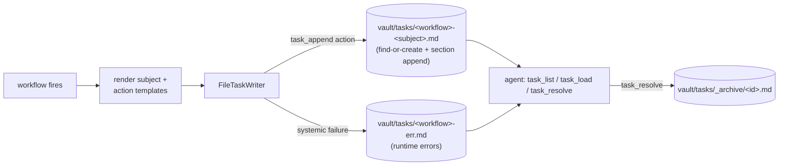

# Tasks

Agent-facing reference for the task surface per [ADR-0024](../adr/0024-workflows-and-tasks.md) + [ADR-0018](../adr/0018-archive-replaces-delete.md): where workflow-spawned tasks land in the vault, how the `task_append` action accumulates into a single file over time, and how the agent reads + resolves them via MCP. Audience is agents driving the task queue + operators-via-agents triaging tasks.

This is a **living reference** (not an ADR). Decision-grounded — every block names the ADR / issue that owns the rule.

For the workflow engine that produces these tasks see [`docs/workflows.md`](./workflows.md). For the broader MCP tool catalogue see [`mcp/SKILL.md`](../mcp/SKILL.md).

## Big picture



ADRs: [ADR-0024](../adr/0024-workflows-and-tasks.md) §"Task" + §"Runtime errors", [ADR-0018](../adr/0018-archive-replaces-delete.md).

## 1. Where tasks live

```
<vault>/
└── tasks/
    ├── boardgame-news-brass-birmingham.md       # workflow=boardgame-news, subject=brass-birmingham
    ├── boardgame-news-caverna.md
    ├── github-notification-classify-err.md      # err-task for the workflow (one per workflow, name="-err")
    ├── pr-review-acme-widget-42.md
    └── _archive/
        ├── boardgame-news-old-edition.md        # auto-archived after task_resolve
        └── boardgame-news-old-edition-err.md
```

- **Active tasks**: `<vault>/tasks/<workflow>-<subject>.md` (or `<workflow>-err.md` for err-tasks).
- **Archived tasks**: `<vault>/tasks/_archive/<id>.md` after `task_resolve`.
- The id is the file's basename without `.md` (e.g. `boardgame-news-brass-birmingham`).

The `<workflow>` slot is the workflow's `name` (frontmatter `name:` value). The `<subject>` slot comes from the workflow's `subject:` CEL template, slugified by the daemon. Find-or-create: same workflow firing on the same subject lands in the same file; the dispatcher appends to sections.

A workflow without a `subject:` (e.g. one that only does `add_note` / `set_property` / `add_canonical_edge` and no `task_append`) doesn't produce a task file under this naming.

## 2. Task file shape

```markdown
---
id: boardgame-news-brass-birmingham
workflow: boardgame-news
subject: brass-birmingham
dedup_key: "workflow + entity.id"
created_at: 2026-05-17T11:00:00Z
resolved_at: null
---

## candidates

- Brass Birmingham (2018) — surfaced via Spielworxx newsletter
- Brass Birmingham (2018) — surfaced via BGG news 2026-04
- Brass Birmingham (2018) — surfaced via reddit thread

## related-entities

- [[bgg:brass-birmingham-2018]]
- [[person:martin-wallace]]

## Missing references

- `graph.get("boardgame:brass-birmingham-prequel")` resolved to no entity at 2026-05-17T11:00:00Z.
```

- **Frontmatter** — daemon-managed metadata (`id` / `workflow` / `subject` / `dedup_key` / `created_at` / `resolved_at` / `errored`).
- **Body sections** — each `task_append.section:` becomes a `## <section>` heading; lines accumulate under it via the action's `if_already_present` policy.
- **`## Missing references` section** — auto-appended by the engine when the workflow's `context[].via` or `graph.get(...)` calls resolved no entity (per ADR-0024 §"Missing-reference handling"). The operator sees the unresolved id + the time it was attempted; deciding to add the missing entity or accept the note is the operator's call.

## 3. Append shape — how `task_append` accumulates

The `task_append` action (per [`docs/workflows.md`](./workflows.md) §5.1):

```yaml
- task_append:
    section: candidates
    content: '{{ entity.name }} ({{ entity.year }}) — surfaced via {{ edge.from_title }}'
    if_already_present: skip
```

Run-time behaviour:

1. The dispatcher renders `content` via CEL.
2. Looks up `tasks/<workflow>-<subject>.md`; creates the file (with frontmatter + empty body) if absent.
3. Finds the `## <section>` heading; creates the section (after any prior sections, before `## Missing references`) if absent.
4. Applies `if_already_present`:
   - `skip` (default) — if the exact rendered `content` line already exists in the section, no-op success.
   - `replace` — find the line that matches the content's prefix (the part before any " — surfaced via ..." tail), rewrite ONLY that line; other section lines unaffected. Per ADR-0024's "matching line only, not the section" semantics.
   - `append-anyway` — write a duplicate line regardless of prior presence.
5. Writes the file back atomically; mirrors the body update to nothing (tasks are not entities in the DB — they live in the vault only).

Per-workflow + per-subject dedup is enforced at the `dedup:` stanza level (see [`docs/workflows.md`](./workflows.md) §6). The `task_append.if_already_present` is line-level dedup *within* an already-fired workflow that decided to update the existing task.

## 4. Err-tasks

Per [ADR-0024](../adr/0024-workflows-and-tasks.md) §"Runtime errors — the err-task pattern", systemic failures (condition-eval errors, subject-render errors, action-runner errors that aren't missing-reference shape) accumulate into a single err-task per workflow:

```
<vault>/tasks/<workflow>-err.md
```

One err-task per workflow regardless of subject. Each failure appends one entry. The err-task's `errored: true` frontmatter flag distinguishes it from normal tasks at `task_list` time.

`task_resolve` on an err-task always auto-archives (per ADR-0024 — err-tasks bypass the `auto_archive_on_done: false` opt-out on the originating workflow).

## 5. MCP tools

Three tools cover the task surface (per [`mcp/SKILL.md`](../mcp/SKILL.md)).

### 5.1 `task_list(errored?)`

```ts
task_list();             // all active tasks (normal + err)
task_list(true);         // only err-tasks
task_list(false);        // only normal tasks
```

Maps to `GET /v1/tasks`. Returns:

```json
{
  "ok": true,
  "tasks": [
    {
      "id": "boardgame-news-brass-birmingham",
      "workflow": "boardgame-news",
      "subject": "brass-birmingham",
      "errored": false,
      "dedup_key": "workflow + entity.id",
      "created_at": "2026-05-17T11:00:00Z"
    },
    {
      "id": "github-notification-classify-err",
      "workflow": "github-notification-classify",
      "subject": "",
      "errored": true,
      "dedup_key": "",
      "created_at": "2026-05-17T11:05:00Z"
    }
  ]
}
```

Active tasks only — resolved + auto-archived tasks live under `tasks/_archive/` and aren't included. Sorted by id. Optional `errored` filter narrows the result to err-only / normal-only / both.

### 5.2 `task_load(id)`

```ts
task_load("boardgame-news-brass-birmingham");
```

Maps to `GET /v1/tasks/{id}`. Returns the full task:

```json
{
  "ok": true,
  "task": {
    "id": "boardgame-news-brass-birmingham",
    "workflow": "boardgame-news",
    "subject": "brass-birmingham",
    "errored": false,
    "dedup_key": "workflow + entity.id",
    "created_at": "2026-05-17T11:00:00Z",
    "body": "## candidates\n\n- Brass Birmingham (2018) — surfaced via ...\n\n## Missing references\n\n- `graph.get(...)` resolved to no entity at ...\n"
  }
}
```

`body` is the markdown content after the frontmatter, verbatim — includes section headers, content lines, and the `## Missing references` annotations.

404 when the id doesn't resolve (no matching file under `tasks/` or `tasks/_archive/`).

### 5.3 `task_resolve(id)`

```ts
task_resolve("boardgame-news-brass-birmingham");
```

Maps to `POST /v1/tasks/{id}/resolve`. Behaviour:

1. Stamps `resolved_at: <now>` on the task's frontmatter.
2. Auto-archives (moves to `tasks/_archive/<id>.md`) when:
   - The originating workflow has `auto_archive_on_done: true` (default), OR
   - The task is an err-task (always auto-archives regardless of workflow opt-out).
3. When `auto_archive_on_done: false`: the task stays under `tasks/` with `resolved_at` stamped — `task_list` no longer includes it (filtered by `resolved_at = null`), but the file remains for the operator's audit trail.

Response:

```json
{
  "ok": true,
  "id": "boardgame-news-brass-birmingham",
  "errored": false,
  "auto_archived": true,
  "resolved_at": "2026-05-17T11:30:00Z"
}
```

Idempotent: re-resolving an already-resolved (but not-yet-archived) task preserves the original `resolved_at` timestamp. Re-resolving an already-archived task is a no-op success.

## 6. Snooze semantics

Per ADR-0024 §"Snooze semantics": **deferred post-v1**. v1 ships the resolve / auto-archive lifecycle; operator-initiated snooze (defer until X) lands in a future ADR. The hooks are in place — frontmatter `snoozed_until` is a reserved field — but the snooze MCP tool is not part of the v1 task surface.

A `task_list` call today returns every active task regardless of intended snooze state. Workflows MUST NOT auto-snooze their own tasks (the design call is "snooze is operator-controlled, not workflow-controlled").

## 7. Tasks outlive their workflow

Per ADR-0024 §"Task": if a workflow file is deleted from `<vault>/workflows/` AFTER it spawned tasks, the loader unregisters the workflow but the task files stay. `task_list` continues to return them; `task_resolve` works as normal. The operator's commitment ("I'll review this PR") is independent of the workflow rule that surfaced it.

The orphaned task's `workflow:` frontmatter field still names the (now-absent) workflow — agents reading the task should not assume the workflow exists. `workflow_load(name)` returns 404 for the orphan's workflow ref.

## 8. Archive lifecycle

Per [ADR-0018](../adr/0018-archive-replaces-delete.md) (archive-replaces-delete), tasks follow the archive-first principle:

- Resolving a task with `auto_archive_on_done: true` (default) moves the file to `<vault>/tasks/_archive/<id>.md` atomically. The file is preserved; the operator can restore it manually by moving it back.
- The `_archive/` subdir is the only archive-state shape for tasks — there's no soft-delete flag or DB tombstone (tasks aren't entities; nothing in the DB needs cleanup).
- An archived task is invisible to `task_list` (which only scans the top-level `tasks/` directory).
- An archived task is still loadable via `task_load(id)` (the reader checks both `tasks/` and `tasks/_archive/`).

To resurrect an archived task: move the file back to `<vault>/tasks/` manually. The daemon doesn't expose a `task_unarchive` MCP tool in v1.

## 9. Where to look when task behaviour surprises

| Symptom                                              | First look                                                                                              |
|------------------------------------------------------|---------------------------------------------------------------------------------------------------------|
| Workflow fired but no task file appeared             | Workflow has no `task_append` action. Check the workflow YAML — `add_note` / `set_property` / `add_canonical_edge` produce no task file. |
| Same workflow + subject created two task files       | Subject template rendered different slugs (slugifier may have diverged on punctuation / case). Confirm the rendered subject offline. |
| `task_append` content disappeared from prior fire    | `if_already_present: replace` matched the prior line on the rendered prefix; check the section for the replacement. |
| Duplicate lines in a section                         | `if_already_present: append-anyway` was set OR the workflow's `dedup.policy: replace` doesn't reach line-level. |
| Err-task accumulating but no normal task             | All fires hitting condition-eval / subject-render / action-runner errors. `task_load(<workflow>-err)` shows the failures.  |
| `task_resolve` left the file under `tasks/`          | Originating workflow has `auto_archive_on_done: false` — intentional; file stays for audit trail.       |
| `task_resolve` returns 404                           | id doesn't match any file under `tasks/` OR `tasks/_archive/`. Confirm via `task_list`.                 |
| Task surfaces `## Missing references`                | The workflow's `context[].via` or `graph.get(...)` failed to resolve an id. Operator decides whether to add the missing entity / accept the note. |
| Task file lingers after the workflow was deleted     | Intentional per ADR-0024 §"Task". The orphan stays listable + closable; no re-trigger.                  |

## 10. ADRs + companion issues

- [ADR-0024](../adr/0024-workflows-and-tasks.md) — Workflows + Tasks (canonical task semantics).
- [ADR-0018](../adr/0018-archive-replaces-delete.md) — archive-replaces-delete.
- [ADR-0008](../adr/0008-vault-as-source-of-truth.md) — vault as source of truth (tasks live in the vault, not the DB).
- `internal/workflow/tasks` — task reader + writer implementation.
- `mcp/SKILL.md` §"Task surface" — MCP tool surface.
