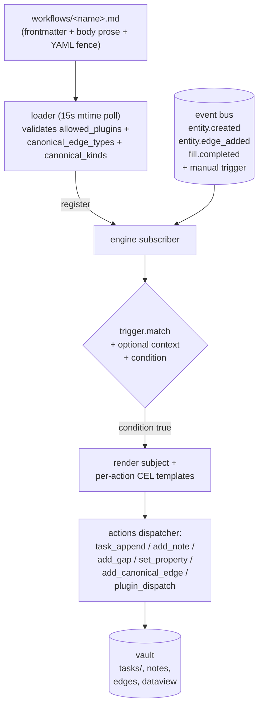

# Workflows

Agent-facing reference for the workflow engine per [ADR-0024](../adr/0024-workflows-and-tasks.md): how the operator declares reactive patterns the daemon runs on its own, what the daemon evaluates each fire, and how the workflow's action primitives map onto the data layer. Audience is agents reading workflow files + authoring them with the operator.

This is a **living reference** (not an ADR). Decision-grounded — every block names the ADR (and where applicable, the implementation issue) that owns the rule.

For complementary surfaces see [`docs/ingest.md`](./ingest.md) (what produces the `entity.created` + `entity.edge_added` events workflows subscribe to), [`docs/fill-gap.md`](./fill-gap.md) (the `fill_completed` event + gap shapes), [`docs/configs.md`](./configs.md) (operator config the loader validates workflow refs against), and [`docs/tasks.md`](./tasks.md) (forthcoming — the task surface workflow outputs land on).

## Big picture



ADRs: [ADR-0024](../adr/0024-workflows-and-tasks.md) §"Workflow" + §"Decision logic", [ADR-0019](../adr/0019-operator-fill.md) (fill-gap), [ADR-0021](../adr/0021-daemon-owns-slug.md) (canonical labels).

## 1. File shape

```markdown
---
name: boardgame-news
version: 1
status: active
---

# Boardgame news → review queue

Operator-readable prose describing what this workflow does and why.
Renders cleanly in Obsidian / GitHub markdown viewers.

```yaml
allowed_plugins:
  - yaad-bgg
  - yaad-wikipedia

addable_gaps:
  - is_interesting_to_me

trigger:
  type: edge_created
  match:
    edge_type: is_about
    target_kind: boardgame

context:
  - name: prior
    via: 'has(entity.previous_edition_id) ? graph.get(entity.previous_edition_id) : null'

condition: 'entity.rating > 7 || (prior != null && prior.rating > 7) || entity.owned == true'

subject: '{{ entity.slug }}'

dedup:
  key: 'workflow + entity.id'
  policy: update

actions:
  - task_append:
      section: candidates
      content: '{{ entity.name }} ({{ entity.year }}) — surfaced via {{ edge.from_title }}'
      if_already_present: skip
```
```

Two parts:

- **Frontmatter** (YAML between `---` fences) — metadata only: `name`, `version`, `status`. The frontmatter shape is flat by design; rich workflow rules live in the body.
- **Body** — operator-readable markdown prose with the structured rules in a single fenced ```yaml``` block. The loader extracts that single fence; surrounding prose is documentation.

The loader (`internal/workflow/loader`) scans `<vault>/workflows/*.md` every 15s (configurable). New / mtime-bumped files register; removed files unregister. Rejected files (parse error, schema-validation failure, unknown `allowed_plugins`, unknown `canonical_edge_types` / `canonical_kinds` on `add_canonical_edge`) log a structured WARN line and stay out of the registry. Fixing the file lands on the next tick without a daemon restart.

ADRs: [ADR-0024](../adr/0024-workflows-and-tasks.md) §"Workflow".

## 2. Trigger types

`trigger.type` is one of the v1 closed set per ADR-0024 §"Trigger types":

| Trigger              | Fires on                                                                                       | `entity` binding                | `edge` binding                       |
|----------------------|------------------------------------------------------------------------------------------------|---------------------------------|--------------------------------------|
| `edge_created`       | Bus `entity.edge_added` matching `trigger.match.{edge_type, target_kind}` (optional filters)   | The triggering edge's `from`    | The full edge `{type, from, to, from_title, to_title, timestamp}` |
| `entity_created`     | Bus `entity.created` matching `trigger.match.{canonical_kind}` (optional)                      | The newly-created entity        | nil (no triggering edge)             |
| `entity_updated`     | Bus `entity.updated` matching `trigger.match.{field_changed, canonical_kind}` (`field_changed` required) | The entity whose field changed | nil                                  |
| `fill_completed`     | Bus `fill.completed` matching `trigger.match.{gap, source}` (both optional)                    | The entity whose gap landed     | nil                                  |
| `manual`             | `workflow.trigger(name, input)` MCP / HTTP / CLI invocation                                    | The id resolved from `input`    | nil                                  |

Match filter shape examples:

```yaml
trigger: { type: edge_created, match: { edge_type: is_about, target_kind: boardgame } }
trigger: { type: entity_created, match: { canonical_kind: email } }
trigger: { type: entity_updated, match: { field_changed: data.state, canonical_kind: [github-pr, github-issue] } }
trigger: { type: fill_completed, match: { gap: is_interesting_to_me, source: operator } }
trigger: { type: manual }
```

`canonical_kind:` accepts either a single scalar (`canonical_kind: email`) or a list (`canonical_kind: [github-pr, github-issue]`); both shapes normalise to the same internal filter list.

Missing match keys widen the trigger — `trigger: { type: edge_created, match: {} }` fires on every edge add. `match` is optional except where the workflow's intent specifically narrows.

**Self-loop detection** (ADR-0024 §"Self-loop detection"): a workflow named `X` does NOT re-fire on a `fill.completed` event whose `source` is `workflow:X`. The engine breaks direct self-loops via the source tag. Indirect loops (X injects gap, agent fills, X re-fires, X injects again) rely on workflow author discipline + an engine backstop counter (10 re-evals on the same `(workflow, entity)` pair within 60s → suppress + emit err-task).

## 3. CEL environment

The decision pipeline uses CEL ([cel-go](https://pkg.go.dev/github.com/google/cel-go)) per ADR-0024 §"Decision logic is agent-free in v1". The expression env is the same for `condition`, `subject`, `dedup.key`, `context[].via`, and per-action template fields.

### 3.1 Variables

- `entity` — the triggering entity (dynamic map of its frontmatter `data` + injected `id` + `kind`). Always populated even when the trigger doesn't carry an entity (empty map for manual triggers without an `input`).
- `edge` — the triggering edge (empty map when the trigger doesn't carry an edge). Fields: `type`, `from`, `to`, `from_title`, `to_title`, `timestamp`. `has(edge.type)` is the standard guard for predicates that support both edge-shape and non-edge triggers. `edge.timestamp` is a CEL `Timestamp`; wrap with `string(...)` to embed in template strings (see §3.2).
- `trigger` — the per-firing trigger context (see §3.1.1). Always populated; predicates referencing missing sub-fields see `has() == false` rather than raising.
- `<binding>` — each entry in the workflow's `context:` stanza becomes a dynamic variable with the same name. Pre-evaluated once per fire (see §4). `entity`, `edge`, and `trigger` are reserved — declaring a binding with one of those names is rejected at workflow-load time.

#### 3.1.1 Trigger context

`trigger.*` describes *what caused this firing*. Fields:

| Field              | Type             | Meaning                                                                                                                                                                          |
|--------------------|------------------|----------------------------------------------------------------------------------------------------------------------------------------------------------------------------------|
| `trigger.source`   | entity (dyn map) | The fully-resolved entity whose action initiated the event (e.g. the source emitting the `is_about` edge that materialized this canonical). Empty map when the cause id didn't resolve. |
| `trigger.event`    | string           | The bus event type: `entity_created`, `entity_updated`, `edge_added`, `fill_completed`, or `manual`.                                                                              |
| `trigger.timestamp`| timestamp        | When the originating event occurred. Wrap with `string(...)` to embed in templates.                                                                                              |
| `trigger.cause`    | string           | Sub-event detail. Field name for `entity_updated` (e.g. `data.state`), edge type for `edge_added`, gap name for `fill_completed`, empty for `entity_created` / `manual`.          |

The engine resolves `trigger.source` from the event envelope's `caused_by_entity_id`, falling back to the triggering entity itself when the publisher didn't stamp a cause — so legacy events stay trigger.source-functional. For self-triggered events (source-plugin re-ingesting its own truth), `trigger.source == entity` by construction.

**When to reach for `trigger.*` instead of graph walks.** Use `trigger.source` when multiple sources can resolve to the same canonical and the workflow needs the firing source specifically — e.g. both yaad-gmail and yaad-github emit `is_about → github-pr:X`; reading `graph.in_neighbors(entity.id, "is_about").items[0]` picks an arbitrary in-neighbor, while `trigger.source` deterministically gives you the one whose action caused *this firing*. Use `trigger.event` to distinguish create vs update on the same entity (`condition: 'trigger.event == "entity_updated"'`), and `trigger.cause` to scope an `entity_updated` workflow to a specific field without redeclaring `field_changed` on the trigger match.

**Worked example — github-PR archive workflow that only fires on gmail-driven materializations:**

```yaml
trigger:
  type: entity_created
  match: { canonical_kind: [github-pr] }
context:
  - name: src
    via: 'trigger.source'
condition: 'trigger.source.kind == "gmail"'
subject: '{{ trigger.source.data.subject }} → {{ entity.data.title }}'
actions:
  - task_append:
      target: 'task:inbox-from-gmail'
      content: '- [PR] {{ entity.data.title }} (via {{ trigger.source.data.from }})'
```

### 3.2 Functions

#### Lookups + utilities

- `graph.get(id)` — fetch a canonical-id entity (`<kind>:<slug>`). Returns the entity's `data` map or null. **Missing entity** does NOT raise — instead the engine records a missing-reference note that gets attached to any task the workflow produces. The workflow proceeds; the operator decides whether to manually add the missing edge / ingest the missing entity.
- `regex_capture(text, pattern, group_index)` — returns the matched capture group as string (0 = whole match) or `""` on no-match / out-of-range / negative index. Process-wide compiled-regex cache. **Literal patterns are pre-validated at workflow-Compile time**; a malformed regex fails registration, not the first fire. Runtime-computed patterns can only fail at eval and return `""`.
- `string(value)` — CEL's standard type cast. The `string(timestamp)` overload formats RFC3339 / ISO 8601 (e.g. `"2026-05-17T19:00:00Z"`) and is the way to embed `edge.timestamp` in a template: `"- alert at " + string(edge.timestamp)`. Direct concat `"prefix " + edge.timestamp` fails with `no such overload` because CEL has no implicit string/time coercion. For date-only or time-only shapes, compose with the strings extension: `string(edge.timestamp).substring(0, 10)` → `"2026-05-17"`.

#### Date helpers (ADR-0027 cut 1)

Three nullary functions returning canonical day-id strings (`day:YYYY-MM-DD`). Resolved via the daemon's configured TZ (`timezone:` config → host `time.Local` fallback per [ADR-0025 § Timezone](../adr/0025-date-entities.md)):

- `today()` → `"day:2026-11-11"`
- `yesterday()` → `"day:2026-11-10"`
- `tomorrow()` → `"day:2026-11-12"`

Compose directly with `graph.get(today())`, `add_canonical_edge: target.name: today()`, action-template interpolation. The `add_canonical_edge` action runner strips the leading `<kind>:` prefix before slugifying — so `target.name: today()` resolves to `day:2026-11-11`, not the doubled-prefix form.

#### Date arithmetic (ADR-0027 cut 2)

Function form — no operator overloading, no custom CEL types:

- `add_days(day_id, n)` → `day_id` (signed; negative `n` walks backward; cross-month / cross-year correct; leap-year aware)
- `days_between(day_a, day_b)` → int (signed; positive when `b` is after `a`)

Comparison via `days_between(a, b) > 0` substitutes for an operator-form `a < b`.

#### Period helpers (ADR-0027 cut 2 §2a) — helpers not entities

Week / month / year are pure CEL helpers — no new entity kinds, no `belongs_to` edges. ISO 8601 week semantics throughout (Monday-start; week containing Jan 4 is week 01).

Current period (parallel to `today()`, per-fire cached):

- `this_week()` → `"YYYY-Www"` (e.g. `"2026-W21"`)
- `this_month()` → `"YYYY-MM"`
- `this_year()` → `"YYYY"`

Group → days (one-to-many; returns plain `list<string>`):

- `days_in_week("YYYY-Www")` → 7 day-ids (Monday-Sunday)
- `days_in_month("YYYY-MM")` → 28-31 day-ids (leap-aware Feb)
- `days_in_year("YYYY")` → 365 or 366 day-ids

Day → group (many-to-one):

- `week_of("day:YYYY-MM-DD")` → `"YYYY-Www"` (ISO-week-year, NOT calendar year — `week_of("day:2025-12-29")` returns `"2026-W01"`)
- `month_of("day:YYYY-MM-DD")` → `"YYYY-MM"`
- `year_of("day:YYYY-MM-DD")` → `"YYYY"`

Period helpers are NOT subject to the graph-walk cap — output size is bounded by calendar shape (max 366 for `days_in_year`), not graph density. No truncation flag.

#### Graph walking (ADR-0027 cut 3)

Four functions × two arities (unfiltered + edge-type-filtered). Single-hop only; multi-hop queries belong on `/v1/entities/{id}/context?depth=N`.

Edges:

- `graph.in_edges(id)` / `graph.in_edges(id, edge_type)` — edges terminating at `id`
- `graph.out_edges(id)` / `graph.out_edges(id, edge_type)` — edges originating at `id`

Neighbors (convenience — single batch entity fetch, not the N+1 `graph.in_edges(...).map(e, graph.get(e.from))` shape):

- `graph.in_neighbors(id)` / `graph.in_neighbors(id, edge_type)` — source-side entities
- `graph.out_neighbors(id)` / `graph.out_neighbors(id, edge_type)` — target-side entities

When `edge_type` is given, the daemon filters SQL-side. Without it, CEL `.filter()` on `.items` handles ad-hoc narrowing.

**Return shape** — every graph-walk call returns a wrapping struct so the truncation flag can ride alongside the data (CEL `list<T>` can't carry sidecar fields):

```
{
  items:     list<T>,     // T = Edge for *_edges, Entity for *_neighbors
  truncated: bool,        // true when total > len(items)
  total:     int          // unbounded count (the pre-cap row count)
}
```

Iterate via `result.items`; check `result.truncated` for overflow handling. Workflows that need exhaustive results MUST check the flag and paginate via the API (no CEL pagination primitive). The engine does NOT auto-fail on overflow.

**Edge shape** returned by `*_edges`:

```
{ from: string, to: string, type: string, metadata: map<string, dyn> }
```

Mirrors `store.Edge.Metadata` lowercased per CEL convention. (Distinct from the trigger-edge binding's shape from §3.1 — that binding carries `from_title`/`to_title`/`timestamp` denormalizations the walk-result intentionally doesn't.)

**Per-call cap** defaults to 1000 entries; operators override via the top-level `workflow.graph_walk_cap` config knob (see [`docs/configs.md`](./configs.md)).

#### Per-fire caching for current-period helpers

`today()`, `yesterday()`, `tomorrow()`, `this_week()`, `this_month()`, and `this_year()` are evaluated **once per workflow fire** from a single clock snapshot. Multiple callsites within one fire's actions all see the same value — important for the rare boundary-crossing case (midnight, Sunday→Monday ISO-week rollover, last-day-of-month, Dec-31→Jan-1). The cache is fire-scoped, not engine-scoped; back-to-back fires across a boundary correctly see different values. Operator `timezone:` reloads take effect on the NEXT fire (no engine restart required).

#### CEL extensions wired

The decision pipeline wires both [`ext.Strings()`](https://pkg.go.dev/github.com/google/cel-go/ext#Strings) and [`ext.Lists()`](https://pkg.go.dev/github.com/google/cel-go/ext#Lists) so workflow templates can use:

- `.split()`, `.replace()`, `.substring()`, `.lowerAscii()`, `.upperAscii()`, `.indexOf()`, `.join(separator)` — string list / member-shape (`ext.Strings`)
- `.flatten()` on `list<list<T>>` → `list<T>` (`ext.Lists`) — useful for the weekly-digest pattern that collects per-day neighbor lists.

The standard `.map()`, `.filter()`, `.exists()`, `.all()` are CEL native and don't need an extension.

### 3.3 Result types

The engine compiles each expression with a known return type:

- `condition` → `bool`. Non-bool result surfaces as an `EvalError` and an err-task.
- `subject` → `string`. CEL stringifies non-strings via Go's default representation.
- `dedup.key` → `string`.
- `context[].via` → `dyn` (the result is bound under the entry's name for downstream evaluations).
- Per-action template fields (`task_append.content`, `add_note.content`, `set_property.fields[*]`, `add_canonical_edge.target.name`, etc.) → `string`.

ADR refs: [ADR-0024](../adr/0024-workflows-and-tasks.md) §"Decision logic", #123 (CEL strings ext + regex_capture).

## 4. Context bindings

```yaml
context:
  - name: prior
    via: 'has(entity.previous_edition_id) ? graph.get(entity.previous_edition_id) : null'
  - name: review_count
    via: 'size(entity.reviews) + 0'
```

Each entry pre-evaluates a CEL expression and binds the result to a name visible to `condition`, `subject`, `dedup.key`, AND every per-action template. Two motivations:

- **DRY** — when the same sub-expression appears multiple times across the workflow.
- **Readability** — giving a graph-walked target a name documents the predicate.

`via` failures (graph.get not-found, CEL eval error) follow the missing-reference path: the workflow proceeds and notes get attached to any resulting task. `context` is optional; workflows that don't need pre-bindings omit the stanza entirely.

## 5. Action primitives

Each entry in `actions:` is exactly one of the v1 closed primitive set. The dispatcher (`internal/workflow/actions`) routes per-action by primitive.

### 5.1 `task_append`

```yaml
- task_append:
    section: candidates
    content: '{{ entity.name }} ({{ entity.year }}) — surfaced via {{ edge.from_title }}'
    if_already_present: skip
```

Append a line to a named section of `tasks/<workflow>-<subject>.md`. `<subject>` comes from the top-level `subject:` CEL template; `<workflow>` is the workflow's `name`. Find-or-create semantics: same workflow + subject → same task file, accumulated over time.

- `section` (required) — non-empty.
- `content` (required) — CEL template; the engine renders before dispatch.
- `if_already_present` — `skip` (default) / `replace` / `append-anyway`. `skip` is the no-op-on-duplicate semantics; `replace` rewrites the matching line only (not the section); `append-anyway` writes a duplicate.

### 5.2 `add_note`

```yaml
- add_note:
    target: 'edge.to'
    content: 'Surfaced via {{ workflow }}: {{ entity.summary }}'
```

Attach a note to an existing entity via the standard notes pathway (the `add_note` MCP tool's daemon-internal equivalent). The note lands between the entity's `<!-- yaad:notes start/end -->` markers per ADR-0015 (extended #115). Author = `workflow:<name>` per the ADR-0024 source vocabulary.

- `target` — CEL expression resolving to the target entity id. Defaults to `entity.id` (the triggering entity).
- `content` (required non-empty) — note body; CEL template.

### 5.3 `add_gap`

```yaml
- add_gap:
    entity: 'entity.id'
    gap: hiring_alert_for
    data_schema:
      role: "the role title in the hiring alert"
      salary: "salary range if mentioned, else omit"
```

Inject a gap onto an entity from the action stage. The gap surfaces in `/v1/needs-fill` until an operator / agent fills it via the standard fill pipeline.

- `entity` — CEL expression resolving to the target id. Defaults to `entity.id`.
- `gap` (required) — gap name; MUST appear in the workflow's `addable_gaps` list (the workflow's declared gap-side-effect vocabulary; enforced at load time + re-checked at fire time).
- `data_schema` (#117) — optional per-key extraction guidance for `canonical_type` gaps carrying per-entry `data`. Map key = data-field name; value = natural-language extraction instruction. Persists on the gap's `GapStateEntry`; surfaces on `/v1/needs-fill` as `gap_metadata.<gap>.data_schema` so the agent's fill-prompt builder includes the per-key instructions.

Idempotency: re-adding a gap already present is a no-op success **unless** the new call supplies a new `data_schema` (then the entry's schema is rewritten — workflows can refresh extraction instructions without going through an operator path).

ADR refs: [ADR-0024](../adr/0024-workflows-and-tasks.md) §"Constraints on add_gap", [ADR-0013](../adr/0013-canonical-kind-owns-gap-contract.md), #117 (data_schema).

### 5.4 `set_property` (#120)

```yaml
- set_property:
    entity: 'entity.id'
    fields:
      classification: 'entity.data.subject.contains("review") ? "github_review" : "github_notification"'
      surfaced_at: 'string(edge.timestamp)'
```

Write static or CEL-templated values directly into the target entity's frontmatter `data` map. No LLM call, no fill-gap detour — the deterministic-derive-from-context counterpart to `add_gap`.

- `entity` — CEL expression resolving to the target id. Defaults to `entity.id`.
- `fields` (required non-empty) — map of field-name → CEL template. Each value renders to a string; the writer merges into frontmatter `data` (per-field overwrite; other keys preserved). One `fill.completed` event fires per field that lands, scoped to the workflow's source tag so downstream workflows can subscribe per-field.

ADR refs: [ADR-0024](../adr/0024-workflows-and-tasks.md) §"Output surface", #120 (set_property).

### 5.5 `add_canonical_edge` (#132)

```yaml
- add_canonical_edge:
    source: 'entity.id'
    edge_type: 'is_about'
    target:
      kind: 'github-repository'
      name: 'regex_capture(entity.data.subject, "\\[([^/]+/[^\\]]+)\\]", 1)'
    data:
      reference: 'regex_capture(entity.data.subject, "#(\\d+)", 1)'
      type: 'entity.data.subject.contains("review") ? "review" : "notification"'
```

Create a canonical edge from the source to a target canonical-label inline — the deterministic-fill counterpart to `add_gap` for canonical_type gaps.

- `source` — CEL expression resolving to the source entity id. Defaults to `entity.id`.
- `edge_type` (required, **literal** string) — must appear in `canonical_edge_types` (operator config + plugin emissions). Validated at workflow-load time.
- `target.kind` (required, **literal** string) — must appear in `canonical_kinds`. Validated at workflow-load time.
- `target.name` (required, CEL expression) — the canonical-label name. The daemon slugifies via `slug.Slug` to produce `<target.kind>:<slug>`.
- `data` — optional map of CEL expressions per key. The daemon appends a sorted-key dataview-inline paragraph to the target canonical entity's body (per #119), auto-materializing the target vault file when missing per ADR-0021 §3.

Idempotency: same `(source, edge_type, target)` tuple does not duplicate. Identical `data` dedups via content-hash; different `data` accumulates as a new paragraph (history-as-event-log).

ADR refs: [ADR-0024](../adr/0024-workflows-and-tasks.md), [ADR-0021](../adr/0021-daemon-owns-slug.md) §3, #119 (per-entry data), #132 (this primitive).

### 5.6 `plugin_dispatch`

```yaml
- plugin_dispatch:
    plugin: yaad-bgg
    command: fetch
    args:
      slug: 'entity.bgg_slug'
    timeout_seconds: 30
```

Fire a plugin command from inside a workflow ("look-something-up-then-decide"). The call is **synchronous** from the workflow's POV: blocks on the plugin result up to `timeout_seconds` (default 30s).

- `plugin` (required) — must appear in the workflow's `allowed_plugins` list.
- `command` (required) — bare command name (no `!` sigil; the sigil lives on the operator-side invocation surface).
- `args` — optional map; plugin-specific.
- `timeout_seconds` — non-negative integer; 0 → daemon default.

On timeout / plugin error: the workflow's err-task pattern fires (one err task per workflow, error appended); the workflow continues firing on future events but the current evaluation aborts.

ADR refs: [ADR-0024](../adr/0024-workflows-and-tasks.md) §"plugin_dispatch execution semantics".

## 6. `dedup` — per-pattern de-duplication

```yaml
dedup:
  key: 'workflow + entity.id'
  policy: update
```

The engine computes the dedup key from the CEL template before dispatching actions. The policy decides what happens when the same key has fired before:

- `update` (default) — re-fire the actions; let `task_append.if_already_present` decide line-level dedup.
- `skip` — drop the fire silently (don't even run actions).
- `replace` — re-fire after wiping prior outputs scoped to the key (v1 narrow: only `task_append` actions clean prior matching section content).

Without `dedup`, every event matching the trigger re-fires the workflow.

## 7. `subject` — task-file disambiguator

```yaml
subject: '{{ entity.slug }}'
```

CEL template that renders to the `<subject>` slot in `tasks/<workflow>-<subject>.md`. Same workflow firing on different subjects produces different task files; same workflow on the same subject accumulates into one file.

Optional. Workflows that produce only `add_note` / `add_canonical_edge` / `set_property` outputs (no `task_append`) can omit `subject:` entirely.

## 8. `allowed_plugins`

```yaml
allowed_plugins:
  - yaad-bgg
  - yaad-wikipedia
```

The workflow's plugin-dispatch scope. The loader rejects the workflow at load time when an entry isn't in the daemon's plugin registry. `plugin_dispatch` actions validate their `plugin:` against this list at fire time too.

Required (non-empty) when the workflow has `plugin_dispatch` actions; otherwise optional. Empty allowed_plugins on a workflow without `plugin_dispatch` is fine.

## 9. `addable_gaps`

```yaml
addable_gaps:
  - is_interesting_to_me
  - hiring_alert_for
```

The workflow's gap-side-effect vocabulary. Both trigger-time gap injection AND action-stage `add_gap` actions must use a gap name in this list. The parser rejects out-of-vocabulary `add_gap.gap` at workflow-load time; the runner re-checks at fire time as defense in depth (catches hot-reloaded edits that shrink the list under live actions).

Required (non-empty) when the workflow has `add_gap` actions; otherwise optional.

## 10. `auto_archive_on_done`

```yaml
auto_archive_on_done: false
```

Controls whether `task_resolve` on a task spawned by this workflow auto-archives the task file to `tasks/_archive/<id>.md` (per the task surface in [`docs/tasks.md`](./tasks.md)). **Default `true`** per ADR-0024 §"Task" — auto-archive on done is the standard path. Workflows that want the operator's completed-tasks audit trail to stick around explicitly opt OUT via `auto_archive_on_done: false`. Err-tasks always auto-archive regardless of the opt-out (per ADR-0024 §"Runtime errors").

## 11. Worked example: GitHub notification classifier

```markdown
---
name: github-notification-classify
version: 1
status: active
---

# GitHub notification triage

Classifies inbound github notification emails (PR review requests,
issue comments, etc.) into a structured `github-repository` canonical
edge with per-event details landing as dataview paragraphs on the
repo's vault file.

```yaml
allowed_plugins:
  - yaad-gmail

trigger:
  type: edge_created
  match:
    edge_type: from
    target_kind: email-address

condition: 'edge.to == "email-address:notifications_at_github_dot_com"'

actions:
  - add_canonical_edge:
      source: 'entity.id'
      edge_type: 'is_about'
      target:
        kind: 'github-repository'
        name: 'regex_capture(entity.data.subject, "\\[([^/]+/[^\\]]+)\\]", 1)'
      data:
        reference: 'regex_capture(entity.data.subject, "#(\\d+)", 1)'
        type: 'entity.data.subject.contains("review") ? "review" : "notification"'
        received_at: 'string(edge.timestamp)'
```
```

What happens at runtime:

1. yaad-gmail ingests a new email → daemon emits `entity.created` + per-edge `entity.edge_added`.
2. One of the edges (`from → email-address:notifications_at_github_dot_com`) matches the workflow's trigger.
3. Engine evaluates `condition`: true.
4. Engine evaluates `regex_capture` over `entity.data.subject` (e.g. `"[acme/widget] Re: PR #42 review requested"`):
   - `target.name` renders to `"acme/widget"`.
   - `data.reference` renders to `"42"`.
   - `data.type` renders to `"review"`.
5. Dispatcher invokes `VaultEdgeWriter.AddCanonicalEdge`:
   - Slugifies `"acme/widget"` → `github-repository:acme-widget`.
   - Ensures the thin DB row for the target.
   - Creates the edge `email:<msgid> -[is_about]-> github-repository:acme-widget`.
   - Auto-materializes `<vault>/ct/github-repository/acme-widget.md` (first-time only).
   - Appends one dataview paragraph: `received_at:: ...  reference:: 42  type:: review`.
6. Publishes `entity.created` (target materialized), `entity.edge_added` (per CreateEdge), `fill.completed` (per landed paragraph) — all `SourceTag=workflow:github-notification-classify`.

Subsequent emails about the same repo append additional dataview paragraphs (different `reference` / `type` accumulates; identical content dedups via the sorted-key hash).

## 12. Where to look when a workflow misbehaves

| Symptom                                              | First look                                                                                              |
|------------------------------------------------------|---------------------------------------------------------------------------------------------------------|
| Workflow doesn't load                                | Loader WARN log: parse error / unknown allowed_plugin / unknown `edge_type` or `target.kind` on `add_canonical_edge`. |
| Workflow doesn't fire on the event you expect        | `trigger.match` filters too narrow; OR the upstream event didn't fire (cache-hit re-fetch doesn't fire `entity.created` — use `entity.edge_added` instead). |
| Predicate references `edge.*` but trigger is manual  | Guard with `has(edge.type) && ...` — manual triggers carry no edge.                                     |
| `graph.get(id)` doesn't find the entity              | Missing-reference path — workflow proceeds, task gets a note attached. Check if the id is right.        |
| Regex doesn't match the subject                      | YAML double-vs-single quoting: single-quoted `'\\d+'` is literal `\d+`; double-quoted `"\\d+"` is `\d+` after YAML decode, then `\d+` after CEL parse. Test the pattern offline.  |
| Workflow re-fires in a loop                          | Direct self-loop via source tag is already blocked; indirect loop triggers the per-(workflow, entity) backstop counter — err-task names the loop. |
| Action fires but writer fails                        | Per-action `ActionResult.Err` surfaces on the workflow's err-task. Check the task file for the wrap.    |
| `add_canonical_edge` slug doesn't match what you expect | `slug.Slug` is the deterministic clean-slug rule per ADR-0017 / ADR-0021 §1. Strip punctuation + lowercase. |
| Two writes to the same entity conflict               | Per-entity write-lock acquired by another writer (workflow + UGC + operator). 409 conflict; rejected caller retries. |

## 13. ADRs + companion issues

- [ADR-0024](../adr/0024-workflows-and-tasks.md) — Workflows + Tasks.
- [ADR-0019](../adr/0019-operator-fill.md) — fill-gap surface + audience filter.
- [ADR-0013](../adr/0013-canonical-kind-owns-gap-contract.md) — canonical-kind owns gap contract.
- [ADR-0021](../adr/0021-daemon-owns-slug.md) — daemon owns slug + auto-materialize policy.
- [ADR-0015](../adr/0015-plugin-body-markers.md) — marker-pair contract (extended for notes + dataview).
- #117 — `add_gap.data_schema` per-key extraction guidance.
- #119 — canonical_type per-entry `data` + dataview-paragraph-append.
- #120 — `set_property` action primitive.
- #123 — CEL strings ext + `regex_capture` custom function.
- #132 — `add_canonical_edge` action primitive.
